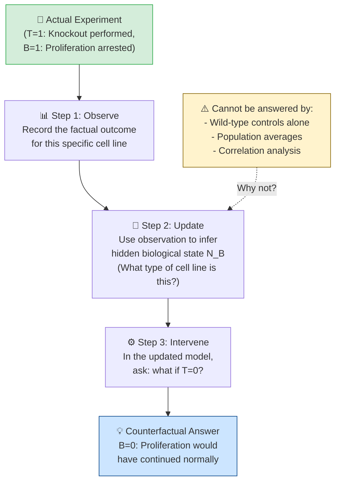
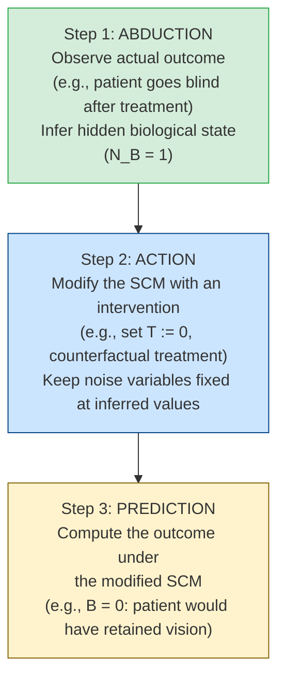
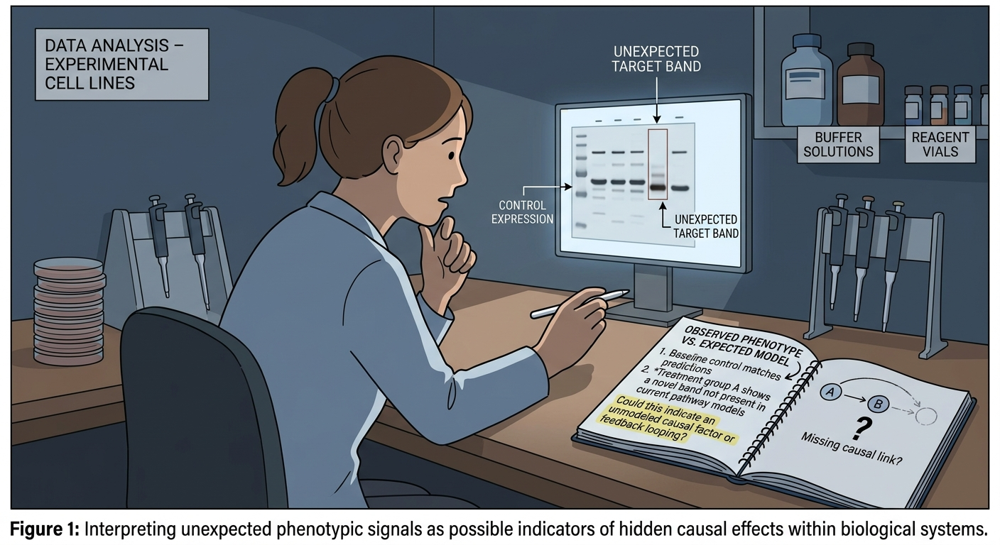
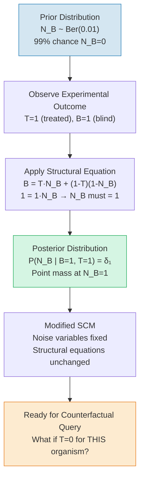
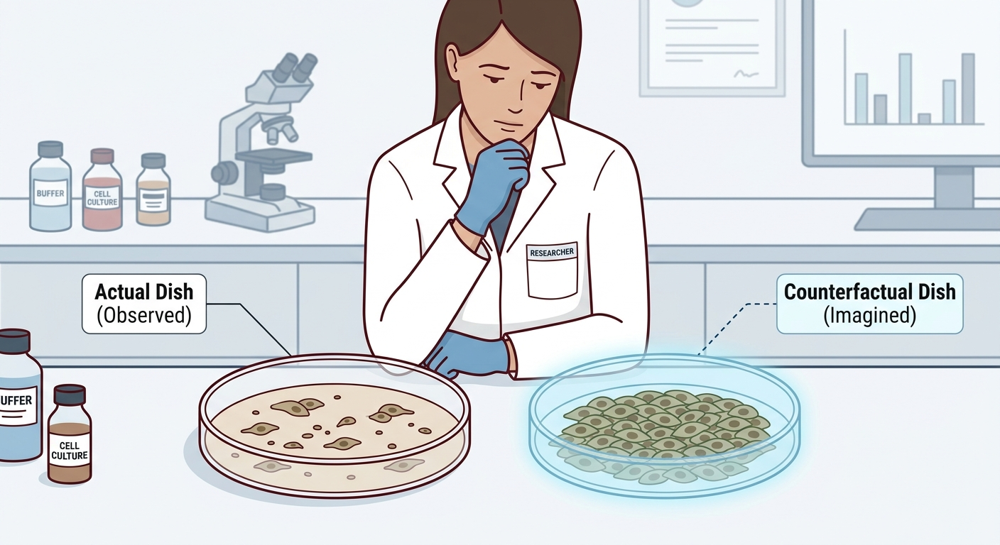
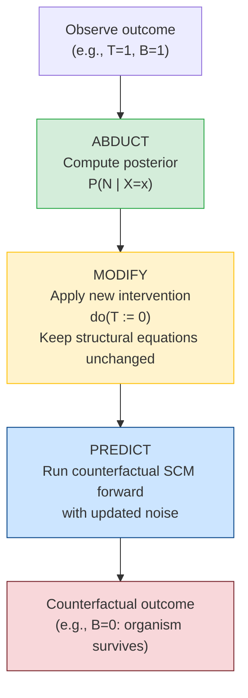
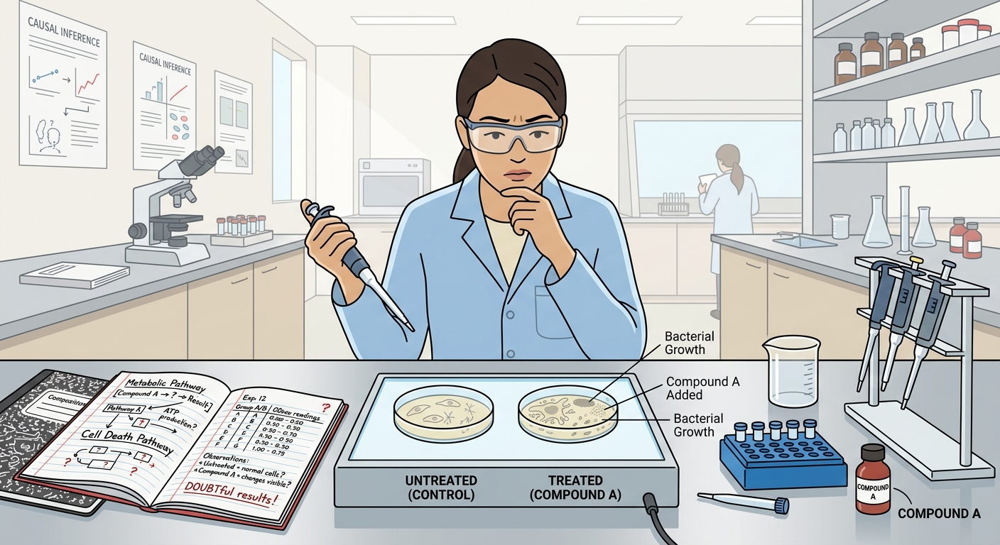
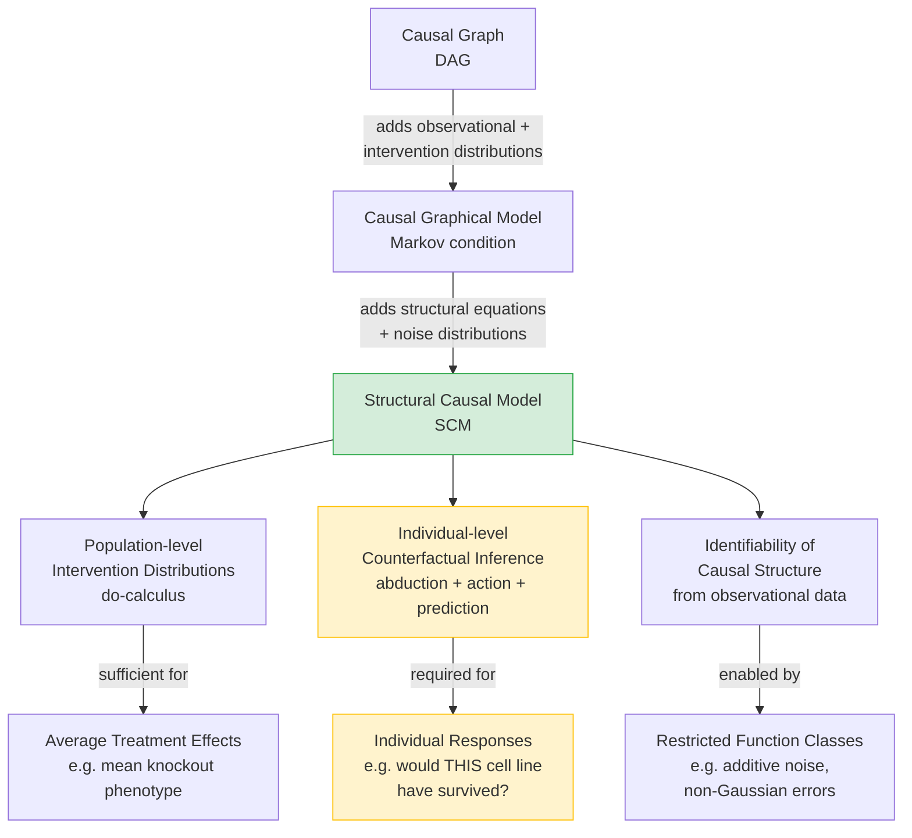

# Counterfactuals

## What If We Had Used a Different Knockout? The Biology of Counterfactual Questions

> By the end of this node, you will be able to:
>
> 1. Explain what a **counterfactual question** is and how it differs from a standard observational or interventional question in a biological context.
> 2. Describe why answering counterfactual questions requires more than correlation or even experimental data alone.
> 3. Recognize the three-step logic — observe, update, intervene — that underlies counterfactual reasoning in gene knockout studies.

You have just finished a CRISPR knockout experiment. Your target gene — let's call it _GeneX_ — has been successfully deleted in a cancer cell line, and the cells have stopped proliferating. Your PI is thrilled. The data look clean. But then, at lab meeting, someone asks a deceptively simple question:

**"What would have happened to _those specific cells_ if we had NOT knocked out GeneX?"**

Your first instinct might be: _easy — look at the wild-type control._ But wait. The wild-type control is a different population of cells. It tells you what happens to cells _that were never treated_, not what would have happened to _the exact cells you knocked out_ had you made a different choice. These are not the same question, and the difference is not just philosophical — it has real consequences for how you interpret your results and design your next experiment.

This is the world of **counterfactual reasoning**: asking what _would have been_ under a hypothetical that contradicts the facts you already observed. It sits at the heart of causal inference, and it is something that standard probability and even well-designed randomized experiments cannot fully answer on their own.

## The Core Idea: Rewinding the Experiment

A **counterfactual** is a statement about what _would have_ occurred in a specific, already-observed instance, had one condition been different. The word literally means 'counter to the facts' — you are reasoning about a world that did not happen, but using everything you know about the world that did.

Let's ground this carefully. In biology, we routinely distinguish three types of questions:

- **Observational:** 'In cell lines where _GeneX_ expression is low, is proliferation also low?' (correlation)
- **Interventional:** 'If we knock out _GeneX_ in a population of cells, what happens to proliferation on average?' (do-calculus, randomized experiment)
- **Counterfactual:** 'Given that _this specific cell line_, after knockout of _GeneX_, showed arrested proliferation — what _would_ its proliferation have been had we NOT performed the knockout?' (individual-level, retrospective)

The third question is fundamentally different. It asks about the same individual unit (the same cells, the same genetic background, the same passage number) under a hypothetical alternative treatment. No experiment can directly answer this, because you cannot simultaneously knock out and not knock out a gene in the same cells. This is sometimes called the **fundamental problem of causal inference**.

### The Three-Step Logic of Counterfactuals

Despite this impossibility, counterfactual questions are not unanswerable — they just require a richer framework. The key insight, formalized in the theory of **Structural Causal Models (SCMs)**, is that a counterfactual involves three steps (Source: ECI):

1. **Observe:** Record what actually happened. (e.g., _GeneX_ was knocked out; proliferation arrested.)
2. **Update:** Use the observation to sharpen your knowledge about the underlying biological context — the hidden factors (noise variables) that characterize _this specific_ cell line. What does the observed outcome tell you about the cell's internal state?
3. **Intervene:** In the updated model — now representing _this specific_ cell line's biology — ask what would happen under the alternative action (no knockout).

This is the formal structure of a counterfactual: it **conditions** on observed data to update uncertainty about the system's hidden state, then **intervenes** on a variable within that updated model (Source: ECI).

### A Worked Example: The Sensitive Cell Line

Imagine a simplified model of a cell line experiment. Suppose there are two types of cell lines in your freezer, which you cannot distinguish by appearance:

- **Type A (99% of lines):** Knocking out _GeneX_ arrests proliferation. Without knockout, they proliferate normally.
- **Type B (1% of lines):** These have a compensatory pathway. Knocking out _GeneX_ paradoxically _increases_ proliferation. Without knockout, they grow slowly.

Which type a given vial belongs to is controlled by a hidden genetic background variable — call it $N_B$ — that you cannot measure directly. Your decision to perform the knockout ($T = 1$) or not ($T = 0$) is independent of $N_B$ (you don't know which type you have).

Formally, we can write the outcome (say, $B = 1$ means proliferation arrested) as:

$$B := T \cdot N_B + (1 - T)(1 - N_B) \quad 	ext{(Equation 1)}$$

where $N_B \sim 	ext{Bernoulli}(0.01)$: $N_B = 1$ means the cell line is Type B (rare), $N_B = 0$ means Type A (common) (Source: ECI).

Now suppose you perform the knockout ($T = 1$) and observe that proliferation is arrested ($B = 1$). You ask: _What would have happened had I NOT knocked out this gene ($T = 0$)?_

**Step 1 — Observe:** You have $T = 1$, $B = 1$.

**Step 2 — Update:** Plugging into Equation 1: $1 = 1 \cdot N_B + 0 \cdot (1 - N_B) = N_B$. So $N_B = 1$. The observation _tells you_ that this specific cell line is the rare Type B. Before the experiment, you had only a 1% prior on this; now you know it with certainty.

**Step 3 — Intervene:** In the updated model (where $N_B = 1$ is now known), set $T = 0$:

$$B = 0 \cdot 1 + (1 - 0)(1 - 1) = 0 \quad 	ext{(Equation 2)}$$

The counterfactual answer is $B = 0$: had you NOT knocked out _GeneX_ in this specific cell line, proliferation would have continued normally. This is the _opposite_ of what you might naively expect from population-level data (Source: ECI).

![A split-panel diagram showing two parallel timelines for the same cell line. Left panel (Actual World): arrow from 'Knockout performed (T=1)' to 'Proliferation arrested (B=1)', with a hidden node labeled 'Type B cell line (N_B=1)' revealed by the observation. Right panel (Counterfactual World): same hidden node 'Type B (N_B=1)' is carried over, but arrow from 'No knockout (T=0)' leads to 'Normal proliferation (B=0)'. A bridge between panels labeled 'Step 2: Update N_B from observation' connects them visually.](imgs/img_01.png)

This example reveals why counterfactuals are powerful and why they require more than standard probability: the population-level average effect of knockout is dominated by Type A cells (99%), suggesting knockout arrests proliferation. But for _this specific cell line_, the counterfactual answer is the reverse. Individual-level causal reasoning and population-level statistics can point in opposite directions.

## Mapping the Logic

The three-step structure of counterfactual reasoning can be visualized as a flow through three distinct modes of inference:

_The counterfactual pipeline: observation feeds into an update of hidden biological context, which then supports a hypothetical intervention. Standard controls and correlations cannot substitute for Step 2, which requires a causal model of the system._

## Why This Matters for Experimental Biology

You might wonder: if counterfactuals require unobservable quantities, are they just philosophical curiosities? Far from it. Counterfactual reasoning is embedded in some of the most important questions in biology and medicine:

- **Personalized medicine:** 'Given that _this patient_ responded poorly to Drug A, would they have responded better to Drug B?' This is not a question about average treatment effects — it is about an individual's counterfactual outcome.
- **Genetic redundancy:** 'Given that knocking out _GeneX_ had no phenotype in _this_ background, would it have had a phenotype in a different genetic background?' Answering this requires reasoning about what the specific background's hidden state implies.
- **Experimental post-mortems:** 'Our knockout showed no effect — but what if we had used a different guide RNA, targeting a different exon?' Counterfactual analysis can help distinguish technical failure from true biological null effects.

Without counterfactual reasoning, you are limited to asking what happens _on average_ across populations of cells or organisms. That is valuable, but it cannot tell you about the causal story of any _specific_ experimental unit. It also cannot support reasoning about individual responsibility, blame, or necessity — concepts that matter when you are trying to understand whether _GeneX_ is truly essential for a phenotype in a given context, or whether its effect is masked by compensatory mechanisms (Source: ECI).

The framework you will build across this concept — grounded in Structural Causal Models — gives counterfactual questions a precise mathematical home. The key move, as you have seen, is that **observations update our knowledge of hidden noise variables**, and those updated noise variables carry the fingerprint of the specific biological context we are reasoning about. This is what distinguishes counterfactual inference from both correlation analysis and standard interventional experiments (Source: ECI).

In the nodes ahead, you will formalize this using SCMs, learn how to compute counterfactuals systematically, and see how this connects to concepts like the **probability of necessity** and **probability of sufficiency** — tools that let you ask, for instance, whether _GeneX_ knockout was _necessary_ for the phenotype you observed, or merely _sufficient_.

## Check Your Understanding

**1.** A researcher knocks out _GeneY_ in a mouse model and observes liver fibrosis. She then asks: 'Would this specific mouse have developed fibrosis if _GeneY_ had NOT been knocked out?' This question is best described as:

A) An observational question, because it refers to a specific mouse
B) An interventional question, because it involves a genetic manipulation
C) A counterfactual question, because it asks about a hypothetical alternative for an already-observed individual
D) A correlational question, because it links genotype to phenotype

**2.** In the three-step logic of counterfactual reasoning, what is the purpose of the 'Update' step?

A) To design a new experiment that tests the counterfactual directly
B) To use the observed outcome to infer the hidden biological state of the specific unit being studied
C) To calculate the average treatment effect across all experimental units
D) To replace the causal model with a statistical regression

**3.** Why can't a wild-type (untreated) control population fully answer the counterfactual question 'What would _these specific knockout cells_ have done without the knockout?'

A) Because wild-type controls are always confounded by batch effects
B) Because the control population consists of different individual cells, not the same cells under a different condition
C) Because wild-type controls only measure correlation, not causation
D) Because counterfactual questions can never be answered in practice

<strong>Reveal Answers</strong>

**1. C** — The question asks about a specific, already-observed individual (this mouse) under a hypothetical alternative condition (no knockout). That is the defining structure of a counterfactual question. It is not merely interventional, because interventional questions ask about populations or future actions, not retrospective what-ifs for a specific observed case.

**2. B** — The Update step uses the observed outcome (e.g., fibrosis occurred after knockout) to sharpen knowledge about the hidden biological variables (noise variables) that characterize this specific individual. This is what allows the counterfactual to be about _this_ unit, not a generic average.

**3. B** — The fundamental problem is that the control population is made up of _different_ cells with potentially different hidden states. The counterfactual question is about the _same_ cells under a different treatment. No experimental control can directly provide this; it requires a causal model that links the observed outcome back to the unit's hidden state.

---

## The Hidden Variable That Explains Everything

> By the end of this node, you will be able to:
>
> 1. Explain what noise variables in a Structural Causal Model represent in biological terms, particularly as sources of individual-level heterogeneity.
> 2. Describe how an unobserved noise variable can be inferred from observed outcomes, and why this is the key to answering counterfactual questions.
> 3. Apply the three-step counterfactual reasoning process (abduction, action, prediction) to a biological treatment scenario.

You have just run a carefully controlled CRISPR knockout experiment. Every cell line received the same guide RNA, the same delivery vector, the same culture conditions. And yet, when you image the results, some cells respond exactly as your model predicts — and a small but reproducible fraction do the opposite. Your protocol was flawless. Your controls checked out. So what went wrong?

Nothing went wrong. What you are observing is **biological individuality** — the irreducible variation in genetic background, epigenetic state, chromatin accessibility, or stochastic gene expression that makes each organism, cell, or patient respond to the same intervention in a subtly (or dramatically) different way. This variation is real, it is causal, and it is almost always _unobserved_. Structural Causal Models have a precise way of representing it: the **noise variable**.

## A Quick Refresher: What SCMs Are Doing

> **Prerequisite recap — Structural Causal Models (SCMs):** An SCM encodes a system as a set of structural assignments of the form $X_i := f_i(	ext{parents}(X_i), N_i)$, where $N_i$ is a noise variable capturing everything that influences $X_i$ beyond its explicitly modeled parents. The accompanying causal graph shows which variables directly affect which others. Crucially, SCMs go beyond graphs: they carry enough information to answer _counterfactual_ questions, not just interventional ones.

## Noise Variables as Biological Individuality

In a causal graph, we draw arrows between variables we can measure and manipulate — gene knockout status, drug dosage, phenotype score. But biology is never that clean. Every organism carries a unique constellation of modifier alleles, methylation patterns, and stochastic developmental histories that shape how it responds to any given perturbation. These influences are real and causal, but they are invisible to the experimenter. In an SCM, this entire hidden layer is compressed into a **noise variable** $N_i$.

Think of $N_i$ not as 'random error' or 'measurement noise' — that framing is misleading. Instead, think of it as a **latent biological state**: everything about an individual organism that is causally relevant but not recorded in your data table. For a patient in a clinical trial, $N_B$ might encode a rare pharmacogenomic variant. For a cell in your knockout screen, it might encode the epigenetic accessibility of a compensatory pathway. The noise variable is the model's honest acknowledgment that _individuals differ_, and those differences matter causally.

### A Worked Example: The Treatment That Helps Most, But Harms Some

Let us work through a scenario drawn directly from the causal inference literature (Source: ECI), translated into biological terms. Imagine a newly approved gene therapy for a progressive retinal degeneration disorder:

- For **99% of patients**, the therapy ($T=1$) halts degeneration and preserves vision ($B=0$). Without treatment ($T=0$), these patients go blind ($B=1$) within a year.
- For a **rare 1% of patients**, the therapy has the _opposite_ effect: treated patients go blind ($B=1$), while untreated patients retain vision ($B=0$).

Which category a patient belongs to is controlled by a rare modifier variant — call it $N_B$ — that is unknown to the clinician at the time of treatment. The clinician's decision to treat is therefore independent of $N_B$, and we write the treatment assignment as driven by its own noise variable $N_T$.

The SCM encoding this system is (Source: ECI):

$$T := N_T, \quad B := T \cdot N_B + (1 - T)(1 - N_B) \quad \text{(Equation 1)}$$

where $N_B \sim \text{Bernoulli}(0.01)$. The causal graph is simply $T \rightarrow B$.

Let us verify Equation 1 with each combination:

| $T$ | $N_B$ | $B = T \cdot N_B + (1-T)(1-N_B)$ | Interpretation                             |
| --- | ----- | -------------------------------- | ------------------------------------------ |
| 0   | 0     | $0 + 1 \cdot 1 = 1$              | Untreated, normal patient → goes blind     |
| 0   | 1     | $0 + 1 \cdot 0 = 0$              | Untreated, rare variant → retains vision   |
| 1   | 0     | $0 + 0 = 0$                      | Treated, normal patient → retains vision ✓ |
| 1   | 1     | $1 + 0 = 1$                      | Treated, rare variant → goes blind ✗       |

The formula is elegant: $N_B$ acts as a **biological switch**. When $N_B = 0$, treatment helps; when $N_B = 1$, treatment harms. The noise variable is not noise at all — it is a hidden causal moderator.

### From Observation to Inference: Abduction

Now suppose a specific patient receives the therapy ($T=1$) and goes blind ($B=1$). We observe the outcome. What can we infer?

Substituting $T=1$ and $B=1$ into Equation 1:

$$1 = 1 \cdot N_B + 0 \implies N_B = 1$$

The observation _uniquely determines_ the patient's hidden biological state. This patient carries the rare modifier variant. Their $N_B$ is no longer uncertain — it collapses from a distribution ($\text{Bernoulli}(0.01)$) to a point mass at 1. In the causal inference literature, this inferential step — using observed data to pin down the noise variables — is called **abduction** (Source: ECI).

This is a profound move. We cannot sequence every patient's genome before treating them. But after observing the outcome, the SCM allows us to _retroactively reconstruct_ the hidden biological state that must have been present. The model's structure does the detective work.

### The Counterfactual SCM

With $N_B$ pinned to 1, we can now construct the **counterfactual SCM** — a modified version of the original that represents this specific patient's biology (Source: ECI):

$$C|_{B=1, T=1}: \quad T := 1, \quad B := T \cdot 1 + (1-T)(1-1) = T \quad \text{(Equation 2)}$$

Note carefully: we updated the _noise distribution_ (fixing $N_B = 1$), but we did **not** change the structural assignment function itself. The mechanism — how biology converts treatment and individual state into outcome — is assumed stable. Only the individual's hidden state is now known.

Now we ask the counterfactual question: _What would have happened had this patient not received treatment ($T=0$)?_

Substituting $T=0$ into Equation 2:

$$B = 0 \cdot 1 + (1-0)(1-1) = 0$$

The counterfactual answer: **this patient would have retained their vision** had they not been treated. The therapy harmed them. This is not a statement about the average patient — it is a statement about _this individual_, inferred from their observed outcome and the causal structure of the model.

## The Three Steps of Counterfactual Reasoning

The example above follows a general three-step logic that applies to any biological counterfactual question (Source: ECI):

_The three-step counterfactual procedure: abduction pins down the individual's hidden biological state from observed data; action applies the hypothetical intervention to the modified SCM; prediction reads off the counterfactual outcome. This sequence is what separates counterfactual reasoning from simple interventional (do-calculus) reasoning._

## Why This Matters for Experimental Biology

The noise variable framework reframes a central challenge in biology: **individual variation is not a nuisance to be averaged away — it is a causal signal to be modeled**.

Consider what this means for your experimental practice:

**Precision medicine and pharmacogenomics.** The eye disease example is not a toy — it is a model for any situation where a subpopulation responds adversely to a treatment. If you observe that a patient or cell line responded unexpectedly, the SCM framework tells you that this observation is _informative about their hidden biological state_. Adverse responders are not statistical outliers; they are individuals whose $N_B$ differs from the majority.

**Interpreting knockout heterogeneity.** When your CRISPR screen produces a bimodal distribution of phenotypes despite uniform guide RNA delivery, the SCM perspective says: there exists a noise variable — perhaps chromatin state, perhaps a modifier locus — that interacts with your knockout to produce different outcomes. The heterogeneity is not experimental failure; it is a clue about the causal architecture.

**Why SCMs go beyond graphs.** A causal graph alone ($T \rightarrow B$) cannot answer the question 'What would have happened to _this patient_ under a different treatment?' It can only tell you about population-level intervention distributions. The noise variables in an SCM carry the individual-level information needed to make counterfactual inferences (Source: ECI). This is precisely why SCMs are the right tool for questions like 'Did this drug cause this patient's adverse event?' — questions that are central to both clinical medicine and mechanistic biology.

In the next nodes, we will formalize the counterfactual SCM definition and see how these three steps (abduction, action, prediction) apply to more complex biological systems, including multi-gene knockouts and developmental trajectories.

## Check Your Understanding

**1.** In the retinal therapy SCM (Equation 1), what does the noise variable $N_B$ biologically represent?

A) Random measurement error in the vision assessment
B) A hidden individual-level biological state (e.g., a rare modifier variant) that determines how a patient responds to treatment
C) The doctor's uncertainty about which treatment to administer
D) The average treatment effect across the patient population

**2.** A cell line is treated with a kinase inhibitor ($T=1$) and shows increased proliferation ($B=1$) — the opposite of the expected response. Using the SCM framework, what can you conclude?

A) The experiment was conducted incorrectly and should be repeated
B) The observation tells you nothing about the cell line's hidden state
C) The observation allows you to infer the cell line's noise variable value, which differs from the majority of cell lines
D) The causal graph must be wrong because the arrow direction is reversed

**3.** In the three-step counterfactual procedure, what is the critical feature of the ACTION step that distinguishes it from a standard interventional (do-calculus) calculation?

A) The action step uses a randomized experiment rather than an observational study
B) The noise variables are held fixed at the values inferred during abduction, representing the specific individual's biology
C) The structural assignment functions are rewritten to reflect the new intervention
D) The causal graph is modified to remove the treatment node

Show Answers

**1. B** — $N_B$ represents a hidden individual-level biological state, such as a rare pharmacogenomic variant, that causally determines whether the treatment helps or harms. It is not measurement error or population-level uncertainty. (Source: ECI)

**2. C** — The unexpected outcome is informative. Just as observing $B=T=1$ in the eye disease example pins down $N_B = 1$, observing an unexpected proliferative response to a kinase inhibitor allows you to infer that this cell line's noise variable takes an atypical value — perhaps indicating an activating mutation in a downstream pathway. (Source: ECI)

**3. B** — The defining feature of counterfactual reasoning (versus interventional reasoning) is that the noise variables are first inferred from the actual observed outcome (abduction) and then _held fixed_ when the hypothetical intervention is applied. This is what makes the answer specific to the individual rather than the population. The structural assignments themselves are not changed. (Source: ECI)

---

## Reading the Clues: What a Phenotype Tells You About Hidden Biology

> By the end of this node, you will be able to:
>
> 1. Explain how observing a specific experimental outcome allows you to infer the value of a hidden noise variable in an SCM.
> 2. Describe the process of "abduction" — updating the noise distribution by conditioning on observed data — and explain why it collapses to a point mass.
> 3. Apply this reasoning to a knockout or treatment experiment to pin down the biological state of an individual organism before asking counterfactual questions.

You have just run a drug treatment experiment on a mouse model. The animal received the compound, and yet — unexpectedly — it developed the pathological phenotype you were trying to prevent. Your first instinct might be to blame the drug batch, the dosing protocol, or random chance. But a causal inference lens offers a sharper interpretation: **the outcome itself is evidence**. It is a clue about the hidden biological individuality of that particular animal — something you could not measure directly, but that the phenotype has just revealed to you.

This is the logic of the **abduction step**, the first of three moves required to answer any counterfactual question. Before you can ask "what _would_ have happened if we had used a different treatment?", you must first ask: "given what we _observed_, what kind of organism were we actually dealing with?" The answer is not a guess — it is a logical inference, grounded in the structure of your causal model.

## Prerequisite Recap: SCMs and Noise Variables

> **Quick recap:** A Structural Causal Model (SCM) represents biological relationships as assignment equations, not just correlations. Each variable is determined by its causal parents _plus_ a noise variable $N$ that captures everything else — genetic background, epigenetic state, unmeasured molecular context. For example, in a treatment experiment, the phenotype $B$ might be written as $B := f(T, N_B)$, where $T$ is the treatment and $N_B$ is a hidden biological factor specific to that individual. Crucially, $N_B$ has a _prior_ distribution across the population, but for any one organism, it has a single true value. The abduction step is how we figure out what that value likely is.

## From Phenotype to Hidden State: The Abduction Step

## Setting Up the Biological Scenario

Consider the following model, adapted from a canonical worked example in causal inference (Source: ECI):

There is a drug treatment for a progressive eye condition. For **99% of patients**, the treatment works: it prevents blindness ($B = 0$). Without treatment, these same patients _would_ go blind ($B = 1$). For the remaining **1% of patients**, something is biologically different — a rare molecular variant captured by the noise variable $N_B$. In these individuals, the treatment has the _opposite_ effect: it _causes_ blindness ($B = 1$), while withholding treatment would have preserved their vision ($B = 0$).

The clinician does not know which category a patient belongs to — this is precisely what $N_B$ encodes. The treatment decision $T$ is therefore independent of $N_B$. We model this as:

$$T := N_T, \quad B := T \cdot N_B + (1 - T)(1 - N_B) \quad \text{(Equation 1)}$$

where $N_B \sim \text{Ber}(0.01)$ and the causal graph is simply $T \rightarrow B$ (Source: ECI).

**Unpacking Equation 1:** Think of $N_B$ as a binary biological switch. If $N_B = 0$ (the common type), then:

- When treated ($T = 1$): $B = 1 \cdot 0 + 0 \cdot 1 = 0$ → no blindness ✓
- When untreated ($T = 0$): $B = 0 \cdot 0 + 1 \cdot 1 = 1$ → blindness ✓

If $N_B = 1$ (the rare variant), then:

- When treated ($T = 1$): $B = 1 \cdot 1 + 0 \cdot 0 = 1$ → blindness
- When untreated ($T = 0$): $B = 0 \cdot 1 + 1 \cdot 0 = 0$ → no blindness

The equation is a compact encoding of the organism's biology.

## The Observation: An Unexpected Outcome

Now suppose a specific patient is treated ($T = 1$) and goes blind ($B = 1$). This is the _observed data_. What can we infer?

Plug $T = 1$ and $B = 1$ into Equation 1:

$$1 = 1 \cdot N_B + (1 - 1)(1 - N_B) = N_B$$

Therefore $N_B = 1$. The observation _logically forces_ the value of the hidden noise variable. There is no ambiguity (Source: ECI).

## Updating the Noise Distribution: Collapsing to a Point Mass

Before observing anything, $N_B$ was distributed as $\text{Ber}(0.01)$ — a 99% chance of being 0, a 1% chance of being 1. This is the **prior** distribution, reflecting population-level uncertainty.

After observing $B = 1, T = 1$, we **condition** on this data to get the **posterior** distribution:

$$P(N_B \mid B = 1, T = 1) = \delta_1$$

where $\delta_1$ is a **point mass** at 1 — a distribution that assigns probability 1 to $N_B = 1$ and probability 0 to everything else (Source: ECI). The uncertainty has been completely resolved. We now _know_ this organism carries the rare variant.

Similarly, since $T = 1$ was observed, $N_T$ collapses to $\delta_1$ as well (because $T := N_T$, so observing $T = 1$ tells us $N_T = 1$).

**Why "abduction"?** The term comes from the philosopher C.S. Peirce's logic of inference to the best explanation. In biology, you are reasoning _backwards_ from a phenotype to a hidden genotypic or molecular state. You are not predicting an outcome from a cause — you are inferring a cause from an outcome. This is the detective's move: Sherlock Holmes does not say "if you had mud on your boots, you might have been in the marshes." He says "you _were_ in the marshes" — because the evidence points to exactly one explanation.

## The Modified SCM After Abduction

Once the noise variables are pinned down, we can write a **modified SCM** that encodes everything we now know about this individual (Source: ECI):

$$\mathcal{C}_{\mid B=1, T=1}: \quad T := 1, \quad B := T \cdot 1 + (1 - T)(1 - 1) = T \quad \text{(Equation 2)}$$

Notice what changed and what did not:

- **Changed:** The noise distributions. $N_B$ is now fixed at 1, and $N_T$ is fixed at 1. The stochasticity is gone.
- **Unchanged:** The _structural equations themselves_ — the biological mechanism encoded in Equation 1 is preserved. Conditioning updates our beliefs about the hidden state; it does not rewrite biology (Source: ECI).

This modified SCM now describes a fully determined individual — a specific organism with a specific molecular background. It is the foundation for the next step: asking what _would_ have happened under a different intervention.

## A Map of the Abduction Step

_The abduction pipeline: a vague prior over the population collapses to a precise posterior for the individual, enabling counterfactual reasoning about that specific organism._

## Why This Matters for Experimental Biology

The abduction step might seem like a mathematical formality, but it captures something biologically profound: **individual organisms are not interchangeable**. When a knockout mouse shows an unexpected phenotype, or when a patient responds paradoxically to a drug, the standard statistical response is to treat this as noise — variance around a population mean. The SCM framework says something different: that unexpected outcome is _information_. It is a window into the hidden biological state of that individual.

This matters enormously for interpreting experiments. Consider a gene knockout study where most animals show the expected loss-of-function phenotype, but a few do not. The abduction step tells you that those outlier animals are not just statistical noise — they likely differ in some hidden molecular variable (a modifier gene, an epigenetic state, a compensatory pathway). The observation pins down that hidden variable, and only then can you meaningfully ask: "what would this animal have looked like if we had _not_ knocked out the gene?"

Without the abduction step, you cannot move from population-level statistics to individual-level causal claims. You would be stuck asking "on average, what does this knockout do?" — a useful but limited question. With abduction, you can ask "what did this knockout do _to this organism_, and what would have happened otherwise?" — which is the question that actually drives mechanistic understanding.

In the next node, you will see how the modified SCM produced by abduction is used to actually compute the counterfactual outcome — completing the three-step process of abduction, intervention, and prediction.

## Check Your Understanding

**1.** A researcher treats a cell line with a kinase inhibitor ($T = 1$) and observes that a downstream reporter gene is _activated_ ($B = 1$), which is the opposite of what happens in 95% of cell lines. According to the SCM framework, what does this unexpected outcome tell us about the noise variable $N_B$ for this cell line?

A) $N_B$ remains uncertain; we need more replicates to estimate it.
B) $N_B$ must equal 1 (the rare variant), because the observation logically forces this value given the structural equation.
C) $N_B$ is now distributed as $\text{Ber}(0.95)$, reflecting the updated population frequency.
D) $N_B$ is irrelevant; the unexpected outcome is simply measurement error.

**2.** After performing the abduction step and conditioning on the observed data $B = 1, T = 1$, the posterior distribution over $N_B$ becomes a **point mass** $\delta_1$. What does this mean in biological terms?

A) The prior probability of the rare variant has been updated to 50%.
B) We are now completely uncertain about the organism's hidden state.
C) All uncertainty about this individual organism's hidden biological state has been resolved — we know with certainty which molecular variant it carries.
D) The structural equation must be rewritten to reflect the new information.

**3.** When we construct the modified SCM $\mathcal{C}_{\mid B=1, T=1}$ after abduction, which of the following correctly describes what changes and what stays the same?

A) The structural equations change to reflect the observation; the noise distributions remain as priors.
B) Both the structural equations and the noise distributions are updated by conditioning.
C) The noise distributions are updated (collapsed to point masses); the structural equations remain unchanged.
D) Nothing changes; the modified SCM is identical to the original SCM.

**Reveal Answers**

**1. Answer: B.** The structural equation $B = T \cdot N_B + (1-T)(1-N_B)$ with $T=1$ and $B=1$ gives $1 = N_B$, so $N_B$ is logically forced to equal 1. The observation is not noise — it is evidence about the cell line's hidden molecular state. (Source: ECI)

**2. Answer: C.** A point mass $\delta_1$ assigns probability 1 to $N_B = 1$ and 0 to all other values. This means the prior uncertainty (e.g., $\text{Ber}(0.01)$) has been completely resolved for this individual. We now know this organism carries the rare variant. (Source: ECI)

**3. Answer: C.** Conditioning on observations updates the noise distributions — they collapse to point masses reflecting the inferred hidden state. However, the structural equations (the biological mechanisms) are preserved unchanged. Abduction updates beliefs, not biology. (Source: ECI)

---

## Running the Counterfactual Experiment: What Would Have Happened?

> By the end of this node, you will be able to:
>
> 1. Execute the three-step **abduct–modify–predict** procedure to answer a counterfactual question using an SCM.
> 2. Construct a **counterfactual SCM** by replacing noise distributions with posteriors conditioned on observations.
> 3. Interpret counterfactual predictions in the context of gene knockout and drug-treatment experiments.

You have just finished a CRISPR knockout experiment. The target gene is silenced, and the organism shows a severe developmental defect — smaller body size, disrupted segmentation. Your advisor leans over and asks the question that haunts every good experimentalist: _"What would this organism have looked like if we had left the gene intact?"_

At first glance, this seems unanswerable. The organism is already committed to its fate. You cannot rewind biology. But here is the subtle insight from the previous nodes in this series: because you _observed_ the outcome, you have actually learned something about the hidden biological individuality of that specific organism — its noise variables. And once you know those, you _can_ rewind the model, swap the intervention, and predict the alternative phenotype. This is the counterfactual experiment.

## The Three-Step Recipe: Abduct, Modify, Predict

Everything in counterfactual reasoning reduces to three clean steps. Let us build them up carefully before applying them to a biological example.

**Step 1 — Abduct:** Use your observation to update your beliefs about the hidden noise variables. Mathematically, you compute the posterior distribution $P_{N \mid X = x}$, conditioning the noise on what you actually saw. This was the focus of the previous node.

**Step 2 — Modify:** Swap the mechanism you want to change. In an SCM, this means applying a $do(\cdot)$ intervention — replacing the structural equation for the variable you are intervening on with a fixed value or a new function.

**Step 3 — Predict:** Run the modified SCM forward using the updated (posterior) noise distributions from Step 1. The resulting distribution over outcomes is your **counterfactual distribution**.

These three steps are captured in a single formal definition. Given an SCM $\mathcal{C} := (\mathcal{S}, P_N)$ over variables $X$, and an observation $X = x$, the **counterfactual SCM** is defined as:

$$\mathcal{C}_{X=x} := (\mathcal{S},\; P_N^{\mathcal{C} \mid X=x})$$

where $P_N^{\mathcal{C} \mid X=x} := P_{N \mid X=x}$ (Equation 1). The structural equations $\mathcal{S}$ are _unchanged_ — only the noise distributions are replaced by their posteriors. Counterfactual statements are then simply $do$-statements evaluated inside this new SCM (Source: ECI, Section 6.4).

---

### A Biological Worked Example: The Rare Responder

Let us make this concrete with a scenario close to what you might encounter in a pharmacogenomics or gene-therapy study.

**Setup.** Imagine a model organism study of a gene therapy vector. For 99% of organisms, administering the vector ($T=1$) rescues a lethal developmental defect ($B=0$, organism survives). For the remaining 1% — those carrying a rare modifier allele captured by a noise variable $N_B = 1$ — the vector paradoxically _causes_ the defect ($B=1$). Untreated organisms with the modifier allele ($T=0, N_B=1$) actually develop normally ($B=0$). The SCM is:

$$\mathcal{C}: \quad T := N_T, \qquad B := T \cdot N_B + (1-T)(1 - N_B) \quad 	ext{(Equation 2)}$$

with $N_B \sim 	ext{Ber}(0.01)$ and $N_T$ encoding the researcher's treatment decision, independent of $N_B$. The causal graph is simply $T 	o B$ (Source: ECI, Section 3.3).

**The observation.** You administer the vector ($T=1$) and the organism shows the defect ($B=1$). Now you ask: _"What would have happened if we had withheld the vector ($T=0$)?"_

---

**Executing Step 1 — Abduct.**

Plug $T=1, B=1$ into Equation 2:
$$1 = 1 \cdot N_B + (1-1)(1-N_B) = N_B$$
So $N_B = 1$ with certainty. Similarly, $N_T = 1$ (the researcher did administer treatment). The posterior collapses to a **point mass**: $P_{N_B \mid B=1, T=1} = \delta_1$, $P_{N_T \mid B=1, T=1} = \delta_1$ (Source: ECI, Section 3.3).

Biologically, you have just inferred that _this particular organism_ carries the rare modifier allele. The observation revealed its hidden genotype.

---

**Executing Step 2 — Modify.**

Construct the counterfactual SCM by (a) keeping the structural equations intact, and (b) replacing noise distributions with the posteriors from Step 1. Then apply the intervention $do(T := 0)$ by replacing the equation for $T$:

$$\mathcal{C}_{B=1,\, T=1}: \quad T := 1 \;	o\; 	ext{intervene: } T := 0, \qquad B := T \cdot 1 + (1-T)(1-1) = T \quad 	ext{(Equation 3)}$$

Note carefully: the noise distributions changed (both fixed at 1), but the _form_ of the assignment $B := T \cdot N_B + (1-T)(1-N_B)$ did not. Only the noise values were updated (Source: ECI, Section 3.3).

---

**Executing Step 3 — Predict.**

Evaluate Equation 3 under the intervention $T=0$:
$$B = 0 \cdot 1 + (1-0)(1-1) = 0$$

The counterfactual prediction is $B=0$: **the organism would have developed normally** if the vector had been withheld.

This is the surprising — and clinically important — conclusion. Even though the vector rescues 99% of organisms, _this specific individual_, identified by its observed response, belongs to the 1% for whom withholding treatment would have been the better choice. No amount of population-level statistics could have told you this; only the counterfactual reasoning over the individual's inferred noise variable could.

![A three-panel diagram labeled 'Abduct → Modify → Predict'. Panel 1 (Abduct): An SCM graph T→B with a magnifying glass over the noise node N_B, showing the posterior collapsing from a broad distribution to a spike at N_B=1, labeled 'Observation: T=1, B=1 reveals hidden genotype.' Panel 2 (Modify): The same graph with the T node highlighted in red and replaced by T=0 (intervention), while N_B remains pinned at 1. Panel 3 (Predict): The B node shows the output B=0, with an arrow labeled 'Counterfactual outcome: organism would have survived.'](imgs/img_07.png)

## The Logic in One Picture

_The abduct–modify–predict pipeline. Abduction (green) pins the hidden noise variables using the observation. Modification (yellow) swaps the intervention while preserving the causal structure. Prediction (blue) propagates the new inputs through the unchanged equations to yield the counterfactual outcome (red)._

## Why This Matters: Counterfactuals Are the Language of Personalized Biology

The three-step procedure you have just learned is not a mathematical curiosity — it is the formal backbone of some of the most important questions in modern biology and medicine.

**Individual-level inference.** Population-level interventional distributions (from do-calculus) tell you the _average_ effect of a treatment across all organisms. Counterfactuals tell you what would have happened to _this specific organism_, given what you observed about it. This distinction is critical in precision medicine, where a therapy that helps 95% of patients may harm the remaining 5% — and observing a patient's response is exactly how you identify which group they belong to (Source: ECI, Section 3.3).

**SCMs contain strictly more information than graphs alone.** Causal graphical models and their associated intervention distributions cannot, in general, answer counterfactual questions. The noise variables in an SCM — and the ability to condition on them — are what make counterfactuals possible. This is one of the core reasons researchers work with full SCMs rather than stopping at the graph level (Source: ECI, Section on SCMs vs. graphical models).

**What goes wrong without this framework.** Without the abduct–modify–predict logic, you might naively compare the treated organism to an untreated population average — confounding individual biological variation with treatment effects. Or you might incorrectly conclude that a treatment is universally harmful because one organism responded badly, ignoring that the observation itself revealed rare hidden biology.

**Looking ahead.** In the final node of this series, you will see how counterfactual SCMs connect to the broader hierarchy of causal reasoning — from association, to intervention, to counterfactual — and why each level requires strictly more assumptions and information than the last. The machinery you have built here is the top of that hierarchy.

## Check Your Understanding

**1.** In the abduct–modify–predict procedure, what exactly changes when you form the counterfactual SCM $\mathcal{C}_{X=x}$?

A) The structural equations $\mathcal{S}$ are replaced with new equations reflecting the counterfactual intervention.
B) The noise distributions are replaced by their posteriors $P_{N \mid X=x}$, while the structural equations remain unchanged.
C) Both the structural equations and the noise distributions are updated simultaneously.
D) Only the causal graph topology changes; noise distributions stay the same.

**2.** In the gene-therapy example, after observing $T=1$ and $B=1$, the posterior over $N_B$ collapses to a point mass at $N_B = 1$. What does this inference represent biologically?

A) The treatment was ineffective on average across the population.
B) The researcher made an error in administering the treatment.
C) This specific organism almost certainly carries the rare modifier allele that inverts the treatment effect.
D) The noise variable $N_B$ is irrelevant because $T$ was observed directly.

**3.** Why can a causal graphical model (graph + Markov condition) _not_ answer counterfactual questions, while a full SCM can?

A) Graphical models do not support interventions of any kind.
B) SCMs include explicit noise variables whose distributions can be conditioned on observations, enabling the abduction step; graphical models lack this mechanism.
C) Graphical models require randomized experiments, whereas SCMs work with observational data.
D) SCMs are only useful for binary variables, making them more tractable than graphical models.

Show Answers

**1. B** — The defining feature of the counterfactual SCM (Equation 1) is that only the noise distributions change to $P_{N \mid X=x}$; the structural equations $\mathcal{S}$ are preserved exactly as they were. (Source: ECI, Section 6.4)

**2. C** — Plugging $T=1, B=1$ into the structural equation forces $N_B = 1$, meaning this organism belongs to the rare 1% with the modifier allele. The observation reveals hidden individual biology. (Source: ECI, Section 3.3)

**3. B** — SCMs carry strictly more information than graphs alone precisely because they include noise variables that can be conditioned on. This conditioning is the abduction step, which is unavailable in a purely graphical model. (Source: ECI, Section on SCMs vs. graphical models)

---

## Beyond the Graph: Why SCMs Are Indispensable for Biology

> By the end of this node, you will be able to:
>
> 1. Explain why causal graphs and intervention distributions alone cannot answer individual-level counterfactual questions in biological experiments.
> 2. Describe what additional information SCMs provide — beyond the graph — and why that information matters for interpreting heterogeneous biological responses.
> 3. Articulate how the noise structure of an SCM enables identifiability of causal relationships that graphs alone leave ambiguous.

You have just completed a CRISPR knockout experiment. Two genetically identical cell lines — same background, same passage number, same media — were treated with the same drug. One cell line survived; the other died. Your causal graph tells you that the drug _influences_ viability through a known pathway. Your intervention distribution tells you that, _on average_, the drug increases survival by 60%. But neither of these tools can answer the question that is keeping you up at night: **Would the cell line that died have survived if you had withheld the drug?**

This is not a question about averages. It is a question about a specific biological individual — a particular cell line with a particular hidden molecular state. And it turns out that answering it requires something your causal graph simply does not contain.

## What Graphs Tell You — and What They Cannot

A **causal graph** (also called a directed acyclic graph, or DAG) encodes the qualitative structure of causal relationships: which variables influence which others, and in what direction. Paired with the **Markov condition**, it gives you a family of **intervention distributions** — the distributions you would observe if you experimentally forced a variable to take a specific value via $do(\cdot)$.

For many experimental questions, this is enough. If you want to know _on average_ whether knocking out gene _X_ reduces tumor growth, the intervention distribution $P(	ext{growth} \mid do(X = 0))$ answers that directly. You can estimate it from randomized experiments or, under certain identifiability conditions, from observational data.

But consider what a graph does _not_ encode:

- **Individual noise states.** The graph $X
ightarrow Y$ tells you that $X$ causes $Y$, but it says nothing about the hidden biological factors — genetic background, epigenetic state, stochastic gene expression — that determine _how_ a specific organism responds to a given $X$.
- **Counterfactual dependence.** Asking "what would have happened to _this_ organism under a different treatment?" requires knowing the organism's hidden state, which is precisely what the noise variables in an SCM capture.

Formally, **Structural Causal Models (SCMs) contain strictly more information than their corresponding graph and observational/interventional distributions** (Source: ECI). The graph tells you the skeleton and direction of influence. The SCM tells you the _mechanism_ — the structural equation and the noise distribution — that generated the data. This extra layer is not just mathematical decoration; it is what makes individual-level reasoning possible.

## A Biological Illustration: The Drug That Helps Most but Harms Some

To make this concrete, consider a scenario inspired by a real challenge in pharmacogenomics.

**The setup:** A new targeted therapy is administered to cancer patients. For 99% of patients, the drug suppresses tumor growth ($G = 0$, good outcome). For the remaining 1%, the drug paradoxically _accelerates_ tumor growth ($G = 1$, bad outcome) due to a rare compensatory pathway activated by a hidden genetic variant $N_G$. Without the drug, these rare patients would have had stable disease ($G = 0$), while the majority would have progressed ($G = 1$).

We can write this as an SCM with structural equations:

$$T := N_T$$
$$G := T \cdot N_G + (1 - T) \cdot (1 - N_G) \quad 	ext{(Equation 1)}$$

where $N_G \sim 	ext{Ber}(0.01)$ indicates whether the patient carries the rare variant, and $N_T$ encodes the treatment decision (Source: ECI). The causal graph is simply $T
ightarrow G$.

**What the graph tells you:** The intervention distribution $P(G \mid do(T=1))$ gives $P(G=1 \mid do(T=1)) = 0.01$ — the drug is overwhelmingly beneficial on average. A population-level analysis would strongly endorse the treatment.

**What the graph cannot tell you:** Now imagine a specific patient receives the drug ($T=1$) and their tumor accelerates ($G=1$). The oncologist asks: _"Would this patient have been better off without treatment?"_

The causal graph $T
ightarrow G$ is silent on this. But the SCM is not. From Equation 1, observing $T=1$ and $G=1$ implies:
$$1 = 1 \cdot N_G + (1-1) \cdot (1 - N_G) = N_G$$

So $N_G = 1$ — this patient carries the rare variant. Now we can run the counterfactual: set $T=0$ in the SCM with the _updated_ noise $N_G = 1$:
$$G_{	ext{counterfactual}} = 0 \cdot 1 + (1 - 0) \cdot (1 - 1) = 0$$

**Yes — this patient would have had a good outcome without treatment.** This is a definitive individual-level answer, derived not from the graph alone, but from the SCM's noise structure combined with the observation (Source: ECI).

## The Information Hierarchy: Graphs, Interventions, and SCMs

It helps to think about causal knowledge as a hierarchy of increasingly rich representations:

**Level 1 — The causal graph:** Encodes _which_ variables causally influence _which_ others. Supports qualitative reasoning about d-separation and independence. Cannot distinguish between different functional forms or noise structures that produce the same graph.

**Level 2 — Intervention distributions:** The family $\{P(Y \mid do(X = x))\}$ for all values of $x$. Supports population-level causal questions like average treatment effects. Can be derived from the graph plus observational data under identifiability conditions. Still cannot answer individual-level counterfactuals.

**Level 3 — The full SCM:** Specifies the structural equations _and_ the noise distributions. Supports all three rungs of the causal ladder: association, intervention, and counterfactual. Contains strictly more information than the graph and all intervention distributions combined (Source: ECI).

The key insight is that **two SCMs can share the same causal graph and even the same intervention distributions, yet make different counterfactual predictions** — because they differ in how they model the hidden biological individuality encoded in the noise variables.

This is not merely a theoretical concern. In biology, organisms are _not_ exchangeable in the way that idealized statistical units are. A mouse with a particular epigenetic background, a cell line with a specific mutation burden, a patient with a rare pharmacogenomic variant — these are all cases where the noise variable $N$ is doing real biological work, representing genuine hidden heterogeneity.

## Identifiability: When Noise Structure Unlocks Causal Discovery

There is a second, equally important reason to care about SCMs beyond graphs: **identifiability of causal structure**.

In many biological settings, you cannot run a randomized experiment. You observe gene expression levels, phenotypes, and environmental conditions, but you cannot freely intervene. The question becomes: can you _infer_ the causal graph from observational data alone?

With purely graphical models, the answer is often _no_ — many different graphs are **Markov equivalent** (they imply the same conditional independences and are therefore indistinguishable from observational data). But when you **restrict the function class** in the SCM — for example, by assuming linear relationships with non-Gaussian noise, or by assuming additive noise models — the causal direction can become identifiable from observational data alone (Source: ECI).

For example, in a simple two-variable system with gene expression $A$ and phenotype $B$, the graphs $A
ightarrow B$ and $B
ightarrow A$ are Markov equivalent and cannot be distinguished by conditional independence tests. But if you assume an **additive noise model**:
$$B := f(A) + N_B \quad 	ext{(Equation 2)}$$
with $N_B$ independent of $A$, then under mild conditions, only one causal direction is consistent with this functional form. The noise structure — which lives in the SCM, not the graph — is what breaks the symmetry and makes identification possible.

This has direct implications for experimental biology: the assumptions you make about _how_ noise enters your system (additive? multiplicative? through which pathway?) are not just statistical nuisances. They are substantive biological claims that determine what causal conclusions you can draw.

## Putting It Together: A Map of the Concepts

_The information hierarchy from causal graphs to SCMs. Each level adds structure that enables new types of causal questions. Individual-level counterfactuals — the kind that matter most for understanding heterogeneous biological responses — require the full SCM._

## Why This Matters for Experimental Design

Understanding the limits of graphs and the power of SCMs has concrete implications for how you design and interpret biological experiments.

**Interpreting non-responders.** When a fraction of your experimental organisms fail to respond to a treatment — a common occurrence in drug screens, gene therapy trials, and knockout studies — the temptation is to treat them as noise or outliers. But through the SCM lens, non-responders are informative: they carry specific hidden states ($N$ values) that, once inferred via abduction, can tell you _what would have happened_ under a different intervention. This is the foundation of precision medicine.

**Designing follow-up experiments.** If you can identify the noise variable responsible for heterogeneous responses (e.g., a specific genetic variant, an epigenetic mark, a baseline expression level), you can design stratified experiments that test counterfactual predictions directly. The SCM framework tells you _what to measure_ to make the counterfactual answerable.

**Avoiding the ecological fallacy.** Population-level intervention distributions can be deeply misleading for individual predictions. A drug that helps 99% of patients on average may actively harm the 1% with a specific variant. Without the SCM's noise structure, you have no principled way to identify, predict, or protect that 1%.

**Causal discovery from observational data.** When experiments are impossible — ethically, practically, or financially — the identifiability results enabled by SCM assumptions (restricted function classes, specific noise structures) may be your only path to causal conclusions. Knowing which assumptions are biologically defensible is therefore a core experimental biology skill, not just a statistical one (Source: ECI).

This node completes the arc of the counterfactuals concept. You began by asking _what if_ questions about knockout experiments. You learned that SCMs encode biological individuality through noise variables, that abduction lets you infer hidden states from observations, and that the counterfactual prediction follows from running the modified SCM. Now you see the full picture: **graphs are necessary but not sufficient**. The noise structure is where biological individuality lives, where individual-level inference becomes possible, and where causal discovery from observational data gets its traction.

## Check Your Understanding

**1.** Two researchers analyze the same gene knockout dataset. Researcher A uses a causal graph with the Markov condition. Researcher B uses a full SCM with explicit noise variables. Which researcher can answer the question: _"Would this specific mouse have developed the disease phenotype if the knockout had not been performed?"_

A) Researcher A, because the causal graph encodes all intervention distributions.
B) Researcher B, because individual-level counterfactuals require the noise structure of the SCM.
C) Both researchers equally, because counterfactuals are just a special case of do-calculus.
D) Neither researcher, because counterfactual questions are unanswerable in principle.

**2.** In a pharmacogenomics study, a patient receives a drug ($T=1$) and has a bad outcome ($Y=1$). Using the SCM from this node (Equation 1), the abduction step reveals that the patient's noise variable $N_Y = 1$. What does this tell you about the counterfactual outcome if the drug had been withheld ($T=0$)?

A) The counterfactual outcome is uncertain because $N_Y$ is unobserved.
B) The counterfactual outcome would also be $Y=1$, because the patient is inherently high-risk.
C) The counterfactual outcome would be $Y=0$, because substituting $T=0$ and $N_Y=1$ into the structural equation gives $G = 0$.
D) The counterfactual outcome equals the population average, $P(Y=1 \mid do(T=0))$.

**3.** Why does restricting the function class in an SCM (e.g., assuming additive noise) help with causal identifiability, in a way that the causal graph alone does not?

A) It reduces the number of variables in the model, making estimation easier.
B) It breaks the Markov equivalence between competing causal graphs by imposing constraints on the noise structure that only one causal direction can satisfy.
C) It eliminates the need for intervention distributions entirely.
D) It ensures that all noise variables are Gaussian, which simplifies computation.

**Reveal Answers**

**1. B** — Individual-level counterfactuals require knowing the organism's hidden state, which is encoded in the SCM's noise variables. The causal graph and its intervention distributions operate at the population level and cannot resolve what would have happened to a specific individual (Source: ECI).

**2. C** — After abduction, $N_Y = 1$ is known. Substituting $T=0$ and $N_Y=1$ into Equation 1: $G = 0 \cdot 1 + (1-0)(1-1) = 0$. The patient would have had a good outcome without the drug — a striking reversal that only the SCM can reveal (Source: ECI).

**3. B** — Two graphs that are Markov equivalent (same conditional independences) cannot be distinguished by observational data alone. But if you assume a specific functional form with restricted noise (e.g., additive, non-Gaussian), only one causal direction is typically consistent with that assumption, breaking the equivalence and enabling identification (Source: ECI).

---
