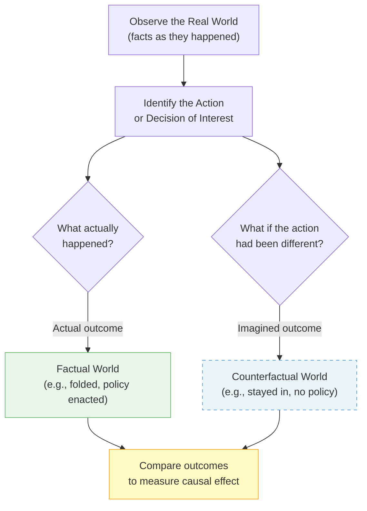
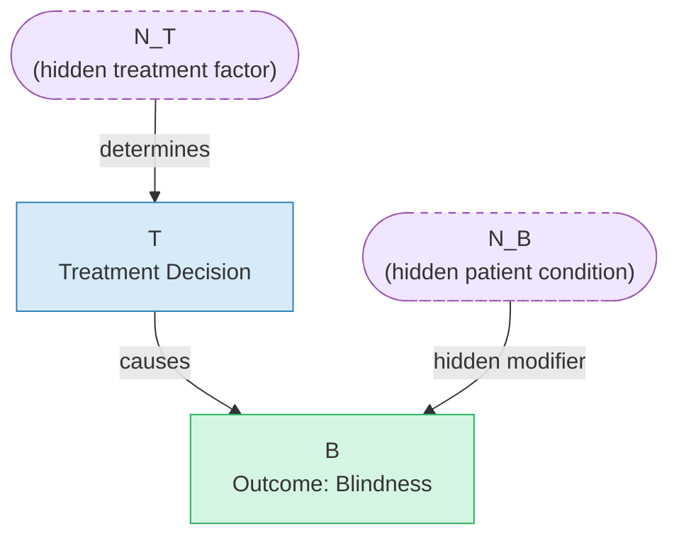
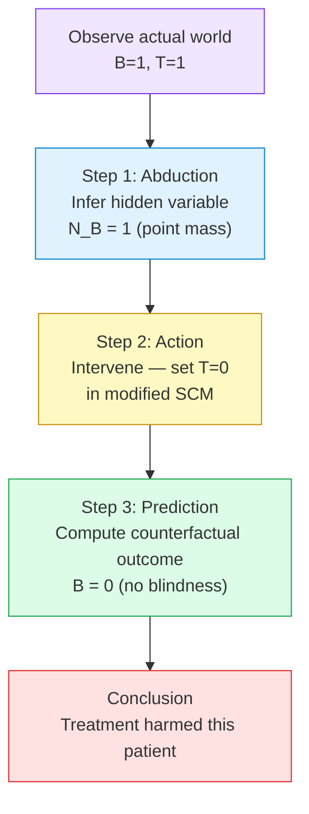
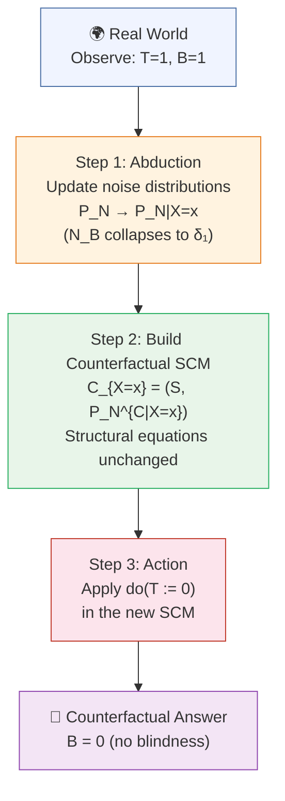
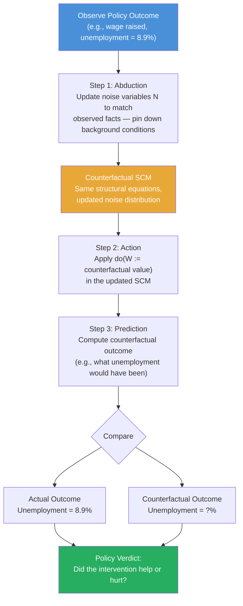

# Counterfactuals

## What If? The Power of Counterfactual Thinking

> By the end of this node, you will be able to:
>
> 1. Explain what a **counterfactual question** is and why it differs from a simple observational question.
> 2. Recognize counterfactual reasoning in everyday scenarios — from a poker hand to a policy decision.
> 3. Describe, in plain language, why counterfactual thinking is the foundation of evaluating cause and effect in economics.

It's budget season, and a government minister is defending a job-training program that cost $500 million. A critic stands up and says: "Unemployment fell by 2% after the program — that's proof it worked." But a sharp economist in the back row raises her hand: "Fell compared to _what_? Unemployment might have fallen by 3% on its own, without spending a single dollar." The room goes quiet.

That economist just asked a **counterfactual question** — and it's the most important question in all of policy evaluation. Not "what happened?" but "what _would_ have happened if we had done something different?" Without an answer to that question, you cannot know whether the program helped, hurt, or did nothing at all. This kind of thinking — imagining an alternative version of reality — is called **counterfactual reasoning**, and it sits at the very heart of causal inference.

## A Quick Reminder: What You Already Know

> **Prerequisite check:** You've already learned that _correlation is not causation_ — two things moving together doesn't mean one caused the other. Counterfactual reasoning is the tool that lets us move from noticing a pattern to actually establishing a cause. Keep that distinction in mind as we go.
>
> You've also encountered basic probability. We'll use it lightly here — mostly just the idea that outcomes can be uncertain and that new information can update what we believe.

## The Core Idea: Rewinding the Tape

A **counterfactual** is a statement about what _would have_ happened under circumstances that _did not_ actually occur. The word literally means "counter to the facts" — you take the real world as your starting point, then mentally rewind the tape and ask: what if one thing had been different?

Let's ground this with a vivid example from the world of poker (Source: ECI).

---

**The Poker Hand**

Imagine you're playing poker. You're dealt a Jack of diamonds and a 3 of diamonds. You look at your hand, decide your chances are too low, and **fold** (you stop playing). Then the dealer reveals three community cards face-up on the table — the "flop" — and they are the 4 of diamonds, the Queen of diamonds, and the 2 of diamonds.

You stare at those cards and groan: _"If I had stayed in the game, my chances would have been good."_

That groan is a **counterfactual statement** (Source: ECI). Notice what makes it special:

1. **It uses the real, observed facts.** You know exactly what cards you held and what the flop showed. This is your _evidence about the world_.
2. **It imagines a different action.** Instead of folding, you stayed in. That's the intervention — a change to what actually happened.
3. **It holds everything else constant.** The cards on the table don't change. The same flop would have appeared whether you folded or not.

This three-part structure — _observe the facts, imagine a different action, hold the rest of the world fixed_ — is the blueprint for every counterfactual question in economics.

---

**From Poker to Policy**

Now replace the poker table with a policy decision:

- **Observed facts:** A city introduced a minimum wage increase in 2019. By 2020, employment in low-wage sectors had dropped by 1%.
- **The counterfactual question:** _If the minimum wage had NOT been increased, what would employment have been in 2020?_
- **Hold the rest fixed:** Same city, same economy, same global conditions — just a different policy choice.

If employment would have dropped by 3% anyway (say, due to a recession), then the minimum wage increase actually _helped_ — it reduced the drop. If employment would have stayed flat, then the policy _caused_ the 1% decline. You cannot tell the difference without the counterfactual.

---

**The Fundamental Problem**

Here's the uncomfortable truth: **you can never directly observe a counterfactual.** Once the city raised the minimum wage, you cannot go back and observe the same city without the raise. Once you folded, you cannot un-fold. The world only runs once.

This is sometimes called the **Fundamental Problem of Causal Inference** — for any individual unit (a city, a person, a country), you observe only one version of reality. The other version — the counterfactual — must be _inferred_, not measured.

This is why causal inference is hard, and why it needs its own toolkit. The rest of this concept will build that toolkit, starting from this simple but profound idea: to understand cause and effect, you must learn to reason carefully about worlds that never happened.

_A split-screen illustration of a poker table. On the left side, labeled 'What Actually Happened,' a player's hand (Jack and 3 of diamonds) is shown face-down with a 'FOLD' stamp over it, and the flop cards (4, Queen, 2 of diamonds) are revealed on the table. On the right side, labeled 'The Counterfactual,' the same player's hand is shown active in the game, with the identical flop cards on the table and a glowing 'near-flush' hand highlighted. A dotted arrow connects the two sides with the label 'What if I had stayed in?' Clean, educational infographic style with muted blues and greens._

## Mapping the Logic

_The factual world (green) is what we observe. The counterfactual world (blue, dashed) is what we must infer. The causal effect lives in the gap between them._

## Why This Matters for Economics

Counterfactual thinking isn't just a philosophical curiosity — it is the engine that drives nearly every serious question in economic policy evaluation.

**Did the stimulus package reduce unemployment?** You need to know what unemployment would have been _without_ it. **Did the new school curriculum improve test scores?** You need to know what scores would have been _without_ the curriculum. **Did the trade tariff protect domestic jobs?** You need to know how many jobs would have existed _without_ the tariff.

In every case, the policy happened to some people or places and not others. The challenge is always the same: construct a credible picture of the counterfactual world.

The good news is that this is exactly what the rest of this learning path is about. In the nodes ahead, you'll learn:

- How **Structural Causal Models (SCMs)** give us a formal language for writing down counterfactual questions (Source: ECI).
- How the poker example maps onto a precise mathematical definition — where we _update our beliefs about the world_ using observed data, then _ask what an intervention would have done_ (Source: ECI).
- How real-world research designs like randomized experiments, difference-in-differences, and instrumental variables are all, at their core, strategies for estimating counterfactuals.

**What goes wrong without this thinking?** You end up confusing correlation with causation — the very trap your prior learning warned you about. A program that targets struggling regions will always _look_ like it failed if you just compare outcomes before and after, because those regions were already struggling. Only by asking "compared to what?" — the counterfactual question — can you see the true effect.

Counterfactual reasoning is the lens that turns data into causal knowledge. Everything else in causal inference is, in one way or another, a method for making that lens as clear as possible.

## Check Your Understanding

**1.** A government introduces a new job-training program. Afterward, unemployment falls by 2%. An economist says this is _not enough_ to conclude the program worked. What is the economist asking for?

- A) A larger sample size
- B) A counterfactual — what unemployment would have been _without_ the program
- C) A longer time period of observation
- D) A correlation coefficient between training and employment

---

**2.** In the poker example, a player folds and then sees a favorable flop. They say: "If I had stayed in, I would have won." Which of the following best describes this statement? (Source: ECI)

- A) A factual claim based on observed outcomes
- B) A correlation between card quality and winning
- C) A counterfactual — it uses observed facts but imagines a different action with the same environment
- D) A prediction about a future poker hand

---

**3.** Why is the **Fundamental Problem of Causal Inference** called "fundamental"?

- A) Because causal effects are always very large and hard to measure
- B) Because we can never observe both the factual and counterfactual outcome for the same unit at the same time
- C) Because economics data is always collected incorrectly
- D) Because correlation and causation are always the same thing

---

<strong>Show Answers</strong>

1. **B** — The economist is asking for the counterfactual: what would have happened to unemployment _without_ the program. A 2% fall could be smaller, equal to, or larger than what would have occurred naturally.

2. **C** — This is a classic counterfactual. The player uses the real observed cards (the facts) but imagines a different action (staying in), while holding the environment constant (same flop). (Source: ECI)

3. **B** — The problem is fundamental because any individual unit — a person, city, or country — can only experience one version of reality. The other version must always be inferred, never directly observed. This is the core challenge that all of causal inference is designed to address.

---

## What SCMs Give Us — and Why You Need Them

> By the end of this node, you will be able to:
>
> 1. Describe the basic structure of a Structural Causal Model (SCM) and identify its key components.
> 2. Explain what **noise variables** represent and why they are essential for capturing individual-level differences.
> 3. Read a simple causal equation and trace how an outcome is determined by a treatment and a noise variable.

You already know from everyday life that counterfactual thinking — asking "what _would_ have happened if...?" — is deeply natural. But here's the uncomfortable truth: intuition alone isn't enough. When a government economist asks "Would GDP have grown faster if we had cut interest rates last year?", they need more than a gut feeling. They need a _formal machine_ that can take real-world observations and reliably wind the clock back to explore an alternative world. That machine is called a **Structural Causal Model**, or SCM. Before we can use it to answer counterfactual questions, we need to understand what it's made of.

## A Quick Recap: What Is an SCM?

> **Prerequisite refresher:** You may not have seen SCMs before — that's okay. This section builds up the key ideas from scratch. All you need is a basic comfort with variables and simple equations.
>
> Recall that **correlation** tells us two things move together, but not _why_. Causal inference is about going further: pinning down the _mechanism_ that produces an outcome. SCMs are the formal language for doing that.

## The Core Idea: Equations, Arrows, and Hidden Factors

A **Structural Causal Model (SCM)** is essentially a set of assignment equations — one for each variable — that describe _how_ each variable is produced from its causes. Think of it like a recipe: the ingredients are the causes, and the recipe itself is the mechanism.

The simplest possible example involves just two variables:

- **T** — a treatment (e.g., a doctor administers a drug: $T=1$ means treated, $T=0$ means untreated)
- **B** — an outcome (e.g., whether a patient goes blind: $B=1$ means blind, $B=0$ means normal vision)

The causal relationship is captured by the graph $T \rightarrow B$: treatment _causes_ the outcome. But here's the critical insight — the same treatment can produce _different outcomes in different people_. Why? Because people differ in hidden ways: their genetics, their lifestyle, their biology. These hidden individual-level factors are encoded as **noise variables**.

### The SCM Equation

The formal SCM from the eye disease example (Source: ECI) is:

$$T := N_T, \quad B := T \cdot N_B + (1-T) \cdot (1 - N_B) \tag{3.5}$$

where $N_B \sim \text{Ber}(0.01)$ — a Bernoulli random variable that equals 1 with probability 1% and 0 with probability 99%.

Let's unpack this step by step.

**Step 1: What does $N_B$ represent?**

$N_B$ is the noise variable for the outcome $B$. It captures a _hidden biological condition_ that the doctor cannot observe. If $N_B = 0$ (99% of patients), the treatment works normally. If $N_B = 1$ (1% of patients), the patient has a rare condition that reverses the treatment's effect (Source: ECI).

**Step 2: Trace through the equation for a typical patient ($N_B = 0$)**

- If treated ($T=1$): $B = 1 \cdot 0 + (1-1) \cdot (1-0) = 0$ → patient is cured ✓
- If untreated ($T=0$): $B = 0 \cdot 0 + (1-0) \cdot (1-0) = 1$ → patient goes blind ✓

**Step 3: Trace through for a rare patient ($N_B = 1$)**

- If treated ($T=1$): $B = 1 \cdot 1 + (1-1) \cdot (1-1) = 1$ → patient goes blind ✗
- If untreated ($T=0$): $B = 0 \cdot 1 + (1-0) \cdot (1-1) = 0$ → patient is cured ✓

The _same treatment_ produces opposite outcomes depending on the hidden noise variable. This is exactly why noise variables matter so much.

### An Economic Analogy

Think of a job training program (T) and future earnings (B). Two workers enter the same program. One thrives; one doesn't. Why? Hidden factors — motivation, prior skills, family circumstances — play a role. In an SCM, those hidden factors are the noise variable $N_B$. The equation for earnings would encode how the program interacts with those hidden factors to produce the final outcome.

Crucially, SCMs contain _strictly more information_ than just a causal graph or a list of correlations — they encode the full mechanism, including how interventions and individual differences interact (Source: ECI). That extra information is exactly what makes counterfactual reasoning possible.

_A simple two-panel diagram. Left panel shows the causal graph with two nodes labeled T (Treatment) and B (Outcome/Blindness) connected by a single arrow from T to B. A third node labeled N_B (noise variable, drawn as a dashed circle to indicate it is hidden/unobserved) also has an arrow pointing into B. Right panel shows a small table: two rows for N_B=0 and N_B=1, two columns for T=0 and T=1, with the resulting B values filled in, illustrating how the same treatment leads to different outcomes depending on the hidden noise variable. Clean, minimal, educational style with soft colors._

## Seeing the Structure

_The causal graph $T \rightarrow B$ shows the observed relationship. Dashed nodes represent **noise variables** — hidden, unobserved factors that encode individual-level differences. $N_T$ determines the treatment independently of $N_B$, reflecting that the doctor does not know the patient's rare condition (Source: ECI)._

## Why This Matters for Policy Thinking

You might wonder: why go through all this trouble? Can't we just run an experiment and measure averages?

Averages hide individual stories — and policy often lives in those stories. Consider:

- A minimum wage increase (T) raises earnings for most workers (B), but may reduce hours for a small group with different labor market conditions ($N_B = 1$). An average effect masks this.
- A tax cut may stimulate investment for firms with easy credit access but not for cash-constrained firms. The noise variable encodes that hidden credit condition.

The SCM framework forces you to be explicit about _what you don't observe_ and _how it interacts with your policy lever_. Without noise variables, you'd have a model that pretends everyone is identical — which is almost never true in economics.

Moreover, as we'll see in the next nodes, it is precisely the noise variable that allows us to answer counterfactual questions about _specific individuals_. When we observe that a particular patient went blind after treatment ($B=1, T=1$), equation (3.5) lets us deduce that _this specific patient_ must have had $N_B = 1$ — and from there, we can calculate what would have happened under no treatment (Source: ECI). That detective-like reasoning is the heart of counterfactual inference, and it's coming up next.

## Check Your Understanding

**1.** In the SCM equation $B := T \cdot N_B + (1-T) \cdot (1 - N_B)$, what does the **noise variable** $N_B$ represent?

- A) The doctor's treatment decision
- B) A hidden individual-level factor that modifies how treatment affects the outcome
- C) The average effect of treatment across all patients
- D) A variable that is always observed in clinical data

**2.** According to the causal graph $T \rightarrow B$, which of the following statements is correct?

- A) The outcome B causes the treatment T
- B) Treatment T and outcome B are merely correlated, with no causal direction
- C) Treatment T is a cause of outcome B
- D) There is no relationship between T and B

**3.** Why do SCMs contain _more information_ than a causal graph alone?

- A) Because SCMs include more variables
- B) Because SCMs encode the structural equations and noise distributions, enabling counterfactual statements that a graph alone cannot support
- C) Because SCMs always assume linear relationships
- D) Because SCMs replace the need for any data

Show Answers

**1. B** — The noise variable $N_B$ encodes the hidden biological condition of the patient — something the doctor cannot observe — which determines whether the treatment has its normal or reversed effect (Source: ECI).

**2. C** — The arrow $T \rightarrow B$ in the causal graph means T is a direct cause of B (Source: ECI).

**3. B** — SCMs contain strictly more information than their corresponding graph and observational distribution, precisely because the structural equations and noise distributions allow counterfactual reasoning (Source: ECI).

---

## What Would Have Happened? Walking Through a Real Example

> By the end of this node, you will be able to:
>
> 1. Trace through the eye disease example step by step and explain how observing a patient's outcome lets us pin down a hidden variable.
> 2. Use the structural equation to calculate what _would have_ happened under a different treatment.
> 3. Connect this reasoning to policy evaluation — understanding why the same policy can have opposite effects on different people.

Imagine you are advising a health ministry on a new drug. The drug was administered to a patient, and the patient got worse. A journalist asks: _"Would the patient have been fine if the drug had never been given?"_ Your instinct might be to say, "We can't know — we can only observe what actually happened." But here is the surprising truth: sometimes, knowing what _did_ happen is enough to figure out what _would have_ happened. The eye disease example shows us exactly how.

## A Quick Refresher: SCMs and Noise Variables

> **Prerequisite recap:** In the previous node, we saw that a Structural Causal Model (SCM) describes the world using _assignment equations_ — recipes that say how each variable is determined by its causes and a **noise variable**. The noise variable captures everything we haven't measured: hidden traits, luck, biology. Crucially, these noise variables are what make individuals differ from one another even when they receive the same treatment. Keep that idea in mind — it's the key to everything that follows.

## Meet the Patient: Setting Up the Eye Disease Example

Let's build the scenario carefully, because the details matter.

**The setup (Example 3.4):** There is a treatment for an eye disease. For **99% of patients**, the treatment works beautifully — they are cured (no blindness). For the **remaining 1%**, the treatment has the _opposite_ effect — it causes blindness. Without treatment, this rare 1% would actually recover on their own, while the 99% majority would go blind.

The doctor doesn't know which category a patient belongs to. So the doctor's decision to treat ($T=1$) or not treat ($T=0$) is made independently of the patient's hidden biology.

This hidden biological trait is captured by a **noise variable** $N_B$, which follows a Bernoulli distribution:

$$N_B \sim \text{Ber}(0.01)$$

That means $N_B = 1$ (the rare, treatment-harming type) with probability 1%, and $N_B = 0$ (the common, treatment-helping type) with probability 99% (Source: ECI).

**The structural equation** for blindness $B$ is:

$$B := T \cdot N_B + (1-T) \cdot (1 - N_B) \tag{3.5}$$

Let's unpack this equation like a recipe:

- **If treated ($T=1$):** The equation becomes $B = 1 \cdot N_B + 0 = N_B$. So blindness equals the patient's hidden type. If $N_B=0$, no blindness. If $N_B=1$, blindness.
- **If untreated ($T=0$):** The equation becomes $B = 0 + (1-N_B) = 1 - N_B$. Now the outcome _flips_. If $N_B=0$, blindness occurs. If $N_B=1$, no blindness.

The causal graph here is simple: $T \rightarrow B$. Treatment causes the blindness outcome, mediated through the patient's hidden biology (Source: ECI).

_A clean educational diagram showing two columns labeled 'Treated (T=1)' and 'Untreated (T=0)'. Each column has two rows: one for N_B=0 (labeled '99% of patients') and one for N_B=1 (labeled '1% of patients'). In the Treated column: N_B=0 leads to 'No Blindness (B=0)' with a green checkmark; N_B=1 leads to 'Blindness (B=1)' with a red X. In the Untreated column: N_B=0 leads to 'Blindness (B=1)' with a red X; N_B=1 leads to 'No Blindness (B=0)' with a green checkmark. Minimalist, textbook-style illustration with soft colors._

## The Detective Move: Pinning Down the Hidden Variable

Now comes the crucial moment. A specific patient walks in. The doctor administers the treatment ($T=1$). The patient goes blind ($B=1$).

We have observed: $B=1$ and $T=1$.

Here's the detective question: **What does this observation tell us about $N_B$?**

Plug the observation into equation (3.5):

$$1 = 1 \cdot N_B + (1-1) \cdot (1 - N_B) = N_B$$

So $N_B = 1$. There is no ambiguity. The observation $B=T=1$ **logically forces** the conclusion that this particular patient belongs to the rare 1% group — the type for whom treatment causes harm (Source: ECI).

This is the key insight: **observing the outcome lets us update our belief about the hidden noise variable from a probability distribution to a certainty.** Before observing anything, $N_B$ was a coin flip weighted at 1%. After observing $B=T=1$, we know with certainty that $N_B=1$ for this patient. In technical language, the distribution of $N_B$ **collapses to a point mass** at 1, written $\delta_1$ (Source: ECI).

Think of it like a Sudoku puzzle. Before you fill in any squares, many numbers are possible. But once you observe enough of the board, some squares become forced — there's only one number that could fit. The observation $B=T=1$ is like filling in enough squares to force $N_B=1$.

## Answering the Counterfactual: What If There Had Been No Treatment?

Now we can answer the counterfactual question: _"What would have happened if the doctor had NOT administered the treatment ($T=0$)?"_

We now have a **modified SCM** — the same structural equations, but with the noise variables fixed at what we learned from the observation (Source: ECI):

$$\text{Modified SCM: } T := 1,\quad B := T \cdot 1 + (1-T) \cdot (1-1) = T \tag{3.6}$$

In this modified model, $N_B$ is no longer uncertain — it is locked at 1. Now we intervene: set $T=0$ (the counterfactual treatment).

Plugging $T=0$ and $N_B=1$ into equation (3.5):

$$B = 0 \cdot 1 + (1-0) \cdot (1-1) = 0$$

So $B=0$: **no blindness**. Had this specific patient not been treated, they would have kept their vision.

This is a striking and counterintuitive result. The treatment — which helps 99% of patients — actually _harmed_ this particular patient. And we can say this with confidence, not just as a population average, but as a statement about _this individual_, because we used the observation to identify their hidden type.

**The three-step recipe for counterfactual reasoning:**

1. **Observe** the actual outcome and treatment: $B=1, T=1$.
2. **Infer** the hidden noise variable: $N_B=1$ (the observation pins it down).
3. **Intervene** in the modified SCM: set $T=0$, compute the new outcome: $B=0$.

Note something important: we only updated the _noise distributions_ — we did not change the structural equations themselves. The recipe for how the world works stays the same; we just learned something new about this patient's hidden biology (Source: ECI).

## The Three Steps at a Glance

_The three-step process for counterfactual reasoning: first use the observation to infer the hidden noise variable (abduction), then intervene in the modified model (action), then compute the new outcome (prediction). This sequence — sometimes called the "abduction-action-prediction" framework — is the engine behind all individual-level causal claims._

## Why This Matters for Policy

You might be thinking: "This is a medical example — what does it have to do with economics?" The connection is deep.

Consider a job training program. On average, it raises wages. But for some workers — perhaps those who already had strong informal skills — the program might actually crowd out better opportunities they would have pursued on their own. If a specific worker's wages _fell_ after the program, a policymaker might ask: _"Would this worker have been better off without the program?"_ The eye disease logic applies directly.

Without the SCM framework, you're stuck with population averages. You can say "the program helps most people" but you cannot say anything about _this_ individual. With the counterfactual machinery, if you can observe enough about the individual's outcome and infer their hidden type, you can make individual-level causal claims.

This is also why **noise variables** are not just a mathematical convenience — they represent the real heterogeneity among people. Different workers, patients, and firms respond differently to the same policy. Counterfactual reasoning is the tool that lets us move from "what works on average" to "what happened to this person and why" (Source: ECI).

The broader lesson: SCMs contain strictly more information than graphs and probability distributions alone. Counterfactual statements — like the one we just made about the eye disease patient — are only possible because the SCM encodes the full structural story, including noise variables (Source: ECI). This is why, as you move forward in causal inference, the SCM framework is so powerful for policy evaluation.

## Check Your Understanding

**1.** In the eye disease example, a patient is treated ($T=1$) and goes blind ($B=1$). Using equation (3.5), what can we conclude about $N_B$?

- A) $N_B = 0$, because most patients respond well to treatment
- B) $N_B = 1$, because the observation logically forces this value
- C) $N_B$ remains uncertain — we cannot determine it from the observation
- D) $N_B = 0.01$, reflecting the prior probability

---

**2.** When constructing the counterfactual SCM (after observing $B=T=1$), what exactly do we change?

- A) The structural equations — we rewrite the assignment formulas
- B) The causal graph — we remove the arrow from $T$ to $B$
- C) Only the noise distributions — we fix $N_B=1$ while keeping the equations the same
- D) Both the structural equations and the noise distributions

---

**3.** In the counterfactual scenario where $T=0$ and $N_B=1$, what is the predicted value of $B$?

- A) $B=1$ (still blind), because the patient's biology is harmful
- B) $B=0$ (no blindness), because without treatment the rare type recovers
- C) $B=0.01$, reflecting the probability of the rare type
- D) $B$ is undefined — we cannot compute counterfactuals for individuals

<strong>Reveal Answers</strong>

**1. B** — Plugging $T=1$ and $B=1$ into equation (3.5) gives $1 = N_B$, so $N_B$ must equal 1. The observation collapses the distribution to a **point mass** at 1. (Source: ECI)

**2. C** — We only update the **noise distributions**. The structural equations themselves do not change — they represent the stable causal mechanism of the world. What changes is our knowledge about this patient's hidden variable. (Source: ECI)

**3. B** — With $N_B=1$ and $T=0$: $B = 0 \cdot 1 + (1-0)(1-1) = 0$. The patient would have kept their vision. This is the counterfactual outcome. (Source: ECI)

---

## What If We Could Rewind the Tape?

> By the end of this node, you will be able to:
>
> 1. Explain how observing real-world data lets us "pin down" the hidden noise in an SCM.
> 2. Describe the two-step process of building a counterfactual SCM: updating noise distributions, then applying an intervention.
> 3. Recognize why the structural equations themselves never change when we condition on observations.

Imagine you are a policy analyst reviewing a job-training program. One participant — let's call her Maria — enrolled in the program and, six months later, is still unemployed. Your boss asks: _"Would Maria have found a job if she had NOT enrolled?"_ This is not a question about averages across thousands of people. It is a question about _this specific person_, given everything you already know about her outcome. To answer it, you cannot simply run the program again — the past is fixed. But if you have a model of how the world works, you can do something remarkable: use what you _observed_ to sharpen your picture of Maria's hidden circumstances, and then mentally "rewind the tape" and play it forward under a different policy. That is exactly what a counterfactual SCM lets you do.

## A Quick Refresher: SCMs and Their Hidden Variables

> **Prerequisite recap:** An SCM (Structural Causal Model) consists of two ingredients: (1) a set of **structural equations** that describe _how_ each variable is determined by its causes and a **noise variable**, and (2) a **probability distribution over those noise variables**. The noise variables capture everything the model does not explicitly measure — luck, unobserved traits, random shocks. Crucially, an SCM lets us do more than observe correlations: it lets us simulate _interventions_ (do-statements) by surgically replacing one equation while leaving the rest intact. If this feels unfamiliar, a quick review of the previous node on SCMs will help before continuing.

## The Core Idea: Pinning Down the Noise

When something happens in the real world, it is not purely random — it is the result of specific (if unknown) circumstances. In an SCM, those circumstances are encoded in the **noise variables**. Observing an outcome is like finding a clue that tells you which value the noise variable must have taken.

### Step 1 — Condition on What You Saw

The first step in building a **counterfactual SCM** is to update the distribution of the noise variables to be consistent with your observation. Formally, if you observe $X = x$, you replace the original noise distribution $P_N$ with the **conditional distribution** $P_{N \mid X = x}$. This is just Bayesian updating: you started with a prior over possible hidden states of the world, and the observation is your evidence.

Definition 6.17 makes this precise (Source: ECI): given an SCM $\mathcal{C} := (S, P_N)$ and some observations $x$, the **counterfactual SCM** is:
$$\mathcal{C}_{X=x} := (S,\; P_N^{\mathcal{C}\mid X=x})$$
where $P_N^{\mathcal{C}\mid X=x} := P_{N \mid X=x}$. Notice what changed and what did not: the **structural equations** $S$ are identical — only the noise distribution is updated (Source: ECI).

### Step 2 — Ask Your "What If" Question as a Do-Statement

Once you have the counterfactual SCM, a counterfactual question becomes an ordinary intervention question. You simply apply a $\text{do}(\cdot)$ operator inside the updated SCM. The magic is that the updated noise distribution now reflects the specific individual or situation you observed, so the intervention plays out in _their_ world, not an average world (Source: ECI).

### The Eye Disease Example, Step by Step

Let's walk through the concrete example from the textbook (Source: ECI). The SCM is:
$$T := N_T, \qquad B := T \cdot N_B + (1-T)(1 - N_B) \tag{3.5}$$
where $N_B \sim \text{Ber}(0.01)$ (only 1% of patients have the rare condition) and $N_T$ is the doctor's independent treatment decision.

**What we observe:** A patient receives treatment ($T=1$) and goes blind ($B=1$).

**What this tells us about the noise:** Plug $T=1$ and $B=1$ into equation (3.5):
$$1 = 1 \cdot N_B + (1-1)(1-N_B) = N_B$$
So $N_B$ must equal 1. The observation collapses the entire distribution of $N_B$ to a **point mass** at 1 (written $\delta_1$). Similarly, $T=1$ tells us $N_T = 1$, so that distribution also collapses to $\delta_1$.

**The counterfactual SCM** (Equation 3.6, Source: ECI) is then:
$$\mathcal{C}\mid_{B=1, T=1}: \quad T := 1, \quad B := T \cdot 1 + (1-T)(1-1) = T$$

Now ask: _What would have happened if the doctor had instead given no treatment, $\text{do}(T := 0)$?_

Substitute $T=0$ into the updated equation:
$$B = 0 \cdot 1 + (1-0)(1-1) = 0$$

The answer: the patient would **not** have gone blind. Because we know this particular patient has the rare condition ($N_B = 1$), withholding treatment would have saved their sight. This is a deeply counterintuitive result — the treatment that helps 99% of patients was exactly wrong for this individual — and it is only discoverable because we used the observation to pin down the noise.

### The Poker Analogy

Think of it like a poker hand (Source: ECI). You folded early, but then you saw the community cards and realized you would have had a winning hand. Your statement — "If I had stayed in, I would have won" — uses the _observed cards_ (the facts) to fix the hidden state of the world, and then imagines a different action (staying in) within that fixed world. The deck is the same; only your decision changes. That is precisely the structure of a counterfactual SCM.

_A two-panel diagram. Left panel labeled 'Step 1: Update the Noise' shows a probability distribution bar chart for N_B with most mass near 0, then an arrow pointing to a new chart with all mass at N_B=1, labeled 'After observing B=T=1'. Right panel labeled 'Step 2: Apply the Intervention' shows the updated structural equation B=T with a do(T:=0) arrow leading to the result B=0. Clean, minimal, educational style with muted colors and clear annotations._

## Seeing the Structure: The Three-Step Counterfactual Process

_The three-step counterfactual recipe: observe the world (Abduction), build the updated SCM (keeping equations intact), then ask your "what if" question as a do-statement. The structural equations $S$ pass through unchanged — only the noise distribution is modified in Step 2._ (Source: ECI)

## Why This Matters for Policy Evaluation

### The Bigger Picture

In economics and policy work, the most important questions are almost always counterfactual: _Would this student have graduated without the scholarship? Would this neighborhood have seen less crime without the policing program? Would Maria have found a job without the training?_ Average treatment effects tell you what works _on average_, but policymakers and judges often need to reason about specific cases.

The formal machinery you just learned — conditioning on observations to update noise distributions, then applying an intervention — is the rigorous foundation for all such reasoning. Without it, you might naively assume that what is true on average applies to every individual, which can lead to badly wrong conclusions (like recommending a treatment that helps 99% of people but harms the specific patient in front of you).

Notice also the key insight that the **structural equations never change** (Source: ECI). This reflects a deep philosophical commitment: the _laws_ governing how the world works (supply and demand, how training affects skills, how diseases respond to treatment) are stable. What changes when you observe something is only your _knowledge_ of the hidden state of the world. Separating "laws" from "initial conditions" is what makes counterfactual reasoning coherent rather than arbitrary.

In the next and final node of this concept, you will see how to pull all of this together — abduction, action, and prediction — into a complete, end-to-end counterfactual analysis, and you will practice applying it to a real policy scenario.

## Check Your Understanding

**1.** When you build a counterfactual SCM by conditioning on observations, what exactly changes?

- A) The structural equations are rewritten to reflect the new scenario.
- B) The noise distributions are updated, while the structural equations stay the same.
- C) Both the structural equations and the noise distributions are updated.
- D) Only the causal graph (the arrows) is modified.

**2.** In the eye disease example, the patient received treatment ($T=1$) and went blind ($B=1$). After conditioning on this observation, what happens to the distribution of $N_B$?

- A) It remains $\text{Ber}(0.01)$, unchanged.
- B) It shifts to $\text{Ber}(0.5)$, reflecting maximum uncertainty.
- C) It collapses to a point mass at $N_B = 1$ (i.e., $\delta_1$).
- D) It collapses to a point mass at $N_B = 0$ (i.e., $\delta_0$).

**3.** According to Definition 6.17, a counterfactual statement in the updated SCM $\mathcal{C}_{X=x}$ is formally equivalent to:

- A) A correlation computed from observational data.
- B) A do-statement (intervention) applied inside the counterfactual SCM.
- C) A new structural equation replacing the old one.
- D) A regression coefficient from a linear model.

<strong>Show Answers</strong>

**1. B** — The structural equations $S$ are kept intact; only the noise distribution is replaced by the conditional $P_{N \mid X=x}$. This is the central mechanic of Definition 6.17 (Source: ECI).

**2. C** — Plugging $T=1, B=1$ into equation (3.5) forces $N_B = 1$, so the distribution collapses entirely to $\delta_1$. This is how the observation "pins down" the hidden state of the world (Source: ECI).

**3. B** — Definition 6.17 states that counterfactual statements can be seen as do-statements in the counterfactual SCM $\mathcal{C}_{X=x}$ (Source: ECI). The observation updates the noise; the "what if" question is then an intervention on top of that updated model.

---

## Counterfactuals in Policy Evaluation: Why This Matters for Economics

> By the end of this node, you will be able to:
>
> 1. Explain why policy evaluation is fundamentally a counterfactual problem — and why that makes it hard.
> 2. Describe how a Structural Causal Model (SCM) answers counterfactual policy questions by updating noise distributions and then applying an intervention.
> 3. Articulate why SCMs are uniquely powerful for policy analysis compared to graphs or correlations alone.

It's 2009. Congress has just passed a stimulus package worth $787 billion. Two years later, the unemployment rate is 8.9%. Was the stimulus a success or a failure?

Here's the uncomfortable truth: you cannot answer that question just by looking at the unemployment rate. To judge the policy, you need to know what unemployment _would have been_ without the stimulus — and that world never happened. You can't run the economy twice, once with the stimulus and once without, and compare the results. This is the fundamental challenge of policy evaluation, and it has haunted economists for generations.

This is not just a data problem. It is a _conceptual_ problem. And it turns out, the tools we've been building throughout this concept — Structural Causal Models and counterfactual reasoning — are precisely designed to tackle it.

## A Quick Reminder: What We've Built So Far

> **Prerequisite refresher:** An **SCM (Structural Causal Model)** consists of a set of structural equations and a set of noise (background) variables. Each variable in the system is determined by a function of its causes plus a noise term. To answer a counterfactual, we do three things: (1) **Abduction** — use the observed facts to pin down the noise variables; (2) **Action** — intervene on the model using a $do(\cdot)$ operation; (3) **Prediction** — compute what the outcome would be in this updated world. We saw this in detail with the eye disease example in the previous node.

## The Policy Question as a Counterfactual

Let's make the abstract concrete. Suppose a city raises its minimum wage from \$10 to \$15 per hour. Six months later, you observe that unemployment among low-wage workers has risen by 2 percentage points. A critic says the wage hike caused the unemployment spike. A supporter says unemployment would have risen even _more_ without the wage hike, because the broader economy was already contracting.

Who is right? To answer, you need to ask: _"What would unemployment have been if the minimum wage had NOT been raised?"_ That is a **counterfactual question** — a question about a world that diverges from the one we actually observed.

Notice the structure of this question. It has two parts:

1. **The observed facts**: The minimum wage was raised. Unemployment rose by 2 points.
2. **The hypothetical intervention**: What if the wage had stayed at \$10?

This is exactly the structure of a counterfactual as defined formally: we incorporate observed data into the model, and then analyze an intervention distribution in which the rest of the environment remains unchanged (Source: ECI). The "rest of the environment" — the broader economic conditions, worker skill levels, firm productivity — is captured by the noise variables in the SCM.

### The Three-Step Recipe Applied to Policy

Let's walk through the logic using a simplified SCM. Imagine the economy has two key variables:

- $W$ = minimum wage level (the policy lever)
- $U$ = unemployment rate among low-wage workers

And there is a background noise variable $N_U$ that captures everything else affecting unemployment: the business cycle, automation trends, consumer demand, and so on.

The structural equation might look like:
$$U := f(W, N_U)$$

This says unemployment is determined by the wage level _and_ all the background economic forces.

**Step 1 — Abduction (What do the facts tell us about the background?):**
We observe $W = 15$ and $U = 0.089$ (8.9% unemployment). Using the structural equation, we can infer what value of $N_U$ is consistent with these observations. In other words, we update our beliefs about the background economic conditions — how bad was the underlying economy, independent of the wage policy? This is exactly what conditioning on observations does: it updates the distribution over noise variables (Source: ECI).

**Step 2 — Action (Apply the counterfactual intervention):**
Now we construct the **counterfactual SCM** — the updated model where $N_U$ is fixed at the value we just inferred (reflecting the actual background conditions), but we intervene to set $W = 10$ instead. Formally, this is a $do(W := 10)$ operation in the updated SCM (Source: ECI).

**Step 3 — Prediction (What would have happened?):**
We compute $U$ in this counterfactual world. If the model tells us $U$ would have been 0.095 (9.5%), then the wage hike actually _reduced_ unemployment relative to the counterfactual — the supporter was right. If it tells us $U$ would have been 0.075 (7.5%), the critic was right.

The key insight: **the noise variable $N_U$ is held fixed** between the real world and the counterfactual world. This is what makes the comparison valid — we're asking what would have happened to _this specific economy_, with _these specific background conditions_, under a different policy. We're not comparing two different economies; we're comparing two versions of the same economy.

_A split-screen diagram showing two parallel economic timelines. On the left (labeled 'Actual World'): a policy lever showing minimum wage = $15, an arrow pointing to unemployment = 8.9%, and a background cloud labeled 'Economic conditions (N_U = inferred value)'. On the right (labeled 'Counterfactual World'): the same background cloud with the same N_U value, but the policy lever shows minimum wage = $10, and a question mark next to unemployment. A bold arrow labeled 'Same background conditions' connects the two clouds. Clean, educational infographic style with blue and orange color scheme._

## Why SCMs — Not Just Graphs or Regressions — Are the Right Tool

At this point you might wonder: can't we just run a regression of unemployment on the minimum wage? Or draw a causal graph and call it a day?

The short answer is: graphs and regressions get you partway there, but not all the way.

**What a causal graph gives you:** A graph like $W \rightarrow U$ tells you that the minimum wage causally affects unemployment. It can help you identify which variables to control for and which interventions are identifiable from data. This is genuinely useful.

**What a causal graph _cannot_ give you:** A graph alone cannot answer the counterfactual question "What would THIS city's unemployment have been under a different wage?" To answer that, you need to know the _functional form_ of how $W$ affects $U$, and you need to be able to pin down the background conditions $N_U$ from the observed data. That requires the full structural equations — the SCM.

Formally, SCMs contain strictly more information than their corresponding graph and the family of all intervention distributions together (Source: ECI). Counterfactual statements are part of that extra information — they live at a level of causal reasoning that graphs alone simply cannot reach.

**What a regression gives you:** A regression can estimate the _average_ effect of raising the minimum wage across many cities or time periods. That's valuable for policy design on average. But it cannot tell you what happened in _this specific city_, in _this specific economic climate_. The counterfactual SCM framework, by fixing the noise variables to match observed conditions, gives you individual-level (or situation-specific) counterfactual answers.

Think of it this way: a regression is like asking "On average, how do patients respond to this drug?" An SCM counterfactual is like asking "Given that _this patient_ went blind after treatment, what would have happened if we hadn't treated them?" — exactly the eye disease question from the previous node (Source: ECI). Policy evaluation often needs the latter kind of answer.

## The Landscape of Counterfactual Policy Reasoning

_The three-step counterfactual pipeline applied to policy evaluation: abduction pins down background conditions from observed data, action applies the hypothetical policy change, and prediction computes what would have happened — enabling a principled policy verdict._

## Why This Matters: The Bigger Picture

Counterfactual reasoning is not just an academic exercise — it is the backbone of nearly every serious policy evaluation method in economics.

When economists use **difference-in-differences** (comparing treated and control regions before and after a policy), they are implicitly constructing a counterfactual: the control region stands in for "what the treated region would have looked like without the policy." When they use **regression discontinuity** (comparing people just above and below an eligibility threshold), they are asking: what would have happened to people just above the threshold if they had fallen just below it?

All of these methods are attempts to approximate the counterfactual that the SCM framework makes explicit and rigorous. Understanding the SCM foundation helps you see _why_ these methods work when they do, and _when_ they break down — for instance, when the control group doesn't actually share the same background conditions as the treated group (i.e., when $N_U$ differs between them).

More broadly, the SCM framework clarifies something profound: **correlation is not enough, graphs are not enough, even average treatment effects are not enough** for some of the most important policy questions. When a city asks "Did our specific housing policy reduce our specific homelessness rate?" — that is an individual counterfactual, and only the full SCM machinery can answer it rigorously.

You've now completed the full arc of counterfactual reasoning: from the intuitive "what if" of everyday life, through the formal structure of SCMs, through worked examples like the eye disease case, to the policy questions that motivate the entire enterprise. The tools you've built here — abduction, action, prediction — are the same tools that researchers use to evaluate minimum wage laws, job training programs, tax reforms, and public health interventions. That's not a small thing.

## Check Your Understanding

**1.** A government implements a job training program. Afterward, participants' wages are higher than before. An economist wants to know: "Would these participants' wages have risen anyway, even without the program?" This question is best described as:

a) A correlation question, answerable by computing the wage-program correlation  
b) A counterfactual question, requiring reasoning about an unobserved alternative world  
c) An intervention question, answerable by a simple $do(\cdot)$ operation on the original SCM  
d) A prediction question about future wages

---

**2.** In the SCM counterfactual framework, what is the purpose of the **abduction** step in policy evaluation?

a) To intervene on the policy variable and set it to a new value  
b) To use observed outcomes to infer the background conditions (noise variables) that were present  
c) To draw the causal graph connecting policy variables to outcomes  
d) To compute the average treatment effect across many observations

---

**3.** Why can a causal graph alone NOT fully answer a counterfactual policy question like "What would this city's unemployment have been without the wage hike?"

a) Because causal graphs only apply to medical, not economic, contexts  
b) Because causal graphs do not include time as a variable  
c) Because causal graphs lack the structural equations and noise variable information needed to pin down background conditions and compute individual counterfactuals  
d) Because causal graphs can only represent correlations, not causal relationships

---

<strong>Reveal Answers</strong>

**1. Answer: b)** The question asks about an unobserved alternative world — what wages would have been _without_ the program. That is the defining feature of a counterfactual question. A simple $do(\cdot)$ on the original SCM (option c) would give an interventional distribution, but not the individual-level counterfactual that accounts for the specific background conditions of these participants.

**2. Answer: b)** Abduction is the step where we use observed data (the actual policy outcome) to update our beliefs about the noise variables — the background economic conditions. This pins down "what kind of economy we were actually in," which is essential for making the counterfactual comparison fair. (Source: ECI)

**3. Answer: c)** Formally, SCMs contain strictly more information than their corresponding graph and the family of all intervention distributions (Source: ECI). Counterfactual statements require the structural equations (to compute outcomes) and the noise variables (to capture background conditions). A graph tells you the causal structure but not the functional relationships or background state needed for individual counterfactuals.

---
