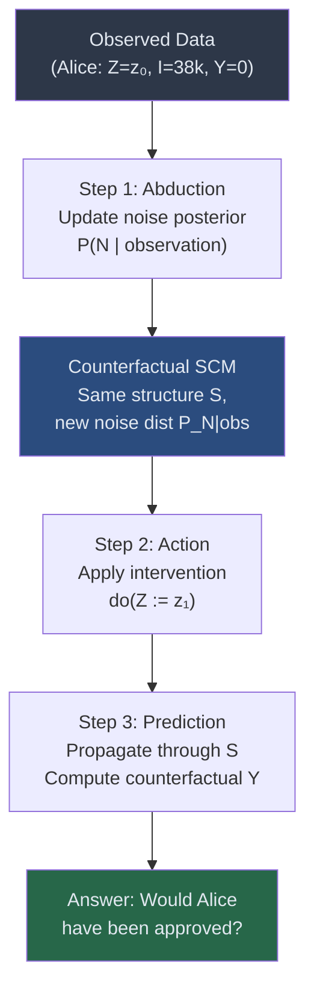
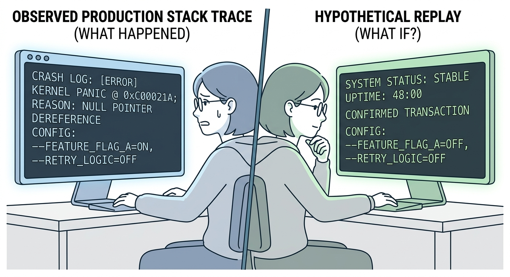
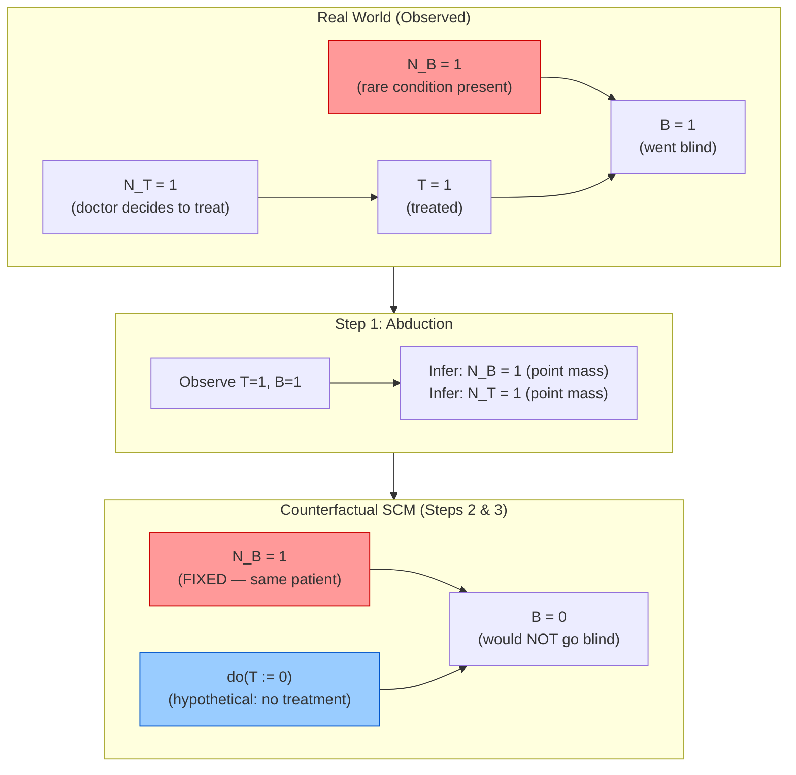
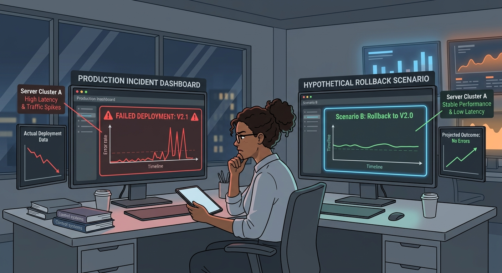
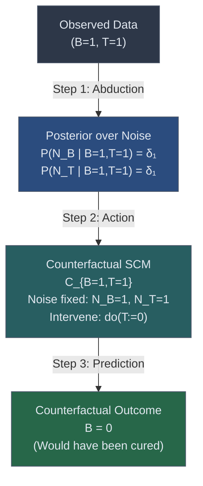
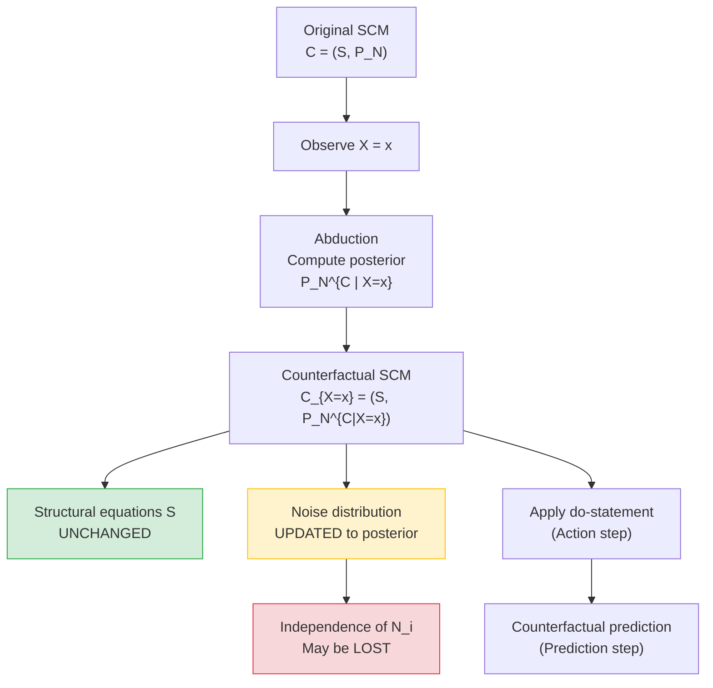
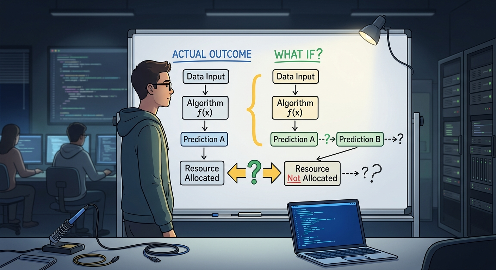
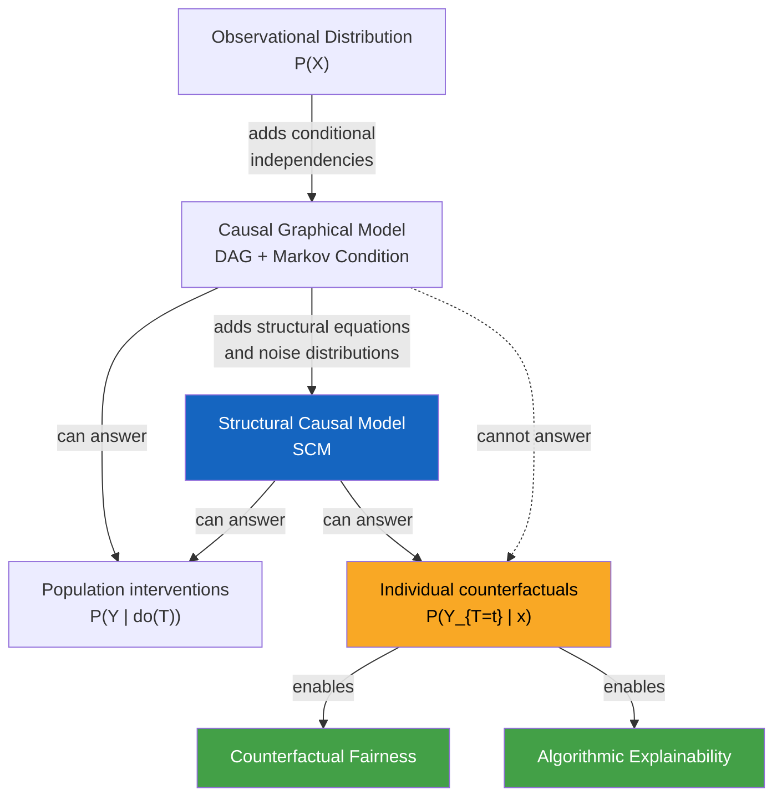

# Counterfactuals

## The 'What If' Problem in Algorithmic Decisions

> By the end of this node, you will be able to:
>
> 1. Articulate why standard probabilistic conditioning and do-operator interventions are insufficient to answer individual-level 'what if' questions about algorithmic decisions.
> 2. Distinguish between observational queries, interventional queries, and counterfactual queries in the context of ML fairness and explainability.
> 3. Explain, at a conceptual level, how an SCM enables counterfactual reasoning by updating noise distributions conditioned on observed facts.

A loan applicant is denied credit by your bank's ML model. She is told the decision was based on her credit history, income, and zip code. She asks a pointed question: _'Would I have been approved if I lived in a different zip code?'_ Your model has no answer. It was never designed to answer that question.

Now consider a hiring algorithm that ranked a candidate poorly. An auditor asks: _'Would this candidate have been ranked higher if their name had indicated a different gender?'_ Again, silence. The model can tell you the probability that a candidate with certain features gets hired. It can even tell you what would happen if you _intervened_ and set the gender field to a different value across the entire population. But it cannot tell you, about _this specific candidate, with this specific résumé and this specific history_, what would have happened in a different world.

This is the **counterfactual gap** — and closing it is essential for building ML systems that are not just accurate, but auditable, fair, and explainable.

## Prerequisite Snapshot: SCMs in Brief

> **Quick recap — Structural Causal Models (SCMs):** An SCM $\mathcal{C} := (\mathcal{S}, P_N)$ consists of a set of structural assignments $\mathcal{S}$ (each variable defined as a deterministic function of its parents and a noise variable) and a joint distribution $P_N$ over the noise variables $N$. The causal graph is derived from $\mathcal{S}$: draw an edge $X_i 	o X_j$ whenever $X_i$ appears in the assignment for $X_j$. The noise variables $N_i$ capture all unobserved, exogenous randomness affecting each variable. This structure is what makes counterfactual reasoning possible — as you will see shortly, the noise variables are the 'fingerprint' of an individual unit.

## Three Levels of Causal Questions

Before we can appreciate why counterfactuals are special, we need to be precise about the three qualitatively different types of questions a causal reasoner can ask. These correspond to three distinct operations on a causal model.

**Level 1 — Observational (Association):** _What is the probability that a loan applicant with income $X = x$ is approved?_ This is pure conditional probability: $P(Y = 1 \mid X = x)$. No causal machinery needed — a well-trained classifier already answers this.

**Level 2 — Interventional (do-operator):** _If we were to set every applicant's zip code to a high-income area, what would the approval rate be?_ This is $P(Y = 1 \mid do(Z := z))$, computed by surgically replacing the structural assignment for $Z$ and propagating forward. This is the language of A/B tests and policy interventions — it asks about a _population-level_ change. (Source: ECI)

**Level 3 — Counterfactual:** _Given that this specific applicant, Alice, was denied with her actual features, would she have been approved if her zip code had been different?_ This question is fundamentally different. It is not about a population. It is about a **specific individual** whose outcome we have already observed, asking what would have happened under a different condition — in the _same world_, with the same background noise.

The critical insight is that Level 3 is strictly more demanding than Levels 1 and 2. You cannot answer it with a classifier alone, nor with a do-operator applied to a causal graph. You need an SCM — specifically, you need to reason about the **noise variables** that characterize the individual. (Source: ECI)

![A three-row table rendered as a visual ladder. Row 1 labeled 'Association' shows a standard ML model with an input-output arrow. Row 2 labeled 'Intervention (do)' shows a causal graph with a node being surgically cut from its parents and set to a fixed value, affecting the whole population distribution. Row 3 labeled 'Counterfactual' shows a split timeline: the left branch is the observed world (Alice denied), the right branch is the hypothetical world (Alice approved), with a shared 'noise fingerprint' icon connecting both branches to indicate the same individual.](imgs/img_01.png)

### Why the do-Operator Isn't Enough

Suppose your hiring model's causal graph has the structure:

$$\text{Experience} \to \text{Score} \leftarrow \text{Demographics}$$

The do-operator intervention $do(\text{Demographics} := d')$ asks: _across all candidates, what would the score distribution look like if we forced demographics to $d'$?_ This is a population-level redistribution. It does not tell you about the specific candidate Bob, who has a particular work history, a particular set of unobserved qualities (captured by noise variables), and who received a score of 42.

The counterfactual question — _'What would Bob's score have been if his demographics had been $d'$?'_ — requires us to hold Bob's noise variables fixed at the values implied by his observed data, and then re-run the model under the hypothetical. (Source: ECI)

Formally, this is a two-step process:

**Step 1 — Abduction:** Use the observation $(\text{Score} = 42, \text{Demographics} = d, \text{Experience} = e)$ to infer the posterior distribution over Bob's noise variables:
$$P_N^{\mathcal{C} \mid \text{obs}} := P_{N \mid \text{Score}=42,\, \text{Demographics}=d,\, \text{Experience}=e}$$

**Step 2 — Action + Prediction:** Construct the **counterfactual SCM** by replacing the noise distribution with this updated posterior, then apply the intervention $do(\text{Demographics} := d')$ and compute the resulting score. (Source: ECI)

Definition (Counterfactual SCM): Given an SCM $\mathcal{C} := (\mathcal{S}, P_N)$ and an observation $\mathbf{x}$, the counterfactual SCM is

$$\mathcal{C}_{\mathbf{X}=\mathbf{x}} := (\mathcal{S},\; P_N^{\mathcal{C} \mid \mathbf{X}=\mathbf{x}}) \quad \text{(Equation 1)}$$

where $P_N^{\mathcal{C} \mid \mathbf{X}=\mathbf{x}} := P_{N \mid \mathbf{X}=\mathbf{x}}$. Crucially, the structural assignments $\mathcal{S}$ are _unchanged_ — only the noise distributions are updated. Counterfactual statements are then do-statements in this new SCM. (Source: ECI)

### A Concrete Algorithmic Walkthrough

Let's make this concrete with a minimal credit-scoring SCM. Suppose:

- $Z$ = zip code (exogenous, drawn from noise $N_Z$)
- $I$ = income, assigned as $I := f(Z, N_I)$ — income depends on zip code and individual noise
- $Y$ = loan decision, assigned as $Y := \mathbf{1}[I > \theta + N_Y]$ — approved if income exceeds a threshold perturbed by noise

Alice is observed: $Z = z_0$ (low-income zip), $I = 38{,}000$, $Y = 0$ (denied).

**Observational answer:** $P(Y=1 \mid Z=z_0) = 0.3$. Not useful for Alice individually.

**Interventional answer:** $P(Y=1 \mid do(Z := z_1)) = 0.65$. This tells us about a hypothetical population where everyone is reassigned to zip $z_1$. Still not about Alice.

**Counterfactual answer:** Given Alice's observation, we infer her noise fingerprint: the specific value of $N_I$ (her individual earning capacity net of zip effects) and $N_Y$ (her individual risk profile net of income). We then ask: in a world where $Z = z_1$ but Alice's noise variables remain at their inferred values, what is $Y$? This is the answer that matters for individual fairness analysis.

## The Structure of Counterfactual Reasoning

The diagram below captures the three-step process — Abduction, Action, Prediction — that underlies every counterfactual query in an SCM.

_The three-step counterfactual engine: Abduction pins down the individual's noise fingerprint from observed data; Action applies the hypothetical intervention to the counterfactual SCM; Prediction reads off the outcome. The key distinction from a pure do-operator query is Step 1 — the noise variables are individualized, not marginalized over._

## Why This Matters for ML Fairness and Explainability

The counterfactual framework is not an academic curiosity — it is the formal foundation for several of the most important concepts in algorithmic fairness and model explainability.

**Counterfactual fairness** (a concept you will formalize in later nodes) defines a model as fair toward an individual if its decision would be the same in a counterfactual world where the individual's protected attribute (race, gender, zip code as a proxy) had been different, holding everything else about that individual constant. This definition is _only_ coherent at the counterfactual level — it cannot be expressed using conditional probabilities or do-operators alone, because both of those operate on populations, not individuals. (Source: ECI)

**Algorithmic recourse** — the problem of telling a denied applicant what they could change to get approved — is also inherently counterfactual. 'If you had a credit score 50 points higher, you would have been approved' is a counterfactual statement about the same individual.

**LIME and SHAP explanations**, while not always framed this way, implicitly approximate counterfactual reasoning by perturbing inputs and observing output changes. The SCM framework gives these heuristics a rigorous foundation and reveals where they can go wrong (e.g., when perturbing one feature while ignoring its causal relationship to others).

Without counterfactual reasoning, you are limited to asking 'what kinds of people get approved?' You cannot ask 'would _this person_ have been treated differently?' — and that is precisely the question that matters for individual justice, regulatory compliance, and building systems people can trust.

In the next nodes, we will formalize the SCM machinery needed to compute counterfactuals, explore identifiability (when can we compute counterfactuals from data alone?), and apply this to concrete fairness metrics.

## Check Your Understanding

**1.** A data scientist computes $P(\text{Hired} = 1 \mid do(\text{Gender} := \text{female}))$ using a causal graph. This is an example of:

A) An observational query
B) A counterfactual query
C) An interventional query
D) A noise abduction step

**2.** What is the key structural difference between a counterfactual SCM $\mathcal{C}_{\mathbf{X}=\mathbf{x}}$ and the original SCM $\mathcal{C}$?

A) The causal graph topology changes to reflect the observed data
B) The structural assignments $\mathcal{S}$ are replaced with new ones fitted to the observation
C) Only the noise distributions are updated; the structural assignments remain unchanged
D) All noise variables are marginalized out, leaving a deterministic model

**3.** Alice was denied a loan ($Y=0$) with features $(Z=z_0, I=38k)$. An auditor wants to know: _'Would Alice have been approved if she had lived in zip code $z_1$?'_ Why can't this question be answered by a standard trained classifier or a do-operator intervention alone?

A) Because classifiers cannot handle zip code features
B) Because the do-operator and classifiers operate at the population level and cannot pin down Alice's individual noise fingerprint
C) Because counterfactual questions require more training data
D) Because interventions on zip code are not causally valid

Show Answers

**1. C** — Computing $P(Y \mid do(X := x))$ is an interventional (Level 2) query. It asks about a population under a forced intervention, not about a specific individual's observed history.

**2. C** — By Definition (Equation 1), the counterfactual SCM keeps the same structural assignments $\mathcal{S}$ and only replaces the noise distribution with the posterior $P_{N \mid \mathbf{X}=\mathbf{x}}$. The causal graph structure is preserved. (Source: ECI)

**3. B** — A classifier estimates $P(Y \mid \text{features})$, a population-level summary. A do-operator intervention $do(Z := z_1)$ redistributes the entire population. Neither operation conditions on Alice's specific noise fingerprint (her individual earning capacity, risk profile, etc.). Counterfactual reasoning requires first inferring those noise values from Alice's observed data (abduction), then re-running the model under the hypothetical.

---

## The Hidden State That Interventions Can't Touch

> By the end of this node, you will be able to:
>
> 1. Explain the role of **exogenous noise variables** in a Structural Causal Model (SCM) and why they represent an individual unit's fixed hidden state.
> 2. Distinguish between the structural assignments of an SCM and its noise distributions, and describe what changes — and what doesn't — under an intervention versus an observation.
> 3. Trace how conditioning on an observation collapses noise distributions to point masses, enabling counterfactual inference.

You've just deployed a new recommendation algorithm to 1% of your users as an A/B test. One user in the treatment group — let's call her User 4721 — immediately churns. Your product manager asks the question that will haunt every ML engineer at least once: \*

## SCM Prerequisites: A Compact Refresher

> **Prerequisite recap — SCM structure:** A **Structural Causal Model (SCM)** $\mathcal{C} := (\mathcal{S}, P_N)$ consists of two components: a set of **structural assignments** $\mathcal{S}$ (deterministic functions that define how each variable is computed from its parents and a noise term) and a **noise distribution** $P_N$ over jointly independent **exogenous noise variables** $N_1, N_2, \ldots$ The causal graph is derived from $\mathcal{S}$ by drawing an edge $X_i 	o X_j$ whenever $X_i$ appears as an argument in the assignment for $X_j$. Crucially, an **intervention** $ ext{do}(X_i := v)$ replaces the assignment for $X_i$ with a constant — it surgically rewires the graph — but leaves all other assignments and all noise distributions untouched.

## What Noise Variables Actually Encode

Think of an SCM as a deterministic program with hidden inputs. The structural assignments are the _source code_ — the fixed logic that maps inputs to outputs. The noise variables are the _random seeds_ passed into that program. Once you fix the seed, every output is determined. The seed encodes everything about a unit that the model doesn't explicitly track: User 4721's latent churn propensity, a patient's rare genetic condition, a server's underlying hardware fault rate.

Formally, consider the classic eye-disease SCM from the causal inference literature (Source: ECI):

$$T := N_T, \quad B := T \cdot N_B + (1-T)(1 - N_B)$$

where $T \in \{0,1\}$ is whether treatment is administered, $B \in \{0,1\}$ is whether the patient goes blind, $N_B \sim 	ext{Ber}(0.01)$ encodes a rare condition that _reverses_ the treatment's effect, and $N_T$ encodes the doctor's (independent) decision. The causal graph is simply $T 	o B$. (Source: ECI)

Let's decode the assignment for $B$:

- If $N_B = 0$ (99% of patients): $B = T \cdot 0 + (1-T) \cdot 1 = 1 - T$. Treatment cures; no treatment blinds.
- If $N_B = 1$ (1% of patients): $B = T \cdot 1 + (1-T) \cdot 0 = T$. Treatment blinds; no treatment cures.

$N_B$ is the patient's **hidden type** — a fixed biological fact about them that exists before any doctor walks in the room. It is independent of $N_T$ because the doctor has no way to observe this rare condition. (Source: ECI)

**Why independence matters:** The independence of $N_T$ and $N_B$ is not just a mathematical convenience — it is the _causal assumption_ that the doctor's decision is not confounded by the patient's hidden type. In ML terms, this is analogous to assuming your treatment assignment mechanism (e.g., which users get the new algorithm) is independent of the latent features that drive the outcome. Violate this, and counterfactual inference breaks down.

![A two-column diagram. Left column labeled 'What the SCM knows explicitly' shows nodes T and B connected by an arrow, with observed values T=1, B=1. Right column labeled 'Hidden state (noise variables)' shows N_T and N_B as separate root nodes with no incoming edges, N_B highlighted in red with the label 'rare condition = 1'. An arrow from N_B points into the B assignment box, and a dashed boundary separates the two columns, labeled 'Intervention boundary: do() can cross this; conditioning can infer across it.'](imgs/img_03.png)

**The key insight:** An intervention $ ext{do}(T := 0)$ rewrites the assignment for $T$ — it overrides the doctor's decision — but it _cannot change_ $N_B$. The patient's rare condition is a fact about who they are, not about what was done to them. This is precisely why noise variables are the bridge to counterfactual reasoning: they are the invariant hidden state that persists across the real world and the hypothetical world.

## The Three-Step Counterfactual Mechanism

Now we can make the counterfactual procedure precise. It has three steps, and understanding _why_ each step is necessary is more important than memorizing the recipe.

**Step 1 — Abduction: Infer the hidden state from observations.**

Given observations $\mathbf{X} = \mathbf{x}$, update the noise distribution:

$$P_N^{\mathcal{C} \mid \mathbf{X}=\mathbf{x}} := P_{N \mid \mathbf{X}=\mathbf{x}}$$

This is standard Bayesian conditioning. In the eye-disease example, observing $T=1, B=1$ and plugging into the assignment $B = T \cdot N_B + (1-T)(1-N_B)$ gives $1 = 1 \cdot N_B$, so $N_B = 1$ with certainty. The posterior over $N_B$ collapses to a **point mass** $\delta_1$. Similarly, $N_T = 1$ since $T = N_T = 1$. (Source: ECI)

In the User 4721 analogy: you observe she churned under the new algorithm. You now _infer_ that her latent churn propensity must be high — you've learned something about her hidden state from the outcome.

**Step 2 — Construct the counterfactual SCM.**

Replace the noise distributions with the updated posteriors, but _keep the structural assignments unchanged_:

$$\mathcal{C}_{\mid B=1, T=1}: \quad T := 1, \quad B := T \cdot 1 + (1-T)(1-1) = T$$

Note that $N_B$ is now fixed at 1, so the assignment simplifies. The structure $B = f(T, N_B)$ is the same function — we have not changed the causal mechanism. (Source: ECI)

**Step 3 — Intervene and compute.**

Now apply $ ext{do}(T := 0)$ in the counterfactual SCM:

$$B_{	ext{counterfactual}} = 0 \cdot 1 + (1-0)(1-1) = 0$$

The patient would _not_ have gone blind had they not been treated — because their rare condition ($N_B=1$) means treatment is what caused the blindness. (Source: ECI)

This three-step process — **Abduction → Action → Prediction** — is the formal backbone of counterfactual inference in SCMs. The noise variable is the thread that connects the observed world to the hypothetical one.

**Worked CS Example — Debugging a Model Decision:**

Suppose your loan-approval model has the following SCM for a single applicant:

$$ ext{Score} := N*{ ext{score}}, \quad ext{Approved} := \mathbf{1}[ ext{Score} \geq heta + N*{ ext{thresh}}]$$

where $N_{	ext{score}}$ encodes the applicant's true creditworthiness (unobserved features) and $N_{	ext{thresh}}$ encodes random noise in the threshold (e.g., model version drift). You observe that Applicant A had Score = 620 and was rejected (Approved = 0) with threshold $ heta = 650$.

- **Abduction:** From Score = 620, infer $N_{	ext{score}} = 620$. From Approved = 0 and Score = 620, infer $N_{	ext{thresh}} \geq -30$ (threshold was at least 620).
- **Action:** Ask — what if we had set $ heta := 600$?
- **Prediction:** With $N_{	ext{score}} = 620$ fixed (same applicant, same creditworthiness), Score = 620 $\geq$ 600, so Approved = 1.

The counterfactual answer: _yes_, this specific applicant would have been approved under the lower threshold. Their creditworthiness hasn't changed — only the policy did.

## Seeing the Structure

_The noise variable $N_B$ (red) is the invariant hidden state — inferred in Step 1, carried unchanged into the counterfactual world. The intervention (blue) replaces $T$'s assignment but cannot touch $N_B$._

## Why This Matters for Fair ML

SCMs with explicit noise variables give you strictly more expressive power than causal graphs alone. As the source material notes, SCMs contain information that cannot be recovered from the observational distribution or even from all intervention distributions together — counterfactual statements are in that extra layer. (Source: ECI)

For ML fairness and explainability, this matters enormously:

**Individual vs. group fairness:** Average treatment effects (ATEs) tell you what happens _on average_ across a population. But fairness often demands individual-level reasoning: _would this specific person have been denied a loan if their race were different, holding everything else about them constant?_ That "everything else" is precisely the noise variable — the individual's hidden state. Without SCMs, you cannot even pose this question formally.

**Counterfactual fairness (preview):** A decision is _counterfactually fair_ if, for every individual, the outcome would be the same in the counterfactual world where a protected attribute (e.g., race) was different but all causally independent factors (encoded in noise variables) remained the same. The noise variable is what makes "holding everything else constant" precise.

**Debugging model behavior:** When a model makes a surprising decision on a specific input, the three-step abduction-action-prediction procedure lets you ask: _what would this model have output if input feature $X_k$ had been different, for this specific instance?_ This is the foundation of counterfactual explanations (e.g., "You would have been approved if your income were $5,000 higher").

**What goes wrong without it:** If you skip the abduction step and just intervene on the observational distribution, you lose the individual's identity. You'd be asking "what happens to a random patient who gets $T=0$" rather than "what happens to _this_ patient — the one we know has $N_B=1$ — if we had given $T=0$." These are different questions with different answers, and conflating them is a common source of flawed algorithmic explanations.

The next nodes will formalize counterfactual fairness and show how to compute these quantities in practice. The noise variable is the load-bearing concept — everything else builds on it.

## Check Your Understanding

**1.** In an SCM, what does an exogenous noise variable $N_i$ primarily represent?

A) The random seed used during model training
B) The hidden, individual-specific state of a unit that is not explained by its causal parents
C) The measurement error introduced by the observation process
D) A latent variable that must be marginalized out before computing interventions

**2.** In the eye-disease SCM $B := T \cdot N_B + (1-T)(1-N_B)$, a patient is observed with $T=1$ (treated) and $B=1$ (blind). What is the posterior distribution of $N_B$ after abduction?

A) $N_B \sim 	ext{Ber}(0.01)$ — unchanged, since we only intervened
B) $N_B \sim 	ext{Ber}(0.5)$ — maximum uncertainty given the observation
C) $N_B = 0$ with certainty — the patient must be in the majority group
D) $N_B = 1$ with certainty — the observation uniquely identifies the hidden state

**3.** When constructing a counterfactual SCM $\mathcal{C}_{\mid \mathbf{X}=\mathbf{x}}$, which of the following correctly describes what changes and what stays the same?

A) The structural assignments $\mathcal{S}$ are updated; the noise distributions $P_N$ stay the same
B) Both $\mathcal{S}$ and $P_N$ are updated to reflect the observation
C) The noise distributions $P_N$ are updated by conditioning; the structural assignments $\mathcal{S}$ remain unchanged
D) Neither changes — counterfactuals are computed by resampling from the original SCM

Show Answers

**1. B** — Noise variables encode the individual-specific hidden state: everything about a unit that is not determined by its observed causal parents. They are fixed properties of the unit, not artifacts of the modeling or training process. (Source: ECI)

**2. D** — Substituting $T=1, B=1$ into the assignment gives $1 = 1 \cdot N_B + 0 \cdot (1-N_B) = N_B$, so $N_B$ must equal 1. The posterior collapses to a point mass $\delta_1$. (Source: ECI)

**3. C** — The counterfactual SCM is defined as $\mathcal{C}_{\mid \mathbf{X}=\mathbf{x}} := (\mathcal{S},\, P_N^{\mathcal{C} \mid \mathbf{X}=\mathbf{x}})$. Only the noise distributions are updated by conditioning; the structural assignments (the causal mechanisms) are invariant. This is what allows the counterfactual to represent the same individual in a different scenario. (Source: ECI)

---

## From Observation to Counterfactual: The Three-Step Pipeline

> By the end of this node, you will be able to:
>
> 1. Execute the three-step counterfactual inference pipeline — abduction, action, prediction — on a concrete SCM.
> 2. Explain why conditioning on observed data collapses noise distributions to point masses (Dirac deltas), and why this is the key to individualized counterfactual reasoning.
> 3. Distinguish the counterfactual SCM from the original SCM and correctly apply an intervention within the modified model.

Your ML fairness pipeline just denied a loan application. The model saw: credit score 620, employment status part-time, loan amount $15,000 — and output _deny_. A regulator asks: _"What would the model have decided if the applicant had been employed full-time?"_ This is not a question about a different person. It is a question about **this specific individual**, with their exact background noise — their particular financial history, their specific risk profile — but with one variable surgically changed. You cannot answer it by rerunning the model on a new input. You need to reason about the same underlying individual under a hypothetical world. That is the promise of counterfactual inference, and the three-step pipeline is how you cash it.

## SCM Prerequisites: A Quick Anchor

> **Prerequisite check:** This node builds directly on Structural Causal Models (SCMs). Recall that an SCM $\mathcal{C} := (\mathcal{S}, P_N)$ consists of a set of structural assignments $\mathcal{S}$ (each variable is a deterministic function of its parents and a private noise term) and a joint distribution $P_N$ over those noise variables. The noise variables $N_i$ encode everything about an individual that the graph does not explicitly model — the "hidden state" of the unit. Interventions, written $do(X := x)$, replace an assignment while leaving all others intact. If any of this feels shaky, revisit the previous node before continuing.

## The Three Steps: Abduction, Action, Prediction

Counterfactual inference in an SCM follows a precise three-step protocol. Each step has a clear computational meaning. We will develop the steps using a medical example from the source material, then map it back to the ML fairness setting you care about.

### The Setup: Eye Disease as a Proxy for Algorithmic Decisions

Consider the following SCM (Source: ECI):

$$\mathcal{C}: \quad T := N_T, \quad B := T \cdot N_B + (1 - T)(1 - N_B) \tag{Equation 1}$$

where $T \in \{0,1\}$ is whether a treatment was administered, $B \in \{0,1\}$ is whether the patient went blind, and the noise variables are:

- $N_T \sim \text{Ber}(p)$ — the doctor's independent treatment decision
- $N_B \sim \text{Ber}(0.01)$ — a rare hidden condition controlling treatment response

The causal graph is simply $T \to B$. Notice what Equation 1 encodes: if $N_B = 0$ (99% of patients), treatment $T=1$ cures ($B=0$) and no treatment $T=0$ causes blindness ($B=1$). If $N_B = 1$ (1% of patients), treatment causes blindness and no treatment cures. The noise variable $N_B$ is the hidden individual-level state — think of it as the "type" of the patient that no feature vector captures.

**The counterfactual question:** A patient receives treatment ($T=1$) and goes blind ($B=1$). What would have happened under no treatment ($T=0$)? (Source: ECI)

---

### Step 1 — Abduction: Infer the Hidden State from Evidence

**Abduction** is Bayesian posterior inference over the noise variables, conditioned on the observed data. You are asking: _given what actually happened, what must the hidden state of this individual have been?_

Formally, you compute:
$$P_{N \mid \mathcal{C}\,|\,X=x} = P_N(\cdot \mid X = x) \tag{Equation 2}$$

For our example, the observation is $B=1, T=1$. Plug into Equation 1:
$$B = T \cdot N_B + (1-T)(1-N_B) = 1 \cdot N_B + 0 \cdot (1-N_B) = N_B$$

So $B=1$ directly implies $N_B = 1$. The posterior collapses to a **point mass** (Dirac delta):
$$P(N_B \mid B=1, T=1) = \delta_1 \tag{Equation 3}$$

Similarly, $T=1$ implies $N_T = 1$, so $P(N_T \mid B=1, T=1) = \delta_1$ as well. (Source: ECI)

> **Why a point mass?** In a deterministic SCM, once you observe the output of an assignment, the noise that generated it is fully determined — there is no residual uncertainty. This is the crucial property that makes counterfactuals _individualized_ rather than population-level. The noise variable is no longer a random variable; it is a known constant for this specific individual.

---

### Step 2 — Action: Intervene on the Modified SCM

Once the noise is pinned down, you construct the **counterfactual SCM** by replacing the noise distributions with the posteriors from Step 1, then applying the desired intervention.

The counterfactual SCM after conditioning is (Source: ECI):
$$\mathcal{C}_{B=1,T=1}: \quad T := 1, \quad B := T \cdot 1 + (1-T)(1-1) = T \tag{Equation 4}$$

Note carefully what happened: the structural assignments are _unchanged_ — the functional form $B = T \cdot N_B + (1-T)(1-N_B)$ is the same — but $N_B$ is now the constant $1$, so it simplifies to $B = T$. The structure encodes the causal mechanism; the noise encodes the individual. You never tamper with the mechanism.

Now apply the intervention $do(T := 0)$, replacing the assignment for $T$:
$$\mathcal{C}_{B=1,T=1}^{do(T:=0)}: \quad T := 0, \quad B := T \cdot 1 + (1-T)(1-1) = T \tag{Equation 5}$$

---

### Step 3 — Prediction: Read Off the Counterfactual Outcome

With the modified SCM from Step 2, you simply evaluate the assignments in topological order to obtain the counterfactual outcome.

From Equation 5, with $T=0$:
$$B = 0 \cdot 1 + (1-0)(1-1) = 0 \tag{Equation 6}$$

The counterfactual outcome is $B=0$: **had the doctor not administered the treatment, this specific patient would have regained normal vision.** (Source: ECI)

This is a striking result. At the population level, treatment is overwhelmingly beneficial (99% cure rate). But for _this individual_ — identified by the abducted noise $N_B = 1$ — treatment was harmful. Counterfactual inference recovers individual-level truth that population statistics obscure.

---

### Mapping Back to ML Fairness

In an algorithmic decision system, the three steps look like this:

| Step           | Medical Example                            | ML Fairness Analogy                                                                     |
| -------------- | ------------------------------------------ | --------------------------------------------------------------------------------------- |
| **Abduction**  | Infer $N_B=1$ from $B=1,T=1$               | Infer the applicant's latent risk profile from their observed features and model output |
| **Action**     | Apply $do(T:=0)$ to the counterfactual SCM | Apply $do(\text{employment} := \text{full-time})$ to the counterfactual SCM             |
| **Prediction** | Compute $B=0$                              | Compute the counterfactual model decision                                               |

The key insight: you are not asking "what would a full-time employee with similar features get?" You are asking "what would _this person_ get if their employment status were different?" The abduction step is what makes this individualized.

## The Pipeline at a Glance

_The three-step counterfactual pipeline: abduction pins down the individual's hidden state from observed evidence; action applies the hypothetical intervention to the modified SCM; prediction evaluates the structural assignments to yield the counterfactual outcome. The noise distributions — not the structural equations — are what change at each stage._

## Why This Matters: Individualization and the Limits of Interventional Reasoning

The three-step pipeline is not just a computational recipe — it encodes a philosophical commitment about what it means to reason about a specific individual rather than a population.

**Why interventional reasoning is insufficient.** If you only had access to $do$-distributions (the second rung of Pearl's causal hierarchy), you could compute $P(B=0 \mid do(T=0)) = 0.99$ — the population-level effect of withholding treatment. But this tells you nothing about the patient who already went blind after treatment. That patient is drawn from a fundamentally different subpopulation (those with $N_B=1$), and the abduction step is precisely what identifies them. (Source: ECI)

**The point mass is doing real work.** The collapse of $P(N_B)$ from $\text{Ber}(0.01)$ to $\delta_1$ is not a mathematical trick — it is the formal representation of the fact that you have learned something specific about this individual. In a model without noise variables (a purely graph-based model), this individualization is impossible. This is one of the core reasons SCMs are strictly more expressive than causal graphical models alone. (Source: ECI)

**For ML fairness and explainability**, this matters enormously. Counterfactual explanations of the form _"you would have been approved if your income were $5,000 higher"_ are only meaningful if they refer to the same individual — same latent risk profile, same everything except the intervened variable. Without the abduction step, you are comparing different people, not different worlds for the same person. The next nodes in this concept will formalize when such counterfactuals are _identifiable_ from data, which is the practical bottleneck you will face when deploying these ideas in real systems.

## Check Your Understanding

**1.** In the eye disease SCM, after observing $B=1$ and $T=1$, what is the posterior distribution $P(N_B \mid B=1, T=1)$?

A) $\text{Ber}(0.01)$ — unchanged from the prior
B) $\text{Ber}(0.5)$ — maximum entropy given the observation
C) $\delta_1$ — a point mass at $N_B = 1$
D) $\delta_0$ — a point mass at $N_B = 0$

**2.** During the **Action** step of counterfactual inference, which of the following is modified in the SCM?

A) The structural assignment functions (e.g., the formula $B := T \cdot N_B + (1-T)(1-N_B)$)
B) The noise distributions (replacing priors with posteriors from abduction)
C) The causal graph topology (removing edges affected by the intervention)
D) Both A and B simultaneously

**3.** A loan-denial model is modeled as an SCM. An applicant was denied ($D=1$) with part-time employment ($E=0$). You abduct the noise and then apply $do(E:=1)$ to compute the counterfactual decision. Which statement best describes what this counterfactual represents?

A) The average decision for full-time employees with similar observable features
B) The decision this specific applicant would have received, holding their latent profile fixed, had their employment been full-time
C) The causal effect of employment on denial, averaged over the population
D) The probability that a randomly chosen full-time applicant is denied

Show Answers

**1. C** — Substituting $T=1$ into Equation 1 gives $B = N_B$, so $B=1$ directly implies $N_B=1$ with certainty. The posterior collapses to $\delta_1$. (Source: ECI)

**2. B** — The structural assignments are never changed during abduction or the action step (except for the intervened variable itself, which is replaced by a constant). Only the noise distributions are updated to the posteriors computed in Step 1. The causal graph topology is also preserved. (Source: ECI)

**3. B** — This is the defining property of counterfactual inference: the abduction step pins down the individual's latent profile ($N$), so the counterfactual refers to the same individual under a hypothetical intervention, not a different person or a population average.

---

## Formalizing the Counterfactual: Objectives and Hook

> By the end of this node, you will be able to:
>
> 1. State Definition 6.17 precisely and explain what the notation $\mathcal{C}_{X=x}$ and $P_N^{\mathcal{C}|X=x}$ mean in terms of an SCM's components.
> 2. Distinguish between _updating noise distributions_ (what counterfactual conditioning does) and _changing structural equations_ (what it does not do).
> 3. Explain why the posterior noise variables in a counterfactual SCM may lose joint independence, and why that matters for downstream reasoning.

Your ML fairness audit has surfaced a troubling case: a credit-scoring model denied a loan to an applicant. A colleague asks the pointed question — _'Would the model have approved the loan if the applicant's zip code had been different?'_ You already know the three-step recipe from the previous node: abduct the noise, intervene, predict. But before you can implement this in code or trust it in a courtroom, you need the formal object that makes those three steps rigorous. What exactly _is_ the modified model you are reasoning in? What guarantees does it carry, and what assumptions does it quietly drop? This node pins down the answer with mathematical precision.

## Recall: SCM Foundations

> **Prerequisite gap detected — SCM mastery below threshold.**
>
> An **SCM** $\mathcal{C} := (\mathcal{S}, P_N)$ has two components: a set of **structural equations** $\mathcal{S} = \{X_i := f_i(\mathbf{PA}_i, N_i)\}$ and a joint distribution $P_N$ over **noise variables** $\mathbf{N} = (N_1, \ldots, N_d)$, which are assumed _jointly independent_ in the base model. The observed variables $\mathbf{X}$ are deterministic functions of $\mathbf{N}$ once the structural equations are fixed. Interventions (do-operations) _replace_ one or more structural equations. Counterfactuals, as you are about to see, do something different: they _condition_ on observations to update $P_N$, leaving $\mathcal{S}$ untouched.

## Definition 6.17: The Counterfactual SCM

## The Formal Object

All the intuition from the abduction–action–prediction pipeline crystallizes into a single, clean definition.

**Definition 6.17 (Counterfactual SCM).** Consider an SCM $\mathcal{C} := (\mathcal{S}, P_N)$ over nodes $\mathbf{X}$. Given observations $\mathbf{X} = \mathbf{x}$, the **counterfactual SCM** is

$$\mathcal{C}_{\mathbf{X}=\mathbf{x}} := \bigl(\mathcal{S},\; P_N^{\mathcal{C}|\mathbf{X}=\mathbf{x}}\bigr) \tag{Equation 1}$$

where

$$P_N^{\mathcal{C}|\mathbf{X}=\mathbf{x}} := P_{\mathbf{N}\mid\mathbf{X}=\mathbf{x}}. \tag{Equation 2}$$

Counterfactual statements are then **do-statements evaluated inside $\mathcal{C}_{\mathbf{X}=\mathbf{x}}$** rather than inside the original $\mathcal{C}$. (Source: Section 6.4)

---

### Unpacking the Notation

Let's read Equations 1 and 2 as a CS student would read a type signature.

- **$\mathcal{S}$ is unchanged.** The structural equations — the _code_ of the causal model — are identical in the counterfactual SCM. No function body is rewritten. This is the formal guarantee that counterfactual reasoning respects the causal mechanism.
- **$P_N$ is replaced by $P_N^{\mathcal{C}|\mathbf{X}=\mathbf{x}}$.** The _prior_ over noise variables is swapped out for its **posterior** conditioned on the observed data $\mathbf{x}$. This is the abduction step, now encoded as a distribution.
- **The superscript $\mathcal{C}$** in $P_N^{\mathcal{C}|\mathbf{X}=\mathbf{x}}$ is a reminder that the conditioning event $\mathbf{X}=\mathbf{x}$ is computed _using the original SCM $\mathcal{C}$_, not some other model. The posterior is model-specific.

Think of it this way: the SCM is a program with stochastic inputs $\mathbf{N}$. Observing $\mathbf{X}=\mathbf{x}$ is like receiving a bug report with a concrete execution trace. You don't rewrite the program (that would be an intervention); instead, you narrow down which random seeds could have produced that trace. The counterfactual SCM is the same program, but now seeded only from the posterior distribution over seeds consistent with the observed trace.

![A two-column diagram. Left column labeled 'Original SCM C': shows a box for structural equations S (code icon, unchanged), and below it a wide bell-curve labeled P_N (prior, jointly independent noise). Right column labeled 'Counterfactual SCM C_{X=x}': shows the same S box (highlighted with a 'no changes' lock icon), and below it a narrow, possibly correlated distribution labeled P_N^{C|X=x} (posterior, independence lost). An arrow between the two columns is labeled 'Condition on X=x (Abduction)'. The structural equations box is visually identical in both columns to emphasize immutability.](imgs/img_07.png)

---

### Worked Example: Loan Denial Audit

Suppose your credit-scoring SCM has two variables:

- $Z$: applicant's zip code (a proxy for race in many US datasets)
- $Y$: loan decision ($Y=1$ deny, $Y=0$ approve)

with structural equations

$$Z := N_Z, \qquad Y := \mathbf{1}[\alpha Z + N_Y > \theta] \tag{Equation 3}$$

and independent priors $N_Z \sim P_{N_Z}$, $N_Y \sim P_{N_Y}$.

**Observation:** A specific applicant has $Z = z^*$ (high-poverty zip code) and $Y = 1$ (denied).

**Step 1 — Abduction (building $\mathcal{C}_{Z=z^*, Y=1}$):**
Condition on $(Z=z^*, Y=1)$. Because $Z = N_Z$, we immediately get $P(N_Z \mid Z=z^*) = \delta_{z^*}$ — a point mass. For $N_Y$, the event $Y=1$ constrains $N_Y > \theta - \alpha z^*$, so the posterior $P(N_Y \mid Z=z^*, Y=1)$ is a truncated version of $P_{N_Y}$.

Critically, after conditioning, $N_Z$ and $N_Y$ are **no longer independent** in general — both are now functions of the same observed event. (In this simple case $N_Z$ collapses to a point mass, so independence is trivially restored, but in richer models with shared parents this is a genuine concern.)

**Step 2 — Action (do-statement in $\mathcal{C}_{Z=z^*, Y=1}$):**
Ask: _what if the applicant had lived in zip code $z'$?_ This is $\text{do}(Z := z')$ applied inside $\mathcal{C}_{Z=z^*, Y=1}$, which replaces the equation $Z := N_Z$ with $Z := z'$ while keeping the posterior on $N_Y$.

**Step 3 — Prediction:**
Evaluate $Y$ under the modified SCM. The posterior on $N_Y$ (truncated above $\theta - \alpha z^*$) is now combined with the new $Z = z'$, yielding the counterfactual probability

$$P(Y_{Z \leftarrow z'} = 1 \mid Z=z^*, Y=1). \tag{Equation 4}$$

If this probability drops substantially when $z'$ is a wealthier zip code, you have quantitative evidence of zip-code-driven disparate impact — derived rigorously from Definition 6.17. (Source: Section 6.4, Section 3.3)

---

### The Independence Caveat: Why It Matters

In the base SCM, joint independence of $\mathbf{N}$ is what lets us interpret each $N_i$ as an autonomous, unexplained source of variation. After conditioning on $\mathbf{X}=\mathbf{x}$, the posterior $P_N^{\mathcal{C}|\mathbf{X}=\mathbf{x}}$ may exhibit **induced dependencies** — a phenomenon familiar from Bayesian networks as _explaining away_ (Berkson's paradox).

Consider a model $A \leftarrow N_A$, $B \leftarrow N_B$, $C := A + B + N_C$. The noise variables $N_A, N_B, N_C$ are prior-independent. But conditioning on $C = c$ induces a negative correlation between $N_A$ and $N_B$ in the posterior: if $N_A$ is large, $N_B$ must be small to explain the observed sum. The counterfactual SCM carries this correlation forward into any subsequent do-operation.

This is not a flaw — it is the mechanism by which the model _remembers_ the specific individual (or execution trace) when reasoning about what would have happened differently. But it means you cannot factor the posterior noise distribution naively; you must treat $\mathbf{N}$ as a joint object. (Source: Section 6.4)

## Structural Map of the Counterfactual SCM

_The counterfactual SCM preserves the structural equations (green) while replacing the noise distribution with its posterior (yellow). The potential loss of noise independence (red) is a key structural consequence that distinguishes counterfactual SCMs from ordinary interventional models._

## Why This Matters: SCMs vs. Graphs Alone

You might wonder: why go through all this machinery? Why not just use a causal graph with the Markov condition?

The answer is that **causal graphical models (graphs + Markov condition) cannot express counterfactuals**. A graph tells you about families of intervention distributions — $P(Y \mid \text{do}(X=x))$ for various $x$ — but it says nothing about the joint distribution of $(Y_{X=x}, Y_{X=x'})$ for a _single unit_. That joint is precisely what individual-level fairness questions require: not just 'what is the average outcome under zip code $z'$?' but 'would _this specific applicant_ have been approved under $z'$?' (Source: Section 6.4, SCMs vs. graphical models discussion)

SCMs carry strictly more information than their corresponding graph and observational/interventional distributions precisely because they encode the noise variables as explicit objects that can be conditioned on. Definition 6.17 is the formal mechanism that unlocks this extra information. (Source: Section 6.4)

Looking ahead, the next node will examine when counterfactual quantities are **identifiable** from data — i.e., when you can compute $P_N^{\mathcal{C}|\mathbf{X}=\mathbf{x}}$ without knowing the full functional form of $\mathcal{S}$. The independence caveat you just learned is central to that analysis: identifiability often fails precisely because the posterior noise distribution is intractable.

## Check Your Understanding

**1.** In Definition 6.17, the counterfactual SCM $\mathcal{C}_{\mathbf{X}=\mathbf{x}}$ differs from the original SCM $\mathcal{C}$ in exactly one way. Which is it?

A) The structural equations $\mathcal{S}$ are updated to reflect the observed data.
B) The noise distribution is replaced by the posterior $P_{\mathbf{N}|\mathbf{X}=\mathbf{x}}$.
C) Both the structural equations and the noise distribution are updated.
D) The causal graph has edges removed based on the observation.

**2.** After conditioning on $\mathbf{X}=\mathbf{x}$ to form $P_N^{\mathcal{C}|\mathbf{X}=\mathbf{x}}$, which property of the original noise variables is _not_ guaranteed to hold?

A) Each noise variable still has a well-defined marginal distribution.
B) The noise variables are still real-valued.
C) The noise variables are jointly independent.
D) The noise variables are still unobserved.

**3.** A fairness engineer wants to answer: _'Would this applicant have been denied if their income had been $10k higher?'_ She has an SCM and has observed the applicant's full feature vector $\mathbf{x}$. According to Definition 6.17, what is the correct procedure?

A) Perform $\text{do}(\text{income} := x_{\text{income}} + 10k)$ directly in the original SCM $\mathcal{C}$.
B) Build $\mathcal{C}_{\mathbf{X}=\mathbf{x}}$ by conditioning the noise on $\mathbf{x}$, then perform the do-statement inside $\mathcal{C}_{\mathbf{X}=\mathbf{x}}$.
C) Replace the structural equation for income with a constant and refit the model.
D) Marginalize out all noise variables and use the observational distribution.

Show Answers

**1. B** — Definition 6.17 explicitly keeps $\mathcal{S}$ identical and only replaces $P_N$ with the posterior. Changing structural equations would be an intervention, not a counterfactual conditioning. (Source: Section 6.4)

**2. C** — Joint independence of noise variables is assumed in the base SCM but is _not_ guaranteed after conditioning on observations. Explaining-away effects can induce posterior correlations among previously independent noise terms. (Source: Section 6.4, Section 3.3)

**3. B** — This is the three-step process formalized by Definition 6.17: first abduct (build $\mathcal{C}_{\mathbf{X}=\mathbf{x}}$), then act (do-statement inside the counterfactual SCM), then predict. Option A ignores the individual's specific noise realization and answers a population-level interventional question instead. (Source: Section 6.4)

---

## The Expressive Gap: Why Graphs Aren't Enough

> By the end of this node, you will be able to:
>
> 1. Articulate precisely why causal graphical models (graph + Markov condition) cannot answer counterfactual queries, while SCMs can.
> 2. Explain why counterfactual fairness in ML requires individual-level 'what-if' reasoning that only SCMs provide.
> 3. Recognize counterfactual statements as do-interventions in a modified SCM, and connect this to the three-step abduction–action–prediction procedure.

You've built a loan-approval model. A user is denied credit. Your manager asks: 'Would this person have been approved if they had a different zip code?' Your fairness auditor asks: 'Would the outcome have changed if the applicant's race had been different, holding everything else equal?' You pull up your causal graph — nodes, edges, the Markov condition — and realize with a sinking feeling that the graph, by itself, cannot answer either question. It tells you about the _distribution_ of outcomes. It tells you how interventions shift that distribution at the population level. But it says nothing about _this specific individual_, with _this specific history_, in a world that never happened.

This is the expressive gap between causal graphical models and Structural Causal Models (SCMs). Closing that gap is not a technicality — it is the difference between a fairness audit that sounds rigorous and one that actually is.

## What a Graph Can and Cannot Tell You

A **causal graphical model** consists of a directed acyclic graph (DAG) $G$ together with the **Markov condition**: every variable is independent of its non-descendants given its parents. This is enough to read off conditional independencies, to compute intervention distributions via the do-calculus, and to reason about population-level causal effects. Formally, the observational distribution $P(X_1, \ldots, X_n)$ and all interventional distributions $P(X \mid do(T := t))$ are encoded.

But here is what the graph _cannot_ do: it cannot tell you what would have happened to a _specific unit_ — a specific user, patient, or loan applicant — under a hypothetical intervention, given that you already know what actually happened to them. That requires knowing the noise variables $N_i$ for that individual, and the graph carries no information about noise at all.

An SCM $\mathcal{C} := (\mathcal{S}, P_N)$ adds two things the graph lacks:

1. **Structural equations** $\mathcal{S}$: deterministic functions $X_i := f_i(\text{PA}_i, N_i)$ that specify _how_ each variable is computed from its parents and private noise.
2. **A joint noise distribution** $P_N$: a distribution over all background variables $N_i$, which encode everything about an individual that the observed variables do not.

As the source material states directly: _'SCMs contain strictly more information than their corresponding graph and law... and hence also more information than the family of all intervention distributions together with the observational distribution.'_ (Source: ECI) The extra information lives entirely in the noise variables and the functional form of the assignments.

To make this concrete in a CS setting: imagine a recommendation algorithm where $A$ = user demographic, $R$ = recommendation score, $Y$ = click outcome. The causal graph $A \rightarrow R \rightarrow Y$ tells you that intervening on $R$ changes the distribution of $Y$ across all users. But it cannot tell you whether _this specific user_, who clicked ($Y=1$) under recommendation $R=r$, would have clicked under $R=r'$. For that, you need to know the user's private noise $N_Y$ — their baseline propensity to click — which the graph does not encode.

## Counterfactuals as Do-Statements in a Modified SCM

The formal machinery that makes counterfactuals tractable is elegant. Given an SCM $\mathcal{C} := (\mathcal{S}, P_N)$ and an observation $\mathbf{x}$ of the variables $X$, we define the **counterfactual SCM** by replacing the noise distribution:

$$\mathcal{C}_{X=\mathbf{x}} := (\mathcal{S},\; P_N^{\mathcal{C} \mid X=\mathbf{x}})$$

(Equation 1)

where $P_N^{\mathcal{C} \mid X=\mathbf{x}} := P_{N \mid X=\mathbf{x}}$ is the posterior over noise variables given the observation. (Source: ECI) Crucially, the structural equations $\mathcal{S}$ are _not_ changed — only the noise distribution is updated. A counterfactual query 'What would $Y$ have been under $do(T := t')$, given that we observed $\mathbf{x}$?' is then simply a **do-statement in $\mathcal{C}_{X=\mathbf{x}}$**: (Source: ECI)

$$P(Y_{T=t'} \mid \mathbf{x}) = P^{\mathcal{C}_{X=\mathbf{x}}}(Y \mid do(T := t'))$$

(Equation 2)

This is precisely the three-step procedure from the previous node — abduction (compute $P_{N \mid X=\mathbf{x}}$), action (apply $do(T := t')$), prediction (propagate through $\mathcal{S}$) — now stated in a single formal definition.

**Worked example: the buggy A/B test.** Suppose your team runs an A/B test on a search ranking algorithm. User $u$ was assigned to variant $T=1$ (new algorithm) and received a low-quality result ($Y=1$, meaning a bad experience). The SCM is:

$$T := N_T, \quad Y := T \cdot N_Y + (1-T) \cdot (1 - N_Y)$$

where $N_Y \sim \text{Ber}(0.01)$ encodes a rare user preference inversion — 1% of users actually prefer the old algorithm's quirky behavior, and the new algorithm frustrates them. (Source: ECI, adapted from the eye-disease example.)

- **Step 1 — Abduction.** Observing $T=1, Y=1$: we compute $P(N_Y \mid T=1, Y=1)$. Substituting into the equation: $1 = 1 \cdot N_Y + 0 \cdot (1-N_Y) = N_Y$, so $N_Y = 1$ with certainty. The posterior collapses to a point mass $\delta_1$.
- **Step 2 — Action.** We construct $\mathcal{C}_{T=1, Y=1}$ by fixing $N_Y = 1$, then apply $do(T := 0)$: the assignment becomes $Y := 0 \cdot 1 + 1 \cdot (1-1) = 0$.
- **Step 3 — Prediction.** In the counterfactual world, $Y=0$ — a _good_ experience. (Source: ECI)

The graph $T \rightarrow Y$ alone, with only the marginal $P(Y \mid T)$, would predict that switching to $T=0$ _helps_ 99% of users and _hurts_ 1%. But it cannot tell you that _this specific user_ is in the 1% who would have been fine under $T=0$. The SCM can, because the observation pins down $N_Y$.

Note also that after abduction, the noise variables need not remain independent — $N_T$ and $N_Y$ may become correlated in the posterior $P_{N \mid X=\mathbf{x}}$, even if they were independent a priori. (Source: ECI) This is a subtle but important point: the counterfactual SCM is not just the original SCM with a different input; it is a genuinely different probabilistic object.

## Counterfactual Fairness: Why Individual-Level Reasoning Is Non-Negotiable

The connection to ML fairness is direct and consequential. **Counterfactual fairness**, as a formal criterion, requires that a model's prediction for an individual would be the same in the actual world and in a counterfactual world where a protected attribute (e.g., race, gender) had been different — holding the individual's background noise fixed. Formally, a predictor $\hat{Y}$ is counterfactually fair if:

$$P(\hat{Y}_{A=a} \mid \mathbf{x}) = P(\hat{Y}_{A=a'} \mid \mathbf{x}) \quad \forall a, a', \mathbf{x}$$

(Equation 3)

where $A$ is the protected attribute and $\hat{Y}_{A=a}$ is the prediction in the counterfactual SCM where $do(A := a)$ is applied after abduction on $\mathbf{x}$.

This criterion is _impossible to evaluate_ with a causal graph alone. Here is why:

- A graph tells you $P(\hat{Y} \mid do(A := a'))$ — the population-level distribution of predictions if everyone's protected attribute were changed. This is a **group-level** interventional quantity.
- Equation 3 requires $P(\hat{Y}_{A=a'} \mid \mathbf{x})$ — the distribution of predictions for _this individual_, whose background noise has been pinned by observing $\mathbf{x}$. This is an **individual-level** counterfactual quantity.

These two quantities are not the same, and the gap between them is exactly the information that the SCM's noise variables encode but the graph discards. A model that passes a group-level fairness audit (e.g., demographic parity, equalized odds) can still fail counterfactual fairness for every individual in the dataset.

Similarly, **algorithmic explainability** — 'Why was this specific user denied?' — requires counterfactual reasoning: 'What is the minimal change to the user's features that would have flipped the decision?' This is a counterfactual query over the individual's noise-pinned SCM, not a population-level interventional query. Graphs cannot answer it; SCMs can.

## The Landscape of Causal Expressiveness

_Each layer adds strictly more expressive power. The jump from causal graphical models to SCMs is what unlocks individual-level counterfactual reasoning — the foundation of counterfactual fairness and fine-grained explainability._

## Why This Matters: The Bigger Picture

This node closes the conceptual arc of the entire sequence. You began by asking why algorithmic decisions need 'what-if' reasoning. You learned that noise variables are the carriers of individual identity in an SCM. You practiced the three-step abduction–action–prediction procedure. You formalized the counterfactual SCM. Now you see _why_ all of that machinery is necessary: because the alternatives — graphs, Markov conditions, do-calculus alone — are provably insufficient for the questions that matter most in fair and explainable ML.

The practical stakes are high. Regulators increasingly demand explanations for automated decisions (GDPR Article 22, the EU AI Act). Courts ask whether a defendant 'would have' been treated differently absent a protected characteristic. These are counterfactual questions, and answering them rigorously requires SCMs. A team that audits fairness using only observational statistics or even interventional distributions is leaving a formal gap that can be exploited — or that can cause genuine harm to individuals who are treated unfairly in ways no population-level metric detects.

There is also an important caveat the source material acknowledges: whether the additional information in an SCM is _identifiable_ from data is a separate, hard question. (Source: ECI) Restricting the function class of structural equations (e.g., to linear models or additive noise models) can make the causal structure — and hence the counterfactuals — identifiable from observational data. This is an active research frontier, and it is the reason SCMs are not just philosophically richer than graphs but also practically more useful as a modeling language.

## Check Your Understanding

**1.** A causal graphical model (DAG + Markov condition) can answer which of the following queries?

A. 'What is the probability that user $u$, who was denied a loan, would have been approved if their zip code had been different?'
B. 'What is the average approval rate if we intervene to change everyone's zip code to a high-income area?'
C. 'What is the correlation between zip code and loan approval in the training data?'
D. Both B and C, but not A.

**2.** In the counterfactual SCM $\mathcal{C}_{X=\mathbf{x}} := (\mathcal{S}, P_N^{\mathcal{C} \mid X=\mathbf{x}})$, what changes relative to the original SCM $\mathcal{C}$?

A. The structural equations $\mathcal{S}$ are updated to reflect the observation.
B. Only the noise distribution is updated; the structural equations remain the same.
C. Both the structural equations and the noise distribution are updated.
D. The graph topology is modified to remove edges inconsistent with the observation.

**3.** Counterfactual fairness (Equation 3) requires comparing $P(\hat{Y}_{A=a} \mid \mathbf{x})$ and $P(\hat{Y}_{A=a'} \mid \mathbf{x})$. Why can a causal graphical model not evaluate this criterion, even in principle?

A. Causal graphs cannot represent protected attributes as nodes.
B. The graph encodes only population-level interventional distributions, not individual-level counterfactuals conditioned on observed data.
C. The do-calculus is only valid for binary interventions, not for changing protected attributes.
D. Counterfactual fairness requires a randomized experiment, which graphs cannot model.

**Answers**

**1. D.** A causal graphical model can answer observational queries (C) and population-level interventional queries via do-calculus (B). It cannot answer individual-level counterfactuals (A) because those require pinning the individual's noise variables via abduction — information the graph does not encode. (Source: ECI)

**2. B.** The defining property of the counterfactual SCM is that only the noise distribution $P_N$ is replaced by the posterior $P_{N \mid X=\mathbf{x}}$. The structural equations $\mathcal{S}$ are unchanged. This is what allows the counterfactual to be a 'what-if in the same world' rather than a different model. (Source: ECI)

**3. B.** The criterion conditions on the individual observation $\mathbf{x}$, which pins the individual's background noise via abduction. This is an individual-level counterfactual quantity. A graph encodes only the marginal interventional distribution $P(\hat{Y} \mid do(A := a'))$ across the population, which is strictly less information. The gap is exactly the noise-variable information the SCM carries but the graph discards. (Source: ECI)

---
