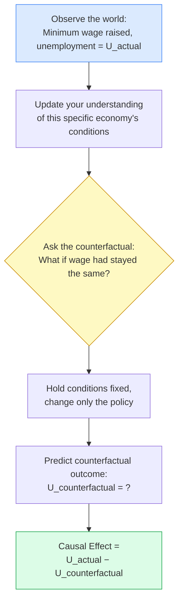
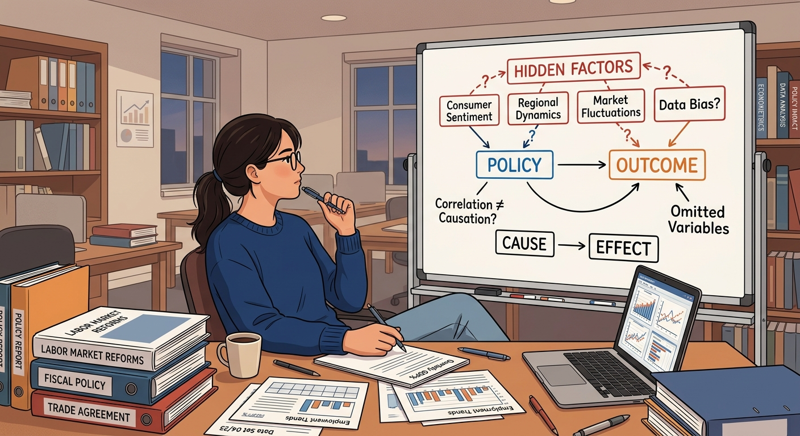
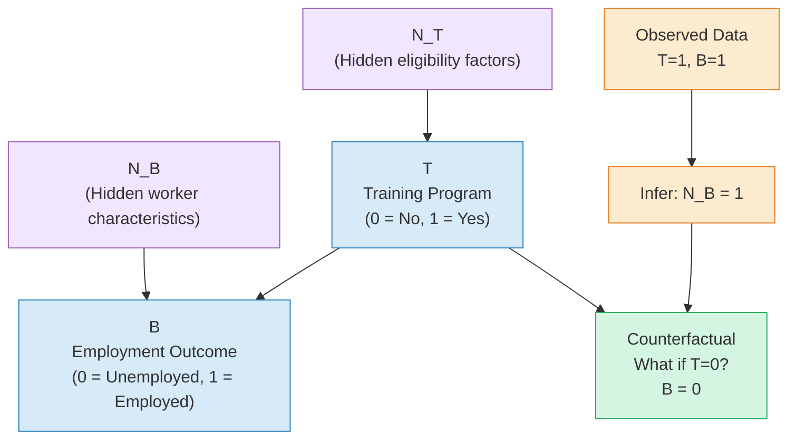
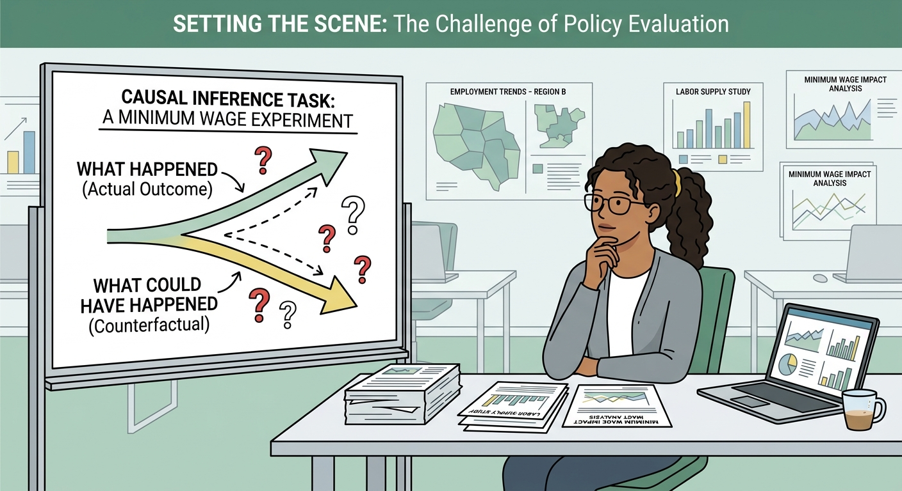
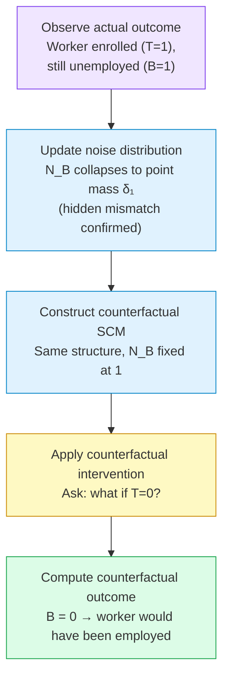
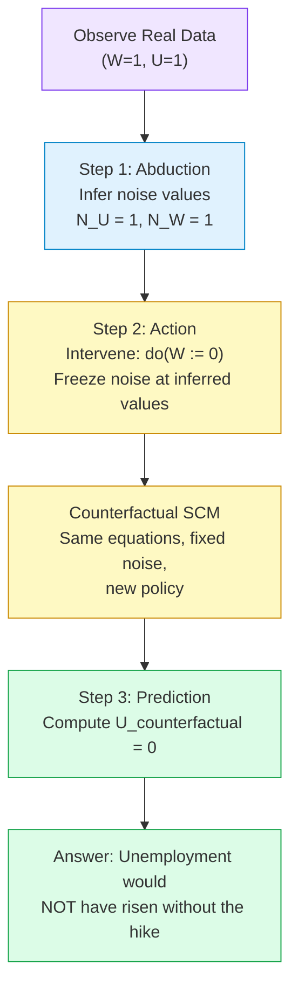
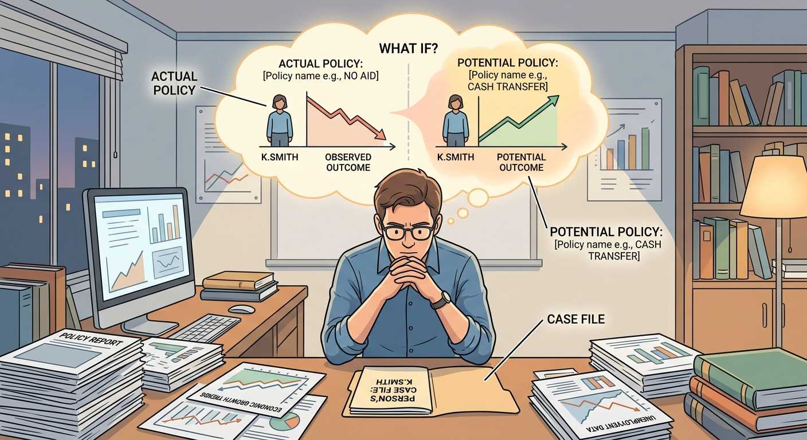
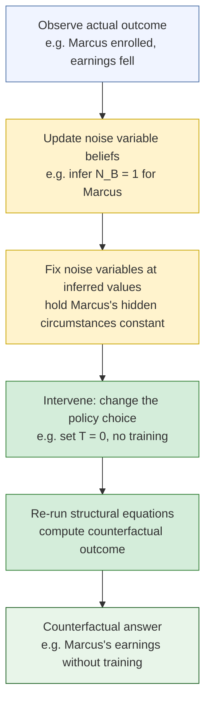

# Counterfactuals

## What If We Had Done Something Different? Counterfactuals in Policy

> By the end of this node, you will be able to:
>
> 1. Explain what a **counterfactual question** is and why it is fundamentally different from a purely observational question.
> 2. Identify counterfactual reasoning in real economic policy debates, such as minimum wage or stimulus spending.
> 3. Describe, in plain language, the two-step logic behind answering a counterfactual: first observe, then imagine an alternative.

It is the morning after a state government raises the minimum wage. The unemployment rate ticks up slightly in the following quarter. A senator holds a press conference: "This proves the minimum wage hike cost jobs." An economist in the back row raises her hand: "But how do you know? Unemployment might have risen _even more_ without the increase — or it might have fallen if something else had been driving it."

This is not a rhetorical trick. It is one of the most important questions in all of policy analysis: **What would have happened if we had done something different?** You cannot answer it just by looking at the data you have, because the data only shows you the world as it _actually unfolded_ — not the world as it _could have_ unfolded under a different policy. That alternative world, the one that never happened, is called a **counterfactual**. And learning to reason carefully about it is the foundation of modern causal inference.

## The Core Idea: Rewinding the Tape

A **counterfactual** is a statement about what _would have_ happened under circumstances that are _counter to the facts_ — that is, different from what actually occurred (Source: ECI).

Think of it like rewinding a video of history to a specific decision point, changing one thing, and pressing play again to see how the story unfolds differently. The key insight is that you are holding everything else fixed — the same economy, the same workers, the same global conditions — and only changing the policy lever you care about.

**A concrete example:** Suppose a city raised its minimum wage from \$10 to \$15 in January, and by July, the restaurant industry had shed 2,000 jobs. The counterfactual question is: _"How many jobs would the restaurant industry have had in July if the minimum wage had stayed at \$10?"_ Maybe it would have been 1,800 jobs — meaning the wage increase actually _saved_ 200 jobs relative to the counterfactual trend. Or maybe it would have been 2,500 jobs — meaning the increase _cost_ 500 jobs. You cannot know just from observing the 2,000 job figure alone.

This is why economists say the **fundamental problem of causal inference** is that we can never directly observe both the actual outcome _and_ the counterfactual outcome for the same economy at the same time. We observe one path; the other remains forever hypothetical.

### The Two-Step Logic of a Counterfactual

Even though we cannot directly observe the counterfactual world, we can _reason_ about it systematically. The formal approach, described in the causal inference literature, works in two steps (Source: ECI):

**Step 1 — Observe and update.** You look at what actually happened and use that information to sharpen your understanding of the specific situation. In the minimum wage example, you learn things about the local economy — its industry mix, its elasticity of labor demand, its trend before the policy — that pin down the context.

**Step 2 — Imagine the intervention.** Holding that context fixed (same economy, same underlying conditions), you mentally replace the actual policy with the alternative policy and ask what the model predicts.

This two-step structure — _condition on what you observed, then intervene on what you want to change_ — is the engine behind counterfactual reasoning (Source: ECI). It is more powerful than simply comparing cities that did and did not raise their minimum wage, because it tries to answer the question for _this specific economy_, not some average across many different places.

### Why Correlation Is Not Enough

You already know that correlation does not imply causation. Counterfactuals make that lesson concrete. Suppose you observe that cities with higher minimum wages tend to have slightly higher unemployment. Does that mean the minimum wage _caused_ the unemployment? Not necessarily — perhaps those cities were already experiencing economic downturns that both prompted the wage increase (as a political response) and drove up unemployment independently. The counterfactual question cuts through this: _holding the city's economic conditions fixed_, what would unemployment have been under the alternative wage level? Answering that question requires more than correlation; it requires a causal model.

## Seeing the Structure

The diagram below captures the logical flow of counterfactual reasoning in a policy context.

_The counterfactual reasoning loop: we start from what we observed, update our picture of the specific situation, mentally replay history under a different policy, and measure the gap between the two outcomes as the causal effect._

## Why This Matters for Policy Evaluation

Almost every major policy debate is secretly a counterfactual debate. When Congress debates whether a stimulus package "worked," they are really asking: _Would GDP have been lower without it?_ When a central bank evaluates whether raising interest rates "caused" a recession, they are asking: _Would the recession have happened anyway?_ When a researcher studies whether job training programs "help" participants, they are asking: _Would those workers have found employment even without the program?_

Without counterfactual thinking, policy evaluation collapses into naive before-and-after comparisons or misleading correlations. A city that raises its minimum wage during an economic boom will see employment rise — but that does not mean the wage increase _caused_ the boom. A city that cuts taxes during a recession will see tax revenue fall — but that does not mean the cut _caused_ the shortfall. In each case, the counterfactual — what would have happened without the policy — is the missing piece.

This is why the tools you will encounter in the rest of this course — randomized experiments, difference-in-differences, instrumental variables, regression discontinuity — are all, at their core, strategies for _constructing a credible counterfactual_. They are different answers to the same question: given that we can only observe one world, how do we make a rigorous inference about the world we did not observe?

Counterfactual reasoning is not just an academic exercise. It is the difference between a policy debate grounded in evidence and one driven by coincidence and confirmation bias. Mastering it is the first step toward becoming the kind of economist who can actually tell the senator in that press conference whether the minimum wage hike cost jobs — or saved them.

## Check Your Understanding

**1.** A government implements a carbon tax, and in the following year, carbon emissions fall by 8%. A journalist writes: "The carbon tax reduced emissions by 8%." What is the key piece of information missing from this claim?

- A) The size of the carbon tax
- B) What emissions would have been _without_ the tax (the counterfactual)
- C) Whether the tax was popular with voters
- D) The total level of emissions before the tax

**2.** Which of the following best describes a **counterfactual** in the context of economic policy?

- A) A prediction about future policy outcomes based on current trends
- B) A statement about what _would have_ happened under a different policy, holding all else fixed
- C) A comparison of two different countries with different policies
- D) A correlation between a policy variable and an economic outcome

**3.** According to the two-step logic of counterfactual reasoning, what is the correct order of operations?

- A) Intervene first, then observe the outcome
- B) Observe and update your understanding of the specific situation, then imagine the alternative intervention
- C) Run a regression, then interpret the coefficient as causal
- D) Compare treated and untreated groups, then average the difference

<strong>Answers</strong>

**1. B** — The 8% figure only tells us what happened in the actual world. To claim the tax _caused_ the reduction, we need to know what emissions would have been without the tax. Perhaps emissions were already falling due to cheaper natural gas, and the true effect of the tax was much smaller — or larger.

**2. B** — A counterfactual is specifically a statement about an alternative, unobserved world, counter to the facts of what actually happened, with other conditions held fixed. Option C describes a cross-sectional comparison, which is a different (and weaker) approach.

**3. B** — The two-step logic is: first, use your observations to update your understanding of the specific context (the particular economy, the particular time period); second, holding that context fixed, mentally replace the actual policy with the counterfactual policy and ask what would have resulted (Source: ECI).

---

## Building the Machine: SCMs and Counterfactual Policy Questions

> By the end of this node, you will be able to:
>
> 1. Explain what a Structural Causal Model (SCM) is and why it is the right tool for answering "what if" questions in economics.
> 2. Describe the role of **noise variables** in capturing the hidden individual-level factors that determine economic outcomes.
> 3. Read a simple causal graph and connect it to the SCM equations that generate observed data.

In the previous node, we asked a deceptively simple question: _What would have happened to this household's income if the minimum wage policy had never been implemented?_ You already know that standard statistics can't answer this — correlation is not causation, and we can never directly observe the road not taken. But knowing _why_ we can't answer it with correlation is different from knowing _how_ we actually can answer it. That's where Structural Causal Models come in. Think of an SCM as the engine underneath the hood of counterfactual reasoning — it's the formal machinery that turns "what if" from a philosophical musing into a precise, calculable question.

## What Is a Structural Causal Model?

A **Structural Causal Model (SCM)** is a set of equations — one for each variable we care about — that describes _how_ each variable is generated from its causes and from hidden background factors. It is not just a description of what tends to happen on average; it is a story about the _mechanism_ that produces every individual outcome.

Let's build intuition with an economics example. Suppose we are studying whether a job-training program (call it $T$) affects a worker's employment status (call it $B$, for "better employment"). An SCM for this situation might look like:

$$T := N_T, \quad B := T \cdot N_B + (1-T) \cdot (1 - N_B) \tag{Equation 1}$$

This comes directly from the structure described in the source material (Source: ECI). Let's unpack each piece:

- **$T$** is whether the worker receives training (1 = yes, 0 = no). Here, $T$ is determined entirely by $N_T$, a noise variable representing all the background factors that determine who gets assigned to the program — maybe it's a lottery, maybe it's based on eligibility criteria we don't fully observe.
- **$B$** is the employment outcome (1 = employed, 0 = not employed). Its value depends on _both_ whether training was given ($T$) and on $N_B$, a noise variable representing the worker's hidden individual characteristics — their motivation, prior skills, local job market conditions, and so on.
- **$N_B$** and **$N_T$** are the **noise variables** — they encode everything that influences the outcome but that we, as researchers, cannot directly measure (Source: ECI).

### The Causal Graph

Every SCM has a corresponding **causal graph**, which is a diagram showing which variables directly cause which others. For Equation 1, the graph is simply:

$$T \rightarrow B$$

This says: training status ($T$) directly causes employment outcome ($B$). The noise variables $N_T$ and $N_B$ are understood to be lurking in the background, feeding into their respective variables.

### Why Noise Variables Are the Secret Ingredient

Here is the key insight: **noise variables are what make individual-level counterfactuals possible.** Without them, an SCM would only tell us about average tendencies. With them, it tells us about _each specific person's_ situation.

Imagine a specific worker — call her Maria. She participated in the training program ($T=1$) and is now employed ($B=1$). We want to ask: _Would Maria have been employed anyway, even without the training?_

To answer this, we need to know something about Maria's hidden characteristics — her $N_B$. The observation that $B=1$ and $T=1$, plugged into Equation 1, tells us:

$$1 = 1 \cdot N_B + (1-1) \cdot (1-N_B) = N_B$$

So $N_B = 1$ for Maria. Now we can ask: what would $B$ have been if $T=0$?

$$B_{T=0} = 0 \cdot 1 + (1-0) \cdot (1-1) = 0$$

Surprisingly, we can conclude that without training, Maria would _not_ have been employed! The training genuinely helped her. This is the power of the SCM framework — by using the observed data to pin down the noise variable, we can compute the counterfactual outcome for a specific individual (Source: ECI).

This three-step process — (1) observe the data, (2) infer the noise variables, (3) compute the counterfactual — is the engine of counterfactual reasoning in economics.

## Mapping the Structure

Here is a visual summary of how the pieces of an SCM fit together, using our job-training policy example:

_The SCM connects hidden noise variables (purple) to observed variables (blue) through structural equations. When we observe data (orange), we can infer the noise values and compute counterfactual outcomes (green) — the "what if" answers that policy evaluation demands._

## Why This Matters for Policy Evaluation

You might wonder: why go through all this trouble? Why not just compare workers who got training to those who didn't?

The answer is that simple comparisons conflate the effect of the program with the effect of the hidden characteristics ($N_B$) that also differ between the two groups. Workers who self-select into training programs might be more motivated to begin with — so their better employment outcomes might have nothing to do with the training itself.

The SCM framework forces us to be explicit about these hidden factors. As the source material notes, SCMs contain strictly _more_ information than just a causal graph or a list of correlations — they encode the full mechanism, including the noise variables, which is exactly what is needed to answer counterfactual questions (Source: ECI). A causal graph alone can tell you that $T$ affects $B$; an SCM tells you _how_, and that "how" is what lets you rewind the clock for a specific individual or a specific policy scenario.

In the nodes ahead, we will use this machinery to formally define counterfactual quantities like the **individual treatment effect** and connect them to real policy evaluation methods. The SCM is not just abstract math — it is the precise language that separates rigorous policy analysis from educated guesswork.

## Check Your Understanding

**1.** In a Structural Causal Model, what is the primary role of **noise variables** like $N_B$?

A) They represent the variables we directly observe in our dataset.
B) They encode the hidden, unobserved background factors that determine individual outcomes.
C) They are placeholders for variables we plan to measure in the future.
D) They represent random errors that we try to minimize with better data collection.

**2.** In the job-training SCM from this node (Equation 1), a worker receives training ($T=1$) and ends up unemployed ($B=0$). What can we infer about this worker's noise variable $N_B$?

A) $N_B = 1$, because the training failed.
B) $N_B = 0$, because plugging $T=1$ and $B=0$ into the equation gives $0 = N_B$.
C) $N_B$ cannot be determined from this observation.
D) $N_B = 0.5$, reflecting uncertainty.

**3.** Why do we need an SCM rather than just a **causal graph** to answer counterfactual questions?

A) Causal graphs are only used for observational data, not experimental data.
B) SCMs contain strictly more information than graphs alone — including the structural equations and noise distributions needed to compute individual-level counterfactuals.
C) Causal graphs cannot represent more than two variables.
D) SCMs are easier to draw and interpret than causal graphs.

Show Answers

**1. B** — Noise variables encode the hidden, unobserved background factors (like a worker's motivation or local job market) that determine individual outcomes. They are not observed directly, but they are the key to computing counterfactuals. (Source: ECI)

**2. B** — Plugging $T=1$ and $B=0$ into Equation 1: $0 = 1 \cdot N_B + 0 \cdot (1-N_B) = N_B$, so $N_B = 0$. This worker has hidden characteristics that make training counterproductive for them.

**3. B** — As noted in the source material, SCMs contain strictly more information than causal graphs alone, including the structural equations and noise distributions that are necessary for answering counterfactual questions about specific individuals or scenarios. (Source: ECI)

---

## Reading the Past to Rewrite It: Updating What We Know

> By the end of this node, you will be able to:
>
> 1. Explain how observing a real-world policy outcome lets you pin down the hidden factors that drove it.
> 2. Describe the three-step process of counterfactual reasoning: observe, update, intervene.
> 3. Apply this logic to a concrete policy scenario to answer a "what if we had done something different?" question.

Imagine you are a junior economist at a central bank. Last year, your team recommended a sharp interest rate hike to cool inflation. The hike was implemented — and the economy slipped into recession. Your director now asks the uncomfortable question: _Would we have avoided the recession if we had kept rates steady?_

This is not idle speculation. It is one of the most important questions in policy evaluation. But here is the subtle magic: the very fact that you _observed_ the recession, and that you _know_ the rate hike happened, gives you more information than you had before. The outcome you witnessed is a clue — a clue about the hidden economic conditions that were present at the time. And once you know those hidden conditions, you can rewind the tape and ask what a different policy would have produced. This is the art and science of counterfactual reasoning.

## From Outcome Back to Hidden Causes

Every policy plays out against a backdrop of conditions the policymaker cannot fully observe. Think of these as the **background factors** — the underlying state of the economy, the behavioral tendencies of households, the structural features of labor markets. In the language of Structural Causal Models (SCMs), these are called **noise variables** (sometimes written $N$), and they capture everything that is not directly controlled by the policy itself (Source: ECI).

Here is the key insight: when a policy is implemented and we observe the outcome, that observation is not just a data point. It is _evidence_ about which background factors were present. By conditioning on what we actually saw, we can often narrow down — sometimes all the way to a single value — what those hidden factors must have been. This process is called **updating the noise distribution**.

Let's make this concrete with a policy analogy. Suppose a government introduces a job-training program ($T = 1$) for unemployed workers, and a particular worker who enrolled ends up _still unemployed_ one year later ($B = 1$, where $B = 1$ means "bad outcome"). The program was designed to work for most people, but there is a small group — say, 1% of workers — for whom the program is actually counterproductive due to a hidden mismatch between the training content and their skill profile ($N_B = 1$). For the other 99%, the program helps ($N_B = 0$).

The SCM for this situation looks like:

$$T := N_T, \quad B := T \cdot N_B + (1 - T) \cdot (1 - N_B) \tag{Equation 1}$$

where $N_B \sim \text{Ber}(0.01)$ — meaning only 1% of workers have the hidden mismatch — and $N_T$ captures whatever led the worker to enroll (Source: ECI).

Now read Equation 1 carefully. If the worker enrolls ($T = 1$):

- The outcome is $B = 1 \cdot N_B + 0 = N_B$.
- So $B = 1$ if and only if $N_B = 1$.

If the worker does not enroll ($T = 0$):

- The outcome is $B = 0 + (1 - N_B) = 1 - N_B$.
- So $B = 1$ if and only if $N_B = 0$ (the worker would have been fine with training, but without it, they stay unemployed).

This means: the moment we observe that the worker enrolled _and_ remained unemployed — $T = 1$ and $B = 1$ — we can deduce with certainty that $N_B = 1$. The hidden mismatch was present. Before observing the outcome, $N_B = 1$ had only a 1% prior probability. After observing $T = 1, B = 1$, it has 100% probability. The distribution of $N_B$ has **collapsed to a point mass** at 1, written $\delta_1$ (Source: ECI).

This collapse is not magic — it is just Bayesian updating applied to the hidden variables of the SCM. The observation acts like a fingerprint that identifies which type of worker this person was.

## The Three Steps: Observe, Update, Intervene

Counterfactual reasoning in an SCM always follows the same three-step recipe (Source: ECI):

**Step 1 — Observe (Abduction):** Look at what actually happened. In our example: the worker enrolled ($T = 1$) and remained unemployed ($B = 1$).

**Step 2 — Update (Conditioning):** Use the observation to update the distribution of the noise variables. We now know $N_B = 1$ with certainty. The SCM becomes a **counterfactual SCM** — identical in structure, but with the noise pinned to its updated values (Source: ECI):

$$T := 1, \quad B := T \cdot 1 + (1 - T) \cdot (1 - 1) = T \tag{Equation 2}$$

Notice what happened: $N_B$ has been replaced by its now-certain value of 1. The _structure_ of the equations did not change — only the noise distribution was updated. This is a crucial point: conditioning on observations updates what we know about the hidden state of the world, but it does not alter the causal mechanisms themselves (Source: ECI).

**Step 3 — Intervene (Prediction):** Now ask the counterfactual question. What would have happened if the worker had _not_ enrolled ($T = 0$)?

Using Equation 2 with $T = 0$:
$$B = 0 \cdot 1 + (1 - 0) \cdot (1 - 1) = 0$$

The counterfactual outcome is $B = 0$: the worker would have found employment without the program. This is a striking and perhaps uncomfortable conclusion — for _this specific worker_, the program made things worse.

This is the power of the three-step method. Before we observed the outcome, we could only say "the program works for 99% of people" — a population-level statement. After observing this worker's outcome, we can make a _personalized_ counterfactual claim about what would have happened to _them_ under a different policy.

## Seeing the Logic Flow

_The three-step counterfactual pipeline: observation pins down hidden factors (abduction), the updated SCM is constructed (conditioning), and a new policy is evaluated within it (intervention). Each step is logically necessary — skip any one and the answer becomes either impossible or unreliable._

## Why This Matters for Policy Evaluation

Without this framework, policy evaluation is stuck at the population level. We can say "on average, the training program increased employment by 5 percentage points" — but we cannot say anything about whether _this particular region_, _this particular cohort_, or _this particular demographic group_ would have fared better under a different policy. That individual-level question is exactly what policymakers, courts, and regulators often need to answer.

The updating step — collapsing the noise distribution based on observed outcomes — is what makes individual-level counterfactuals possible at all. It is the bridge between the general causal model (which describes how the world works on average) and the specific case (which describes what happened to one particular unit). Without SCMs, this bridge does not exist, because there is no formal place to represent the hidden background factors that the observation can update (Source: ECI).

In the next node, we will see how to combine these updated SCMs with more complex policy interventions — and how to handle cases where the noise cannot be pinned down to a single value, requiring us to reason over a distribution of counterfactual worlds rather than just one.

## Check Your Understanding

**1.** A government implements a carbon tax ($T = 1$) and observes that emissions _increased_ ($B = 1$) in a particular industrial sector. According to the SCM framework, what does this observation allow us to do?

A) Prove that carbon taxes never work.
B) Update the distribution of hidden background factors for this specific sector.
C) Directly compute the average treatment effect across all sectors.
D) Conclude that the causal mechanism linking taxes to emissions must be wrong.

**2.** When we say the noise variable $N_B$ "collapses to a point mass" after conditioning on an observation, this means:

A) The noise variable is deleted from the model.
B) The causal structure of the SCM is rewritten to remove $N_B$.
C) We become certain about the value of $N_B$ for this specific case, so its distribution concentrates on one value.
D) The noise variable now follows a uniform distribution.

**3.** In the three-step counterfactual process (observe, update, intervene), why is the "update" step essential before the "intervene" step?

A) Because interventions can only be applied after the causal graph has been deleted.
B) Because without updating the hidden factors to reflect what actually happened, the counterfactual intervention would be applied to the wrong background conditions.
C) Because updating changes the causal mechanisms, making the intervention easier to compute.
D) Because the intervention step requires knowing the average noise distribution across the whole population.

Show Answers

**1. B** — Observing the outcome lets us update (condition) the distribution of hidden background factors for this specific sector, which is the foundation of counterfactual analysis. It does not prove a general claim about carbon taxes, nor does it directly give us an average treatment effect. (Source: ECI)

**2. C** — A point mass (written $\delta_1$ or $\delta_0$) means all probability is concentrated on a single value. The noise variable is not removed; it is simply now known with certainty for this case. The causal structure itself is unchanged. (Source: ECI)

**3. B** — The update step pins down the hidden background conditions that were present when the policy was actually implemented. If you skip it and just intervene in the original SCM, you are asking "what would happen to a random person under the alternative policy" — a population question — rather than "what would have happened to _this specific person_." (Source: ECI)

---

## Running the Counterfactual: What Would Have Happened?

> By the end of this node, you will be able to:
>
> 1. Walk through the three-step process — abduction, action, and prediction — for answering a counterfactual question in an economic policy context.
> 2. Explain how observing real-world outcomes lets us "pin down" hidden factors in a structural causal model.
> 3. Apply a modified (counterfactual) SCM to compute what would have happened under a different policy.

Imagine you are a junior analyst at a central bank. Last year, the government raised the minimum wage in a struggling region. Unemployment ticked upward — not dramatically, but enough to raise eyebrows. Your supervisor turns to you and asks: _"Would unemployment have risen anyway, even without the wage increase?"_

This is not a question you can answer by running another regression. The policy happened. You cannot un-raise the minimum wage and observe the same region in the same year under the same economic conditions. And yet, this is precisely the kind of question that policymakers need answered every single day. Counterfactual reasoning gives us a rigorous way to answer it — by using what we _did_ observe to figure out what we _would have_ seen.

## The Three-Step Engine: Abduction, Action, Prediction

Answering a counterfactual question with a Structural Causal Model (SCM) always follows the same three-step recipe. Think of it as rewinding a film, editing one scene, and then pressing play again to see how the story changes. Let's build up each step carefully.

---

**Step 1 — Abduction: Infer the Hidden Factors**

Every SCM contains noise variables — the unobserved background conditions that make each individual situation unique. In our minimum wage story, these might represent things like a region's underlying industrial composition, the skill mix of its workforce, or the global demand for its exports. These factors are never directly measured, but they shape the outcome we observe.

Abduction means: _use the actual observed data to figure out what those hidden factors must have been._ Formally, we update the probability distribution over the noise variables by conditioning on what we saw (Source: ECI). If the observation pins the noise down to a single value — as it often does in simple models — we replace the uncertain noise distribution with a point mass at that value.

> **Key idea:** Abduction is like a detective inferring the hidden cause from the visible clue. The crime scene (observed data) tells us which suspect (noise value) must have been present.

**Step 2 — Action: Intervene in the Modified Model**

Now that we know the hidden background conditions, we rewrite the SCM with those conditions locked in. Then we perform the hypothetical intervention — the _do_-statement — that represents the counterfactual policy. In our example, this means asking: _do(minimum wage := no increase)_, while keeping everything else (the region's industrial mix, the global economy, the workforce) exactly as we inferred it in Step 1.

This is the crucial difference between a counterfactual and a simple observational comparison. We are not comparing this region to a different region that never had the wage hike. We are asking what _this specific region_, with _its specific background conditions_, would have experienced (Source: ECI).

**Step 3 — Prediction: Compute the Outcome**

With the modified SCM in hand — noise fixed by abduction, policy changed by the intervention — we simply run the model forward and read off the predicted outcome. This gives us the counterfactual value: what unemployment _would have been_ had the policy been different.

---

### A Worked Example: The Minimum Wage Region

Let's make this concrete with a stylized SCM. Suppose the economy of our region is described by two variables:

- $W$ = minimum wage policy (1 = raised, 0 = not raised)
- $U$ = unemployment rate outcome (1 = rose, 0 = did not rise)

And two noise variables:

- $N_W$ = political and institutional factors that determine whether the wage is raised (independent of $N_U$)
- $N_U$ = the region's underlying economic fragility (1 = fragile, 0 = resilient)

The structural equations are:

$$W := N_W \quad 	ext{(Equation 1)}$$

$$U := W \cdot N_U + (1 - W) \cdot (1 - N_U) \quad 	ext{(Equation 2)}$$

This says: if the region is economically fragile ($N_U = 1$), raising the wage causes unemployment to rise; if the region is resilient ($N_U = 0$), raising the wage does _not_ cause unemployment to rise. The region's fragility is rare — say, $N_U \sim 	ext{Bernoulli}(0.01)$, so only 1% of regions are truly fragile (Source: ECI).

Now, we observe: the wage was raised ($W = 1$) and unemployment rose ($U = 1$).

**Applying Step 1 — Abduction:**

Plug $W = 1$ and $U = 1$ into Equation 2:

$$1 = 1 \cdot N_U + (1 - 1) \cdot (1 - N_U) = N_U$$

So $N_U = 1$. The observation tells us with certainty that this particular region _is_ economically fragile. We update our noise distribution: $N_U$ is no longer uncertain — it is pinned to 1. Similarly, $N_W = 1$ since $W = 1$ was observed (Source: ECI).

**Applying Step 2 — Action:**

We now construct the counterfactual SCM. The noise is fixed: $N_U = 1$, $N_W = 1$. We intervene: $do(W := 0)$. The modified structural equation for $U$ becomes:

$$U_{	ext{counterfactual}} = 0 \cdot 1 + (1 - 0) \cdot (1 - 1) = 0 + 1 \cdot 0 = 0 \quad 	ext{(Equation 3)}$$

**Applying Step 3 — Prediction:**

The counterfactual outcome is $U = 0$: unemployment would _not_ have risen if the minimum wage had not been raised, _for this specific region with its specific fragility_.

This is a striking result. It tells us that the wage hike genuinely caused the unemployment increase in this region — not some pre-existing economic weakness that would have caused problems regardless. The policy was the decisive factor.

---

### The Formal Definition Behind the Steps

Definition 6.17 from the source material formalizes what we just did (Source: ECI). Given an SCM $\mathcal{C} := (\mathcal{S}, P_N)$ and some observations $x$, the **counterfactual SCM** is defined as:

$$\mathcal{C}_{X=x} := (\mathcal{S},\, P_N^{\mathcal{C}|X=x}) \quad 	ext{(Equation 4)}$$

where $P_N^{\mathcal{C}|X=x} := P_{N|X=x}$ is the noise distribution updated by conditioning on the observed data. Crucially, the **structural equations** $\mathcal{S}$ themselves do not change — only the noise distributions are updated (Source: ECI). Counterfactual statements are then simply _do_-statements applied inside this new, noise-updated SCM.

## Seeing the Flow

The three steps have a clear logical structure. Here is how they connect:

_The three-step counterfactual process applied to a minimum wage policy evaluation. Abduction (blue) pins down the hidden regional fragility from observed data; Action (yellow) freezes those conditions and changes the policy; Prediction (green) reads off the counterfactual unemployment outcome._

## Why This Matters for Policy Analysis

You might wonder: why go through all this trouble? Why not just compare regions that got the wage hike to regions that did not?

The answer is that simple comparisons conflate two things: the effect of the policy _and_ the pre-existing differences between regions. A region that never raised its minimum wage might be structurally different in ways that affect unemployment regardless of policy. The counterfactual approach sidesteps this by asking about the _same unit_ — the same region, the same year, the same background conditions — under a different policy (Source: ECI).

This is also why SCMs are more powerful than graphs alone. A causal graph tells you the _structure_ of relationships. An SCM, by encoding noise variables explicitly, gives you the machinery to run counterfactuals — to ask not just "does the wage affect unemployment in general?" but "did the wage cause _this region's_ unemployment to rise?" (Source: ECI). That individual-level precision is what makes counterfactuals indispensable for policy accountability.

In the next node, we will zoom out and ask: when can we actually trust these counterfactual answers? What assumptions are we making, and when might they break down? For now, the key takeaway is the three-step rhythm: **abduction → action → prediction**. Memorize it. It is the engine behind virtually every rigorous policy counterfactual you will encounter.

## Check Your Understanding

**1.** In the abduction step of a counterfactual analysis, what are we doing?

A) Choosing which policy intervention to simulate.

B) Using observed data to infer the values of the hidden noise variables.

C) Running the structural equations forward to compute the outcome.

D) Removing noise variables from the model entirely.

---

**2.** In the worked minimum wage example, we observed $W=1$ (wage raised) and $U=1$ (unemployment rose). After abduction, what did we conclude about $N_U$?

A) $N_U$ remains uncertain with probability 0.01.

B) $N_U = 0$, meaning the region is resilient.

C) $N_U = 1$, meaning the region is economically fragile.

D) $N_U$ cannot be determined from the observations.

---

**3.** When we construct the counterfactual SCM (Definition 6.17), what changes and what stays the same?

A) The structural equations change; the noise distributions stay the same.

B) Both the structural equations and the noise distributions change.

C) The noise distributions are updated by conditioning on observations; the structural equations stay the same.

D) Neither changes — we only add a new variable for the intervention.

---

<strong>Reveal Answers</strong>

**1. B** — Abduction is the step where we use the observed data (e.g., $W=1, U=1$) to condition on and thereby infer the values of the hidden noise variables. This is the "detective work" of the three-step process. (Source: ECI)

**2. C** — Plugging $W=1$ and $U=1$ into the structural equation $U = W \cdot N_U + (1-W)(1-N_U)$ gives $1 = N_U$. The observation pins the noise to 1, revealing the region is fragile. (Source: ECI)

**3. C** — The counterfactual SCM keeps the structural equations $\mathcal{S}$ identical; only the noise distribution is updated by conditioning on the observations. Counterfactual questions are then posed as do-statements in this noise-updated model. (Source: ECI)

---

## Beyond the Graph: Why Policy Analysis Needs More

> By the end of this node, you will be able to:
>
> 1. Explain why a causal graph alone cannot answer counterfactual questions about specific individuals or cases.
> 2. Describe what extra information Structural Causal Models (SCMs) carry that graphs do not.
> 3. Articulate why this distinction matters for economists who want to move beyond average treatment effects to individual-level policy conclusions.

Imagine you are a policy analyst at the Treasury. A new job-training program was rolled out last year, and you have access to rich data: who participated, who didn't, and what happened to everyone's earnings afterward. Your regression models and causal graphs look clean. You know, on average, the program raised earnings by $4,000 a year. Your boss is satisfied.

But then a journalist calls. She's writing about Marcus, a 34-year-old who enrolled in the program and whose earnings actually _fell_ the following year. His employer downsized, he lost his job, and he's now worse off than before. The journalist asks: "Would Marcus have been better off if he had _not_ enrolled?"

Your causal graph — the one with arrows from _Training_ to _Earnings_ — cannot answer that. It tells you about populations and averages. It says nothing about Marcus specifically, about what his particular circumstances were, or what would have happened to _him_ under a different choice. To answer the journalist's question, you need something more powerful than a graph. You need an SCM.

## What a Graph Can — and Cannot — Tell You

A **causal graph** (also called a directed acyclic graph, or DAG) is an enormously useful tool. It encodes which variables causally influence which others, and it lets us reason about interventions — what happens to the average outcome when we change a policy for everyone. This is the world of _do_-calculus and average treatment effects (ATEs), and it is genuinely powerful for many policy questions.

But a causal graph, even paired with the full joint probability distribution of the data, has a hard ceiling on what it can tell you. Specifically:

- It can tell you: "On average, across all workers like Marcus, what does training do to earnings?"
- It **cannot** tell you: "Given that Marcus enrolled _and_ his earnings fell, what would his earnings have been if he had _not_ enrolled?"

The second question is a **counterfactual** — it asks about a specific individual, using what we already observed about them, to reason about an alternative world. Answering it requires us to _update our beliefs about that individual's hidden circumstances_ and then _re-run the world_ under a different choice.

This is precisely what graphs cannot do on their own. A graph tells you the causal _structure_ — the wiring diagram. But it does not tell you the specific values of the unobserved factors (what economists might call unobserved heterogeneity, or what SCMs call **noise variables**) that shaped any one person's outcome. (Source: ECI)

> **Key insight:** Formally, SCMs contain strictly more information than their corresponding graph and the observational data distribution — and even more than all intervention distributions combined. That extra information is what makes counterfactuals possible. (Source: ECI)

![A two-column diagram. Left column labeled 'Causal Graph' shows a DAG with nodes Training → Earnings, and below it a probability distribution table of average outcomes. Right column labeled 'SCM' shows the same DAG but adds structural equations (T := N_T, E := f(T, N_E)) and a separate layer showing individual noise variables N_T and N_E. Arrows from the noise layer feed into the equations. A red 'X' marks the graph column under the question 'What would Marcus earn without training?' while a green checkmark marks the SCM column.](imgs/img_09.png)

## The Secret Ingredient: Noise Variables and What They Represent

To see concretely what SCMs add, let's build a simple economic example inspired by a classic illustration in causal inference. (Source: ECI)

Suppose a doctor administers a medical treatment to a patient who then gets worse. The causal graph is simply:

$$
T
ightarrow B
$$

where $T$ is treatment (1 = treated, 0 = not treated) and $B$ is the bad outcome (1 = blind, 0 = sighted). The graph tells us treatment causally affects the outcome. But it cannot tell us _why_ this particular patient got worse, or what would have happened without treatment.

Now add the SCM layer. The structural equations are:

$$T := N_T, \quad B := T \cdot N_B + (1 - T) \cdot (1 - N_B) \quad 	ext{(Equation 1)}$$

Here, $N_B$ is a **noise variable** representing a rare hidden condition: if $N_B = 1$ (which happens for 1% of patients), the treatment _harms_ the patient; if $N_B = 0$ (99% of patients), the treatment _helps_. The doctor cannot observe $N_B$. (Source: ECI)

Now the crucial move. Suppose we observe that the patient _was_ treated ($T = 1$) and _did_ go blind ($B = 1$). We ask: **what would have happened if the doctor had not treated this patient?**

Using Equation 1 and the observation $T = 1, B = 1$, we can _deduce_ the value of the noise variable:

$$1 = 1 \cdot N_B + (1 - 1)(1 - N_B) = N_B$$

So $N_B = 1$ for this patient. We have _learned something about this individual's hidden circumstances_ from the observed outcome. (Source: ECI)

Now we can answer the counterfactual. Holding $N_B = 1$ fixed (the patient's hidden condition doesn't change just because we imagine a different treatment), we re-run the equation with $T = 0$:

$$B_{	ext{counterfactual}} = 0 \cdot 1 + (1 - 0)(1 - 1) = 0$$

The patient would _not_ have gone blind without treatment. The treatment caused the blindness for this specific individual — even though it helps 99% of patients on average.

**Translating to economics:** Replace the patient with a worker, the treatment with a job-training program, and the bad outcome with a drop in earnings. The noise variable $N_B$ represents unobserved worker characteristics — perhaps the worker's industry was contracting, or their skills were a poor match for the program. By observing that Marcus enrolled _and_ his earnings fell, an SCM lets us infer something about his hidden circumstances and then ask what would have happened under the alternative policy. A graph alone cannot do this. (Source: ECI)

## Seeing the Structure

The diagram below summarizes the three-step logic that separates SCM-based counterfactual reasoning from graph-based reasoning alone.

_The three-step counterfactual process: first observe and infer hidden circumstances (yellow), then intervene and recompute (green). A causal graph alone only supports the intervention step — it cannot perform the inference step that personalizes the analysis to a specific individual._

## Why This Matters for Policy Economics

You might wonder: does any of this matter in practice? After all, most policy analysis focuses on average treatment effects — and for that, graphs and standard regression tools often suffice.

But consider the questions that economists and policymakers increasingly want to answer:

- **Heterogeneous treatment effects:** Does the minimum wage increase help low-skill workers on average but harm specific subgroups? Identifying _who_ is harmed requires individual-level counterfactual reasoning.
- **Harm and liability:** If a regulation was applied and a firm went bankrupt, was the regulation the cause _for that firm_? Courts and regulators need individual-level causal attribution, not just averages.
- **Personalized policy:** Should _this_ student receive a scholarship? Should _this_ neighborhood receive infrastructure investment? Optimal targeting requires counterfactual predictions at the individual level.

All of these questions live in the space that graphs cannot reach but SCMs can. (Source: ECI)

There is also a deeper theoretical point. The extra information in an SCM — the specific functional form of the structural equations and the distributions of noise variables — is not just a technical nicety. It also enables **identifiability** of causal structure in cases where graphs alone leave things ambiguous. Restricting the class of functions in an SCM (for example, assuming linear relationships or non-Gaussian noise) can allow researchers to distinguish between competing causal stories from observational data alone — something impossible with graphs and distributions alone. (Source: ECI)

This is why, as you continue studying causal inference in economics, you will find SCMs at the foundation of the most powerful modern methods: instrumental variables, regression discontinuity, and difference-in-differences can all be understood as special cases of SCM-based reasoning. The graph tells you the story; the SCM lets you _live inside it_.

## Check Your Understanding

**1.** An economist has a causal graph showing that education ($E$) causes income ($I$), along with the full joint distribution of $E$ and $I$ in the population. A specific worker, Priya, has a college degree and a low income. Can the economist use the graph alone to answer: "What would Priya's income have been if she had not gone to college?"

A) Yes — the causal graph plus the joint distribution is sufficient for any causal question.
B) No — counterfactual questions about specific individuals require inferring noise variable values, which graphs cannot provide.
C) Yes — as long as the graph is acyclic, individual counterfactuals are always identified.
D) No — causal graphs can only be used for descriptive statistics, not causal questions of any kind.

**2.** In an SCM, what do **noise variables** represent in an economic context?

A) Measurement error in the survey instruments used to collect data.
B) The unobserved individual characteristics (like ability, motivation, or industry conditions) that affect outcomes beyond the observed policy variable.
C) Random shocks that are averaged out when computing treatment effects.
D) The residuals from a linear regression of the outcome on the treatment.

**3.** Which of the following statements best captures why SCMs contain _strictly more information_ than causal graphs?

A) SCMs include more nodes and edges, making the graph larger and more detailed.
B) SCMs specify the structural equations and noise distributions, enabling individual-level counterfactual inference that graphs and observational distributions alone cannot support.
C) SCMs are estimated from larger datasets, so they have less statistical uncertainty.
D) SCMs replace probability distributions with deterministic rules, removing ambiguity.

<strong>Reveal Answers</strong>

**1. B** — Counterfactual questions about a specific individual require the three-step process: observe, infer the noise variable value for that individual, then re-run the equations. A causal graph encodes structure and average relationships but does not carry the machinery to infer individual noise values. (Source: ECI)

**2. B** — In economic SCMs, noise variables represent everything about an individual that is unobserved by the analyst: innate ability, local labor market conditions, personal motivation, and so on. They are the source of individual heterogeneity. (Source: ECI)

**3. B** — The structural equations and noise distributions are the extra layer that SCMs add on top of the graph. This layer is what enables the "abduction" step — inferring the specific noise realization for an observed individual — which is the key to answering individual-level counterfactual questions. (Source: ECI)

---
